# Electronics Complete Robot Kit Learning Starter Kit for Arduino UNO R3

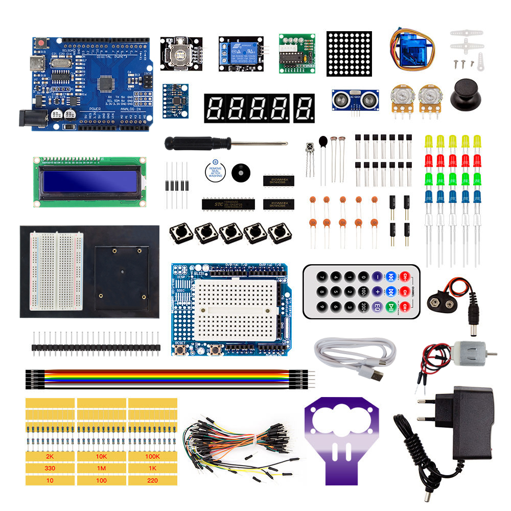

**Before starting the projects, please make sure you have installed the Arduino IDE and necessary libraries.**

## 1. Introduction

The Electronics Complete Learning Starter Kit is a comprehensive and versatile Arduino-compatible development kit designed for beginners, students, and electronics enthusiasts. This kit contains a wide variety of sensors, modules, and components to help you get started quickly and practice a multitude of basic and intermediate electronics projects. Whether you are learning programming, building smart home prototypes, or exploring robotics, this kit provides all the essential tools you need.

---

## 2. Features

1. **User-Friendliness**: Arduino is popular for its simplicity and ease of use, allowing users to get started without needing advanced programming or electronic expertise.
2. **Abundant Component Modules**: The kit includes various modules like LEDs, sensors, displays, motors, and more, enabling users to undertake diverse projects.
3. **Detailed Tutorials**: It offers detailed tutorials for 32 projects, covering working principles, code, and wiring diagrams to help users gradually master the basics.
4. **Versatile Applications**: The kit supports the creation of a wide range of projects, from basic temperature monitoring to complex smart home systems and robotic controls, greatly expanding its applicability.
5. **Expandability**: Beyond the basic projects in the tutorials, users can explore and develop more advanced applications based on personal interests. This flexibility significantly enhances the kit's practical value.

---

## 3. Component List

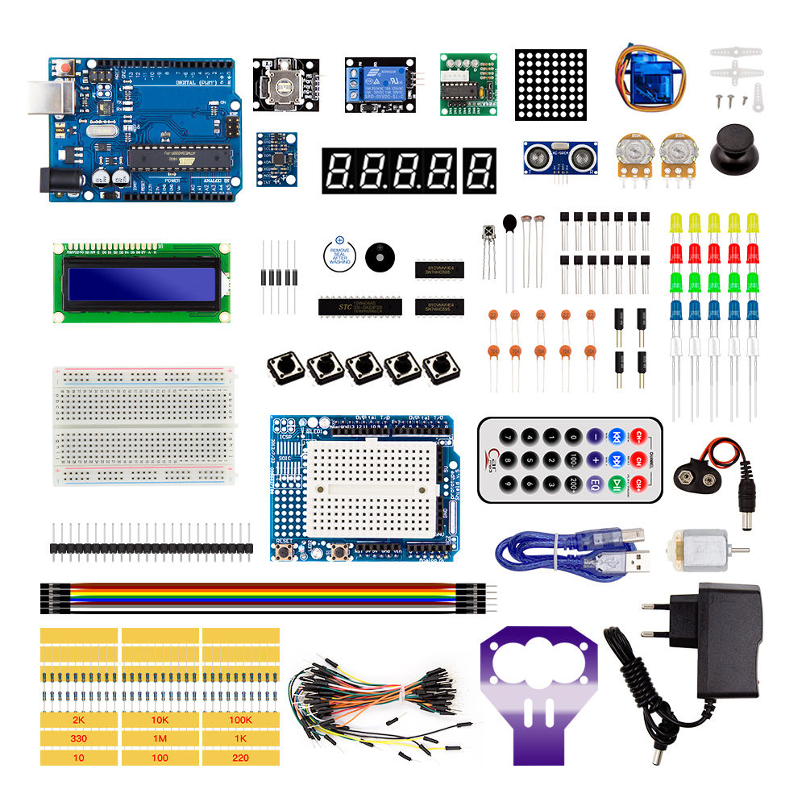

| Component | Quantity | Component | Quantity |
|-----------|----------|-----------|----------|
| Arduino UNO R3 Board | 1 | LCD 1602 Module | 1 |
| Prototype Expansion Shield | 1 | 4-digit LED Segment Display | 1 |
| 830-hole Breadboard | 1 | 1-digit LED Segment Display | 1 |
| Stepper Motor (5V) | 1 | HC-SR04 Ultrasonic Sensor | 1 |
| ULN2003 Stepper Motor Driver | 1 | SG90 Servo Motor | 1 |
| 130 DC Motor | 1 | Joystick Module | 1 |
| IR Remote Control | 1 | IR Receiver Sensor | 1 |
| 5V Relay Module | 1 | 74HC595 Shift Register | 1 |
| Active Buzzer | 1 | Passive Buzzer | 1 |
| Button Switch | 5 | MPU6050 Module | 1 |
| 10K Potentiometer | 2 | Thermistor NTC-MF52AT 10K | 1 |
| Photoresistor | 2 | 8x8 LED Dot Matrix | 1 |
| RGB LED | 1 | MAX7219CNG | 1 |
| LED - Red | 5 | LED - Green | 5 |
| LED - Blue | 5 | LED - Yellow | 5 |
| LED - White | 5 | L293D Motor Driver | 1 |
| Resistor (220Ω) | 10 | Resistor (1KΩ) | 10 |
| Resistor (10KΩ) | 10 | Resistor (100KΩ) | 10 |
| Resistor (330Ω) | 10 | Resistor (1MΩ) | 10 |
| Resistor (10Ω) | 10 | Resistor (100Ω) | 10 |
| Resistor (2KΩ) | 10 | 9V Battery Connector | 1 |
| USB Cable | 1 | 9V 1A Power Adapter | 1 |
| Jumper Wires (M-M) | 65 | Dupont Wires (F-M) | 10 |
| BC547 Transistor | 5 | BC557 Transistor | 5 |
| 2N2222 Transistor | 5 | 1N4007 Diode | 5 |
| 10uF 50V Capacitor | 2 | 100uF 50V Capacitor | 2 |
| 104PF Ceramic Capacitor | 5 | 22PF Ceramic Capacitor | 5 |
| Pin Header (24pin) | 1 | Ultrasonic Holder | 1 |

---

## 4. Getting started with Arduino

**WHAT IS ARDUINO?**

Arduino is an open-source electronics platform based on easy-to-use hardware and software. It's intended for anyone making interactive projects.

**ARDUINO SOFTWARE**

You can tell your Arduino what to do by writing code in the Arduino programming language and using the Arduino development environment.

### 1. Download Arduino IDE

#### A. Windows System

You could download Arduino IDE from the official website: <https://www.arduino.cc/>

Enter the link and click **SOFTWARE**:

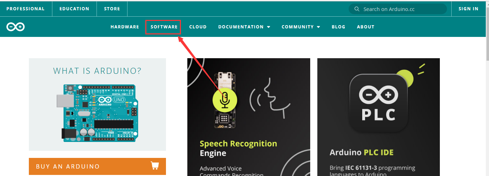

There are various versions of IDE for Arduino. Just download a version compatible with your system.


Here we will show you how to download and install the windows version of Arduino IDE.

There are two versions of IDE for WINDOWS system. You can choose between the installer (.exe) and the Zip file. For installer, it can be directly downloaded, without the need of installing it manually while for Zip package, you will need to install the driver manually.


You just need to click **JUST DOWNLOAD**.

#### B. Mac System

The versions of Arduino IDE vary from operation systems.

For how to download Arduino IDE on Mac, please refer to Windows:


After downloading, double-click to open it and follow the installation instructions.

#### C. Detailed installation steps:

1. Save the .exe file downloaded from the software page to your hard drive and simply run the file.

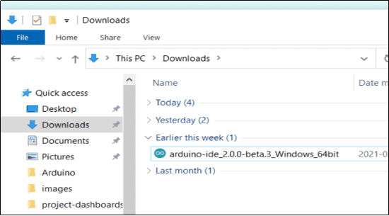

2. Read the License Agreement and agree it.

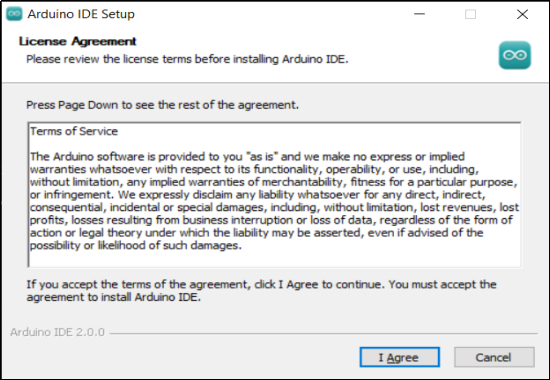

3. Choose the installation options.


4. Choose the install location.

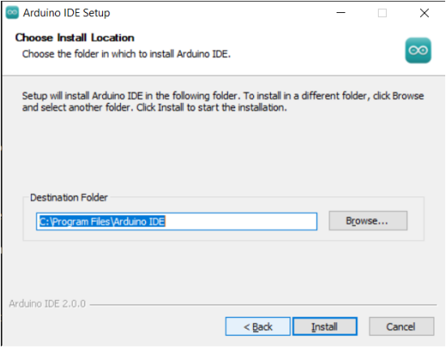

5. Click finish and run Arduino IDE.


### 2. Install Driver

We need a driver to boot our development board. Or else, the COM port connected to computer will not be found.

#### Install CH340 Driver on Windows System

Download: <https://fs.keyestudio.com/CH340-WINDOWS>

Windows 10 (and later systems) boasts their own drivers, so there is no need to install additional drivers.

Connect the control board to your computer.

Click Computer – Properties – Device Manager, as shown below. This indicates a successful connection, so the installation of driver is not required.

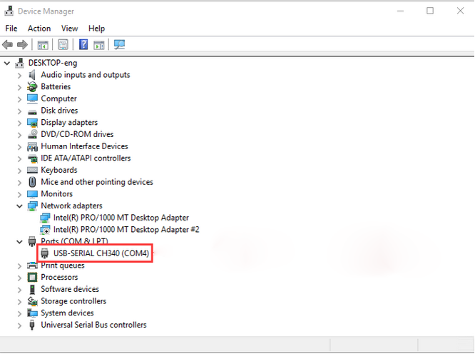

If the following situation occurs, you need to manually install the driver.

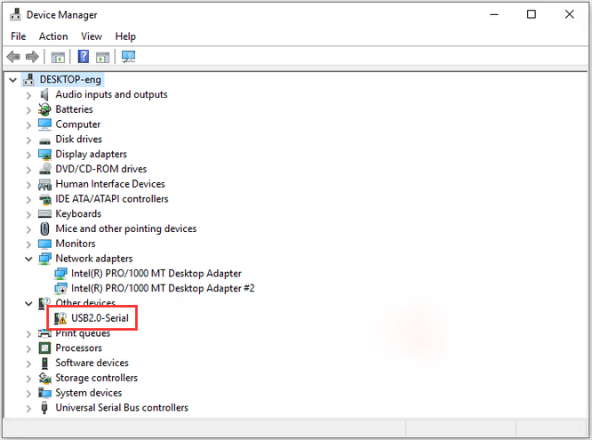

Click 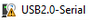 to select "Update driver". And then the driver will start to install.

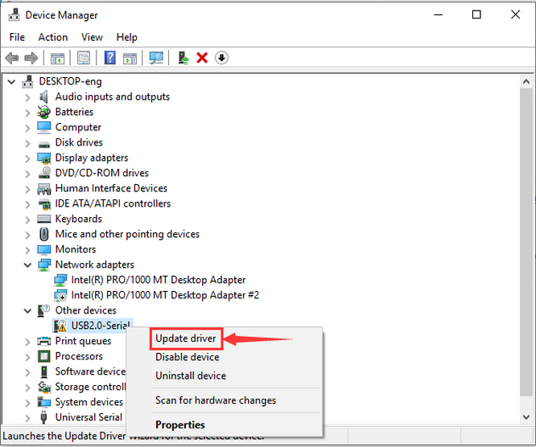

Tap "Browse my computer for drivers".

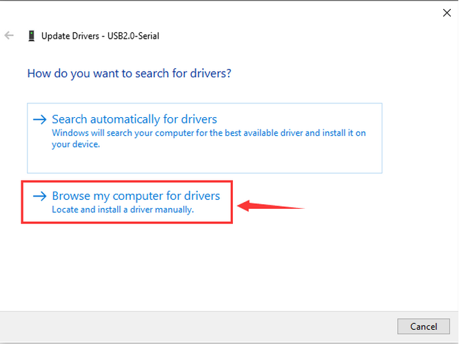

Find the file **usb_ch341_3.1.2009.06** or **cp210x** you have downloaded, and click "Next".

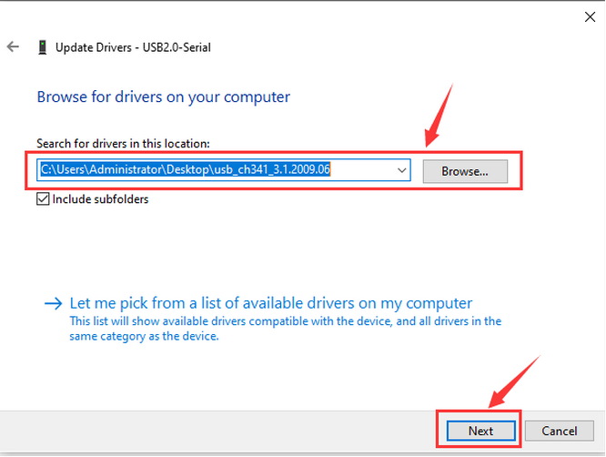

After finishing installing, click "Close" and the serial port number will show up.


The driver is successfully installed!

Click Computer – Properties – Device Manager to check:


#### Install CH340 Driver on MAC System

**Step 1**: Download the driver from the Website and extract the file to the local installation directory.

<https://fs.keyestudio.com/CH340-MAC>


**Step 2**: For details about how to install the driver in pkg format by default, see Step 3. If OS X 11.0 or later does not support Rosetta, refer to Step 4 to install the dmg driver.

Before installation, please forward to "System Preferences" -> "Security & Privacy" -> "General" page, below the title "Allow apps downloaded from:" choose the choice 2 -> "Mac App Store and identified developers", then the driver will work normally.


**Step 3**: To install the driver in pkg format, tap the driver file → Continue → Install.


Then the installation will be successful.


To install the pkg format driver on OS X 11.0 and later: Open "LaunchPad" → "CH34xVCPDriver" → Install.


When using OS X 10.9 to OS X 10.15, click "Restart" to restart your computer, and perform the following steps after the restart.


**Step 4**: To install the dmg driver, tap the dmg file and drag "CH34xVCPDriver" to enter the application folder in the operating system.


Then open "LaunchPad" → "CH34xVCPDriver" → Install.

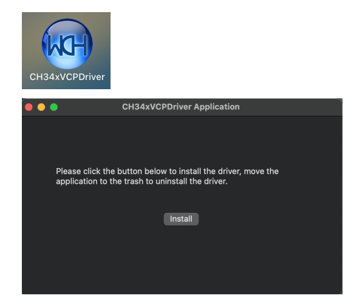

Then the installation will be successful.

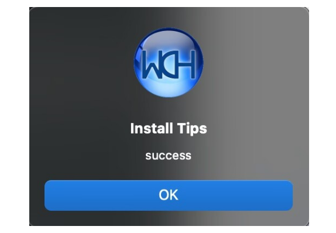

When inserting the CH340 control board into the USB port, open System Report -> Hardware -> USB. On the right is USB Device Tree. If the USB device is working properly, you will find a device whose "Vendor ID" is [0x1a86].

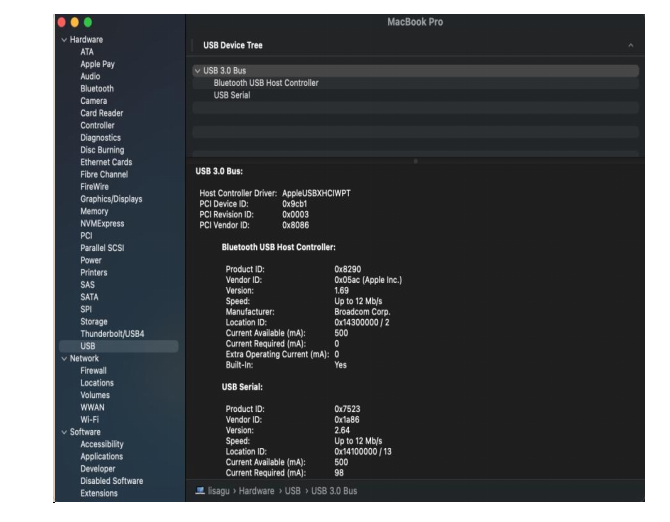

Open "Terminal" program under Applications-Utilities folder and type the command "ls /dev/tty\*".


You should see the "tty.wchusbserialx" where "x" is the assigned device number similar to Windows COM port assignment.

### 3. Arduino IDE Setting

Click 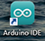 icon to open Arduino IDE.


1. "File": Including New Sketch, Open…, Sketchbook, Examples, Close, Save(Save as…), Preferences, Advanced…, etc.

2. "Edit": Including Copy, Paste, Auto Format, Increase/Decrease Font Size, etc. Commonly, you can use shortcuts to do these operations.

3. "Sketch": Including Verify/Compile, Upload, Include Library, etc.

4. "Tools": Including Board and Port, which are two of the most important functions.

5. "Help": Including Check for Updates as well as some official data references.

6. "Serial Plotter": To display the data from serial port in the way of a line chart.

7. "Serial Monitor": To prints the data from serial port.

8. Verify code.

9. Verify and upload code.

10. "Sketchbook": To create a new sketch, or sign in to Arduino Cloud to sync and edit your Cloud Sketches.

11. "Boards Manager": To install or remove development board.

12. "Library Manager": To install or remove library.

13. "Debug": To monitor code and debug breakpoints.

14. Search.

15. Sketch editing area.

16. IDE Output: To report error or successful uploading, and to display data from serial monitor.

### 4. Upload Code via Arduino IDE

#### For Windows

Upload code: An examples code is provided here: it will print "Hello Keyestudio!" per second.

Copy and paste the following code to Arduino IDE:

```cpp
/*

keyestudio

Print "Hello Keyestudio!"

http://www.keyestudio.com

*/

void setup() {
  // put your setup code here, to run once:
  Serial.begin(9600); //Set the serial port baud rate to 9600
}

void loop() {
  // put your main code here, to run repeatedly:
  Serial.println("Hello Keyestudio!"); //Serial port printing
  delay(1000); //Delay of 1 second
}
```

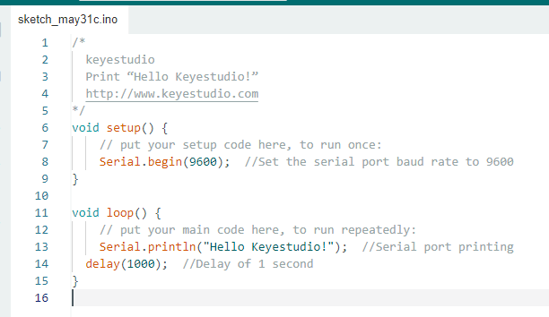

Click "Tools" ——> "Board" ——> Arduino AVR Boards, and here we choose Arduino Uno as our development board.


Choose the correct COM port.

If there are so many ports that you have no idea which is the correct one, you may unplug the board to check which one disappears. If there is no COM port, please check whether the driver is installed.


In our demonstration, the port is COM3, so we click "Tools" to choose "COM3" in "Port".


If your board is successfully connected, it will show on the interface.


Click  to compile the code. If it succeeds, the following two show up:


Click  and set baud rate to 9600, and "Hello Keyestudio!" are being printed!


1. "Toggle Autoscroll": To set whether to follow the print.

2. "Toggle Timestamp": To set whether to display printing time.

3. "Clear Output": To clear the output data.

4. Serial Input.

5. Serial port sending format.

6. Baud rate: To set the baud rate.

7. Printing box.

This is the end of how to upload code!

Now please import libraries for IDE, otherwise an error will occur.

#### For Mac

Upload code: An examples code is provided here: it will print "Hello Keyestudio!" per second.

Copy and paste the following code to Arduino IDE:

```cpp
/*

keyestudio

Print "Hello Keyestudio!"

http://www.keyestudio.com

*/

void setup() {
  // put your setup code here, to run once:
  Serial.begin(9600); //Set the serial port baud rate to 9600
}

void loop() {
  // put your main code here, to run repeatedly:
  Serial.println("Hello Keyestudio!"); //Serial port printing
  delay(1000); //Delay of 1 second
}
```


Click "Tools" ——> "Board" ——> Arduino AVR Boards, and here we choose Arduino Uno as our development board.


Choose the correct COM port.

If there are so many ports that you have no idea which is the correct one, you may unplug the board to check which one disappears. If there is no COM port, please check whether the driver is installed.

In "Tools", click "Port" to select "/dev/cu.usbderial-0001".


If your board is successfully connected, it will show on the interface.

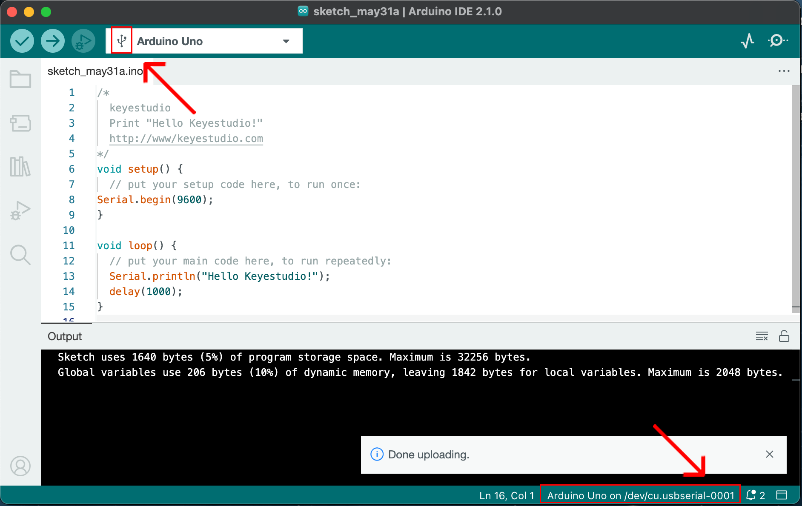

Click  to compile the code. If it succeeds, the following two show up:


Click  and set baud rate to 9600, and "Hello Keyestudio!" are being printed!


1. "Toggle Autoscroll": To set whether to follow the print.

2. "Toggle Timestamp": To set whether to display printing time.

3. "Clear Output": To clear the output data.

4. Serial Input.

5. Serial port sending format.

6. Baud rate: To set the baud rate.

7. Printing box.

This is the end of how to upload code!

Now please import libraries for IDE, otherwise an error will occur.
