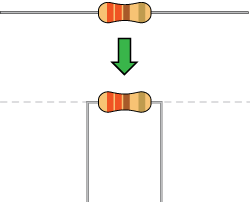
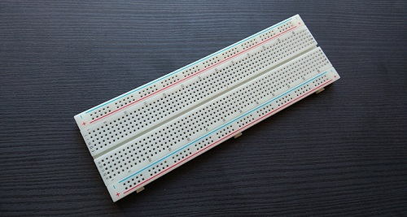
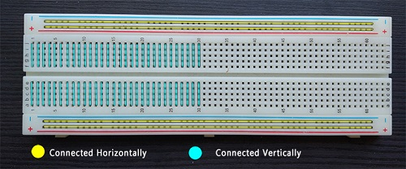
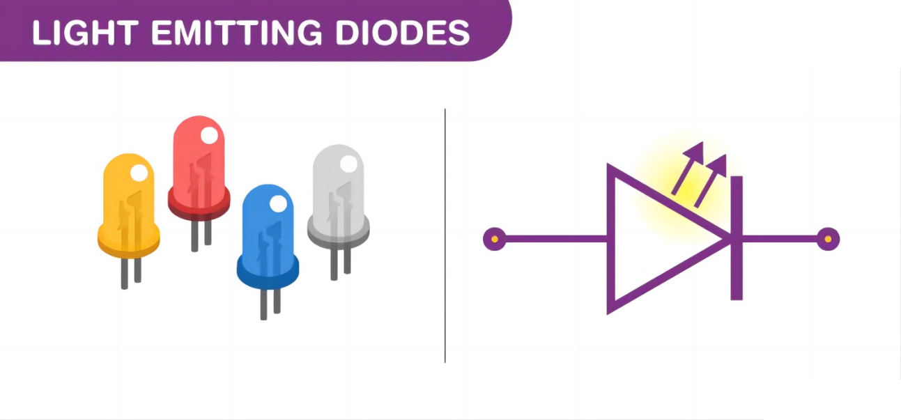
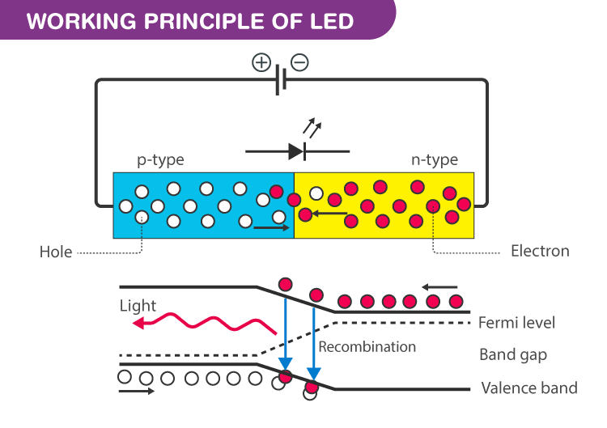
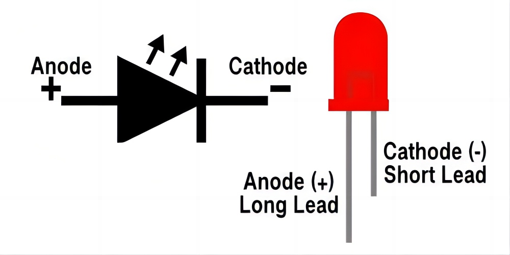
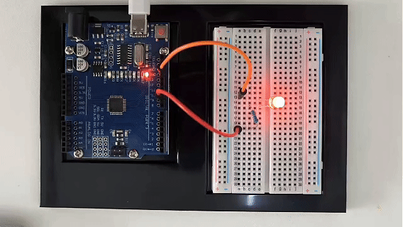

# Проект 1: Мигающий светодиод


#### Описание

Светодиод, также известный как светящийся диод, — это полупроводниковое устройство, которое может преобразовывать электрическую энергию в видимый свет. Он состоит из двух различных типов полупроводниковых материалов, один с отрицательным зарядом, а другой с положительным. Когда через светодиод течет ток, электроны переходят из отрицательного слоя в положительный, высвобождая фотоны и производя свет.

В этом проекте мы будем использовать плату Arduino и светодиод для создания классического проекта "Мигание". Через этот проект вы поймете принцип работы светодиодов и напишете простую программу для управления миганием светодиода.

#### Аппаратное обеспечение

1\. Плата разработки UNO R3 (ch340) x1

2\. Светодиод 5 мм x1

3\. Резистор 220 Ом x1

4\. Макетная плата x1

5\. Соединительные провода

#### Знания о компонентах

**Что такое резистор?**

Резистор — это электронный компонент в цепи, который ограничивает и регулирует ток. Его единица измерения — Ом (Ω).

Единицы больше Ом — это килоомы (КΩ) и мегаомы (МΩ). При использовании, помимо величины сопротивления, необходимо также обращать внимание на его мощность. В проекте выводы резистора с обеих сторон следует согнуть под углом 90°, чтобы он правильно вошел в макетную плату. Если выводы слишком длинные, их можно обрезать до подходящей длины.



**Что такое макетная плата?**

Макетная плата используется для быстрого создания и тестирования схем перед окончательным проектированием. Макетная плата имеет множество отверстий, в которые можно вставлять компоненты схемы, такие как микросхемы и резисторы. Типичная макетная плата показана ниже:




Макетная плата имеет металлические полосы, которые проходят под платой и соединяют отверстия сверху. Металлические полосы расположены следующим образом. Обратите внимание, что верхние и нижние ряды отверстий соединены горизонтально, а остальные отверстия соединены вертикально.



Для использования макетной платы выводы компонентов вставляются в отверстия. Каждый набор отверстий, соединенных металлической полосой под платой, образует анод.

**Что такое светодиод?**

Светодиод (LED) — это полупроводниковое устройство, которое излучает свет при прохождении электрического тока. Когда ток проходит через светодиод, электроны рекомбинируют с дырками, излучая свет в процессе. Светодиоды пропускают ток в прямом направлении и блокируют ток в обратном направлении.



Светодиоды — это сильно легированные p-n переходы. В зависимости от используемого полупроводникового материала и степени легирования, светодиод излучает цветной свет на определенной спектральной длине волны при прямом смещении. Как показано на рисунке, светодиод заключен в прозрачный корпус, чтобы излучаемый свет мог выходить наружу.

Символ светодиода

Символ светодиода — это стандартный символ диода с добавлением двух маленьких стрелок, обозначающих излучение света.


Простая схема светодиода

Ниже показана простая схема светодиода.  
  
Схема состоит из светодиода, источника напряжения и резистора для регулирования тока и напряжения.

#### Принцип работы светодиода

Когда диод смещен в прямом направлении, неосновные электроны переходят из p → n, а неосновные дырки переходят из n → p. На границе перехода концентрация неосновных носителей увеличивается. Избыточные неосновные носители на переходе рекомбинируют с основными носителями заряда.



Энергия высвобождается в виде фотонов при рекомбинации. В стандартных диодах энергия выделяется в виде тепла. Но в светодиодах энергия выделяется в виде фотонов. Это явление называется электролюминесценцией. Электролюминесценция — это оптическое и электрическое явление, при котором материал излучает свет в ответ на прохождение через него электрического тока. По мере увеличения прямого напряжения интенсивность света увеличивается и достигает максимума.

#### Технические характеристики светодиода

1.8-2.2 В прямое падение напряжения

Максимальный ток: 20 мА

Рекомендуемый ток: 16-18 мА

Световая интенсивность: 150-200 мкд

#### Распиновка светодиода



У светодиода есть положительный (анод) и отрицательный (катод) выводы. Схематический символ светодиода похож на символ диода, за исключением двух стрелок, указывающих наружу. Анод (+) обозначен треугольником, а катод (-) — линией.

Длинный вывод светодиода обычно является положительным (анодом), а короткий — отрицательным (катодом).

#### Схема подключения

1. Вставьте светодиод в макетную плату;

2. Подключите один конец резистора 220 Ом к ряду макетной платы, где находится анод светодиода, а другой конец резистора — к цифровому пину 9 платы разработки;

3. Подключите вывод GND платы с помощью соединительного провода к ряду макетной платы, где находится катод светодиода.


#### Пример кода

```cpp

/*

Electronics Learning Starter Kit for Arduino

Project 1

LED Blink

Edit By Keyes

*/

void setup() {

pinMode(9, OUTPUT); // Установить цифровой пин 9 как выход

}

void loop() {

digitalWrite(9, HIGH); // Установить цифровой пин 9 в высокий уровень, включить светодиод

delay(1000); // Подождать 1000 миллисекунд (1 секунду)

digitalWrite(9, LOW); // Установить цифровой пин 9 в низкий уровень, выключить светодиод

delay(1000); // Подождать 1000 миллисекунд (1 секунду)

}
```

#### Объяснение кода

Сначала нам нужно определить переменную, которая будет представлять цифровой пин, подключенный к светодиоду. В программировании Arduino это можно сделать простой строкой кода:

```cpp

int ledPin = 9;

```

Эта строка кода определяет переменную с именем `ledPin` и инициализирует ее значением 9, что указывает на то, что светодиод подключен к цифровому пину номер 9 на плате Arduino. В Arduino каждый цифровой пин может использоваться как вход или выход, в зависимости от того, как мы его настроим.

Далее нам нужно установить режим `ledPin`, чтобы он мог правильно отправлять сигналы светодиоду. Это делается с помощью функции `pinMode()` со следующим синтаксисом:

```cpp
pinMode(ledPin, OUTPUT);
```

Эта строка кода устанавливает `ledPin` в режим выхода (`OUTPUT`). В режиме выхода плата Arduino может отправлять сигналы напряжения на подключенные устройства. Для светодиода это означает, что мы можем управлять его состояниями включения и выключения.

После установки режима пина следующий шаг — управлять состояниями светодиода (включен или выключен), отправляя высокие (HIGH) или низкие (LOW) сигналы на светодиод. Это делается с помощью функции `digitalWrite()`, представленными двумя строками кода соответственно:

```cpp
digitalWrite(ledPin, HIGH); // Включить светодиод

digitalWrite(ledPin, LOW); // Выключить светодиод
```

Когда второй параметр функции `digitalWrite()` равен `HIGH`, Arduino выдает высокий уровень напряжения на `ledPin`, заставляя подключенный светодиод светиться. И наоборот, когда параметр равен `LOW`, выдается низкий уровень напряжения, и светодиод выключается.

Чтобы сохранить состояние светодиода (включен или выключен) на определенное время, мы используем функцию `delay()`, чтобы приостановить выполнение программы. Например:

```cpp

delay(1000);

```

Эта строка кода приостанавливает программу на 1000 миллисекунд (то есть 1 секунду). Это означает, что светодиод будет сохранять свое текущее состояние (включен или выключен) в течение одной секунды. Изменяя количество миллисекунд в `delay()`, мы можем контролировать, как долго светодиод будет находиться в этом состоянии.

#### Результат проекта



После загрузки кода на плату разработки светодиод, подключенный к цифровому пину 9, начинает мигать, включаясь и выключаясь с интервалом в 1 секунду.