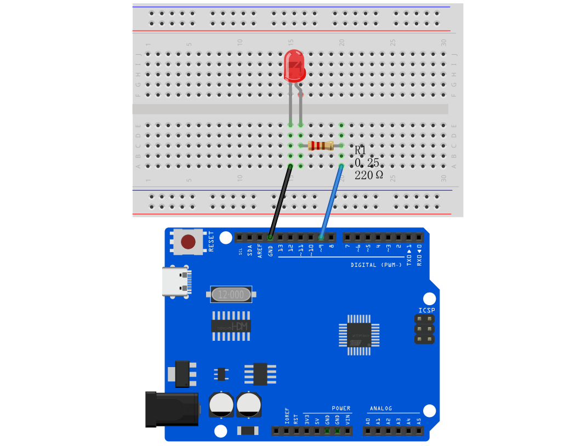
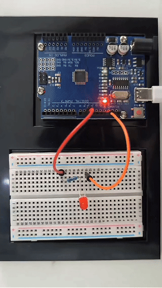

# Proyecto 2: SOS


#### Descripción

SOS es una señal de socorro aceptada internacionalmente, que consiste en tres señales cortas de punto, tres señales largas de raya y tres señales cortas de punto (correspondientes a "· · · – – – · · ·" en código Morse).

Este proyecto utilizará un LED para simular el proceso intermitente de la señal SOS. Cada señal de punto el LED parpadea durante 0.2s, cada señal de raya parpadea durante 0.6s, y el intervalo entre dos caracteres es de 0.2s.

#### Hardware

1\. Placa de desarrollo UNO R3 (ch340) x1

2\. Cable USB x1

3\. Protoboard x1

4\. LED x1

5\. Resistencia de 220Ω x1

6\. Cables de conexión

#### Principio de Funcionamiento

SOS ("Save Our Souls" o "Save Our Ship") es una señal de socorro aceptada internacionalmente. Su principio de funcionamiento es simple pero efectivo.


La señal SOS generalmente consta de tres letras: tres sonidos cortos "S", tres sonidos largos "O" y tres sonidos cortos "S". Este ritmo único la hace destacar en diversos ambientes ruidosos. Ya sea en el tic-tac del telégrafo o el susurro de la radio, SOS puede ser claramente identificada.

Históricamente, la aparición de la señal SOS cambió el destino de innumerables personas. Barcos en peligro en el mar, aviones estrellados y cualquier persona en apuros puede solicitar ayuda al mundo exterior enviando señales SOS. Una vez que se recibe la señal SOS, las operaciones de rescate comienzan de inmediato.

En la sociedad moderna, la aplicación de SOS ha ido mucho más allá del ámbito marítimo. La función de llamada de emergencia en teléfonos móviles y otros dispositivos de comunicación es en realidad una variante de SOS. Siempre que presiones una combinación específica de teclas en una emergencia, tu información de ubicación y datos de ayuda serán enviados automáticamente a la policía, bomberos y otros departamentos de rescate.

#### Diagrama de Conexiones

El cableado es el mismo que en el Proyecto 2.




#### Código de Ejemplo

```cpp

/*

Electronics Learning Starter Kit for Arduino

Project 2

SOS

Edit By Keyes

*/

int ledPin = 9; // Define the digital pin to which the LED is connected

// Define the duration of the dot signal '.' and the dash signal '-' in ms

int dotDuration = 200;

int dashDuration = 600;

// Set the pause time between two characters in ms

int pauseDuration = 200;

void setup() {

pinMode(ledPin, OUTPUT); // Set the pin to output mode

}

void loop() {

// S ···

for (int i = 0; i < 3; i++) {

digitalWrite(ledPin, HIGH);

delay(dotDuration);

digitalWrite(ledPin, LOW);

delay(pauseDuration);

}

delay(pauseDuration);

// O ---

for (int i = 0; i < 3; i++) {

digitalWrite(ledPin, HIGH);

delay(dashDuration);

digitalWrite(ledPin, LOW);

delay(pauseDuration);

}

delay(pauseDuration);

// S ···

for (int i = 0; i < 3; i++) {

digitalWrite(ledPin, HIGH);

delay(dotDuration);

digitalWrite(ledPin, LOW);

delay(pauseDuration);

}

delay(3000); // SOS cycle interval is 3 s

}
```

#### Explicación del Código

Primero, necesitamos definir el puerto digital que conecta el LED. En la programación de Arduino, esto se puede hacer con una simple línea de código:

```cpp

int ledPin = 9;

```

Esta línea de código declara una variable entera llamada `ledPin` y la inicializa en 9. Esto significa que el LED está conectado al puerto digital 9 en la placa Arduino. En Arduino, cada puerto digital puede configurarse como entrada o salida, utilizado para leer sensores o controlar dispositivos externos como LEDs.

A continuación, necesitamos configurar el modo de este puerto en la función `setup()` del programa. La función `setup()` es una parte esencial de cada programa Arduino, que se ejecuta automáticamente una vez cuando la placa Arduino se enciende, para configuraciones iniciales. Para controlar el LED, necesitamos establecer el puerto 9 en modo salida:

```cpp
void setup() {

pinMode(ledPin, OUTPUT);

}
```

Aquí, `pinMode()` es una función de Arduino que establece el modo de un puerto digital especificado. `ledPin` es el número de puerto que definimos anteriormente, y `OUTPUT` es una constante predefinida que indica que el puerto se usará para emitir señales eléctricas.

Posteriormente, escribiremos la función `loop()`, que es el núcleo de un programa Arduino, ejecutándose repetidamente después de que el dispositivo se enciende. En esta función, implementaremos la lógica para controlar el LED y que parpadee la señal SOS. Usamos la función `digitalWrite()` para encender y apagar el LED, y la función `delay()` para controlar la velocidad e intervalo del parpadeo:

```cpp
void loop() {

// S ···

for (int i = 0; i < 3; i++) {

digitalWrite(ledPin, HIGH);

delay(dotDuration);

digitalWrite(ledPin, LOW);

delay(pauseDuration);

}

delay(pauseDuration);

// O ---

for (int i = 0; i < 3; i++) {

digitalWrite(ledPin, HIGH);

delay(dashDuration);

digitalWrite(ledPin, LOW);

delay(pauseDuration);

}

delay(pauseDuration);

// S ···

for (int i = 0; i < 3; i++) {

digitalWrite(ledPin, HIGH);

delay(dotDuration);

digitalWrite(ledPin, LOW);

delay(pauseDuration);

}

delay(3000); // SOS cycle interval is 3 s

}
```

En esta sección del código, `digitalWrite(ledPin, HIGH)` y `digitalWrite(ledPin, LOW)` se usan para encender y apagar el LED conectado al puerto 9. La función `delay()` controla los intervalos de tiempo en milisegundos. Ajustando los valores en `delay()`, puedes cambiar la velocidad y el ritmo del parpadeo de la señal SOS.

#### Resultado del Proyecto



Después de cargar el código y encender el dispositivo, el LED parpadeará según el ritmo de la señal SOS: "· · · – – – · · ·", con 3 segundos entre cada ciclo SOS.