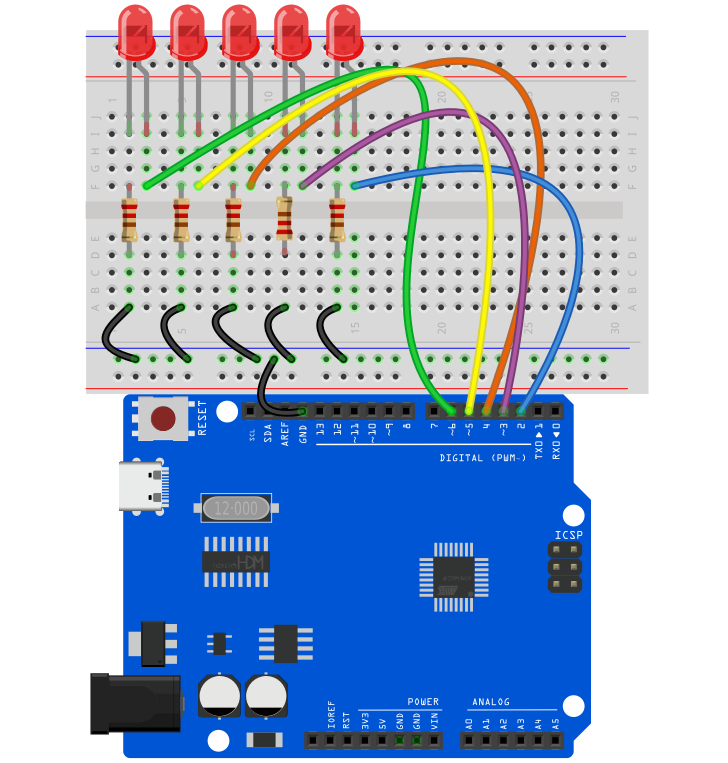
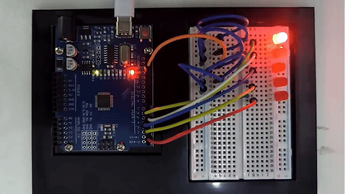

# Proyecto 3: Luz LED Fluida


#### Descripción

Una luz de agua fluida parpadea continuamente como agua corriente. Es una luz decorativa común que se usa ampliamente en diversas ocasiones, como celebraciones de festivales, vitrinas de centros comerciales, actuaciones en el escenario, etc.

Este proyecto utilizará una placa de desarrollo Arduino y 5 LEDs para hacer una luz LED de agua fluida simple. Controlando la secuencia de encendido y apagado de los LEDs, se puede crear un efecto visual similar al agua corriente.

#### Hardware

1\. Placa de desarrollo UNO R3 （ch340） x1

2\. LED x5

3\. Resistencia de 220 ohm x5

4\. Protoboard x1

5\. Cables de conexión

#### Principio de Funcionamiento

El principio de funcionamiento de la luz LED de agua fluida es controlar la secuencia de encendido y apagado de los LEDs a través de la placa de desarrollo Arduino, produciendo así un efecto visual similar al agua corriente. La placa Arduino está conectada al pin positivo del LED a través del pin de salida digital, mientras que el pin negativo del LED está conectado al pin GND (tierra) de la placa mediante una resistencia. Escribiendo código Arduino, podemos controlar los niveles alto y bajo de los pines de salida digital para controlar el encendido y apagado del LED.


#### Diagrama de Conexiones

1.Conecta los pines ánodo de los 5 LEDs a los pines digitales D2, D3, D4, D5, D6 en la placa de desarrollo Arduino respectivamente.

2.Conecta los pines cátodo de cada uno de los cinco LEDs a un extremo de cada una de las cinco resistencias de 220 ohm.

3.Conecta el otro extremo de las cinco resistencias de 220 ohm al GND (tierra) de la placa de desarrollo.




#### Código de Ejemplo

```cpp

/*

Electronics Learning Starter Kit for Arduino

Project 3

LED Flowing Light

Edit By Keyes

*/

int ledPins[] = {2, 3, 4, 5, 6, }; // Define the pin of the LED

int ledCount = 5; // Number of LEDs

int delayTime = 100; // Delay time in ms

void setup() {

for (int i = 0; i < ledCount; i++) {

pinMode(ledPins[i], OUTPUT); // Set the LED pin to output mode

}

}

void loop() {

for (int i = 0; i < ledCount; i++) {

digitalWrite(ledPins[i], HIGH); // Light up the current LED

delay(delayTime); // Delay

digitalWrite(ledPins[i], LOW); // Light off the current LED

}

for (int i = ledCount - 2; i > 0; i--) {

digitalWrite(ledPins[i], HIGH); // Light up the current LED

delay(delayTime); // Delay

digitalWrite(ledPins[i], LOW); // Light off the current LED

}

}
```

#### Explicación del Código

Definición de Variables

```cpp

int ledPins[] = {2, 3, 4, 5, 6}; // Define los pines para los LEDs

int ledCount = 5; // Número de LEDs

int delayTime = 100; // Tiempo de retardo en milisegundos

```

`ledPins[]`: Este es un arreglo de enteros que almacena los números de los pines digitales a los que está conectado cada LED. En este ejemplo, los LEDs están conectados a los pines digitales 2, 3, 4, 5 y 6 en la placa Arduino.

`ledCount`: Esta variable almacena el número total de LEDs, facilitando su uso en los bucles for.

`delayTime`: Controla el tiempo de retardo entre el encendido y apagado de cada LED, en milisegundos.

Función de Configuración `setup()`

```cpp
void setup() {

for (int i = 0; i < ledCount; i++) {

pinMode(ledPins[i], OUTPUT); // Configura los pines de los LEDs como salida

}

}
```

La función `setup()` es una función estándar de inicialización en los programas Arduino, llamada automáticamente una vez al inicio del programa.

`pinMode(ledPins[i], OUTPUT)`: Esta línea de código configura cada pin de LED como modo salida. `OUTPUT` es una constante en el lenguaje Arduino usada para especificar que el pin es una salida.

Función Principal `loop()`

```cpp
void loop() {

for (int i = 0; i < ledCount; i++) {

digitalWrite(ledPins[i], HIGH); // Enciende el LED actual

delay(delayTime); // Retardo

digitalWrite(ledPins[i], LOW); // Apaga el LED actual

}

for (int i = ledCount - 2; i > 0; i--) {

digitalWrite(ledPins[i], HIGH); // Enciende el LED actual

delay(delayTime); // Retardo

digitalWrite(ledPins[i], LOW); // Apaga el LED actual

}

}
```

La función `loop()` es la parte principal del programa Arduino, ejecutándose repetidamente después de la función `setup()`.

El primer bucle for se encarga de encender cada LED en secuencia, manteniendo cada LED encendido por el tiempo especificado por `delayTime`, y luego apagándolo.

El segundo bucle for apaga los LEDs en orden inverso, comenzando desde el penúltimo LED y terminando en el segundo LED.

`digitalWrite(pin, value)`: Se usa para controlar el nivel alto o bajo en el pin especificado. `HIGH` representa un nivel alto, encendiendo el LED; `LOW` representa un nivel bajo, apagando el LED.

#### Resultado del Proyecto

Después de subir el código de ejemplo a la placa de desarrollo,



los LEDs se encenderán y apagarán en secuencia de izquierda a derecha, y luego de derecha a izquierda, creando un efecto de agua corriente.