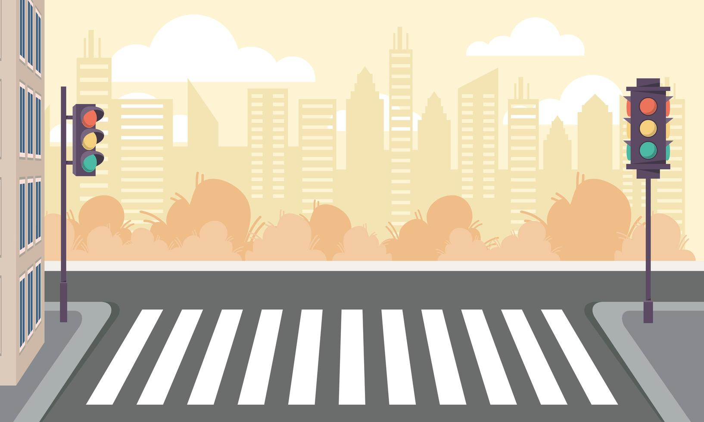
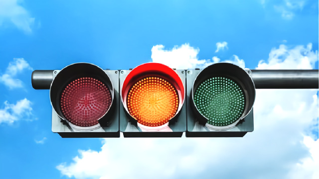
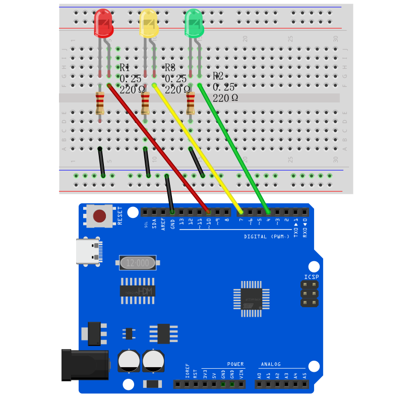
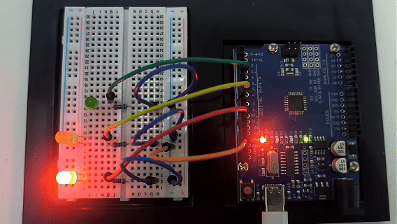

# Проект 4: Светофор




#### Описание

Светофоры — важные средства обеспечения безопасности дорожного движения. Они используют разные цвета света для регулирования проезда транспортных средств и пешеходов, чтобы обеспечить безопасность и порядок на дороге.

В этом проекте будет использована плата разработки Arduino и светодиоды для реализации простой системы светофора. С помощью написания кода для Arduino можно управлять светодиодами красного, жёлтого и зелёного цветов, чтобы реализовать базовые функции светофора.

#### Аппаратное обеспечение

1\. Плата разработки UNO R3 (ch340) x1

2\. Красный светодиод x1

3\. Жёлтый светодиод x1

4\. Зелёный светодиод x1

5\. Резистор 220 Ом x3

6\. Макетная плата x1

7\. Соединительные провода

#### Принцип работы

Светофоры — неотъемлемая часть современной транспортной системы, которая с помощью красного, жёлтого и зелёного света регулирует движение транспортных средств и пешеходов, обеспечивая тем самым упорядоченное и безопасное движение. В этом проекте будет изучено, как работают светофоры.

Светофор состоит в основном из электронного контроллера и сигнального огня. Электронный контроллер — это «мозг» светофора. Он управляет изменением сигнального огня в соответствии с заданным временем и логикой. Сигнальные огни обычно состоят из светодиодов или ламп накаливания, которые отображают три цвета: красный, жёлтый и зелёный.



Рабочий цикл светофора обычно делится на четыре этапа: красный свет, красный и жёлтый свет, зелёный свет и жёлтый свет. Во время фазы красного света загорается красный свет, и все транспортные средства и пешеходы должны остановиться и ждать. Когда красный свет заканчивается, одновременно загораются красный и жёлтый свет, что сигнализирует водителям и пешеходам о подготовке к движению. Затем загорается зелёный свет, и транспортные средства и пешеходы могут проезжать. Наконец, загорается жёлтый свет, напоминая водителям и пешеходам, что зелёный свет скоро закончится, и им нужно подготовиться к остановке или ускориться, чтобы проехать.

#### Схема подключения

1. Подключите анод красного светодиода к цифровому пину D10 на плате, а катод через резистор 220 Ом к GND;

2. Подключите анод жёлтого светодиода к цифровому пину D7 на плате, а катод через резистор 220 Ом к GND;

3. Подключите анод зелёного светодиода к цифровому пину D4 на плате, а катод через резистор 220 Ом к GND;




#### Пример кода

```cpp

/*

Electronics Learning Starter Kit for Arduino

Project 4

Traffic Lights

Edit By Keyes

*/

int redPin = 10; // Red LED is connected to digital pin 10

int yellowPin = 7; // Yellow LED is connected to digital pin 7

int greenPin = 4; // Green LED is connected to digital pin 4

void setup() {

pinMode(redPin, OUTPUT);

pinMode(yellowPin, OUTPUT);

pinMode(greenPin, OUTPUT);

}

void loop() {

// Red LED will be on for 5s

digitalWrite(redPin, HIGH);

delay(5000);

// Red LED will be off and green LED will be on for 3s

digitalWrite(redPin, LOW);

digitalWrite(greenPin, HIGH);

delay(3000);

// Green LED will be off and yellow LED will be on for 1s

digitalWrite(greenPin, LOW);

digitalWrite(yellowPin, HIGH);

delay(1000);

// Yellow LED will be off

digitalWrite(yellowPin, LOW);

}
```

#### Объяснение кода

В коде определены три целочисленные переменные `redPin`, `yellowPin` и `greenPin`, которые хранят номера цифровых пинов, подключённых к трём светодиодам на плате Arduino. Красный светодиод подключён к цифровому пину 10, жёлтый — к пину 7, зелёный — к пину 4.

```cpp

int redPin = 10; // Red LED connected to digital pin 10

int yellowPin = 7; // Yellow LED connected to digital pin 7

int greenPin = 4; // Green LED connected to digital pin 4

```

В функции `setup()` эти три пина устанавливаются в режим вывода (`OUTPUT`) с помощью функции `pinMode()`. Это необходимо, потому что светодиоды должны получать сигнал питания от платы Arduino для управления своим состоянием включения/выключения.

```cpp
void setup() {

pinMode(redPin, OUTPUT);

pinMode(yellowPin, OUTPUT);

pinMode(greenPin, OUTPUT);

}
```

Функция `loop()` является ядром программы Arduino и выполняется повторно. В этой функции функция `digitalWrite()` управляет состоянием включения/выключения каждого светодиода, а функция `delay()` контролирует длительность каждого состояния.

1\. Сначала красный светодиод устанавливается в высокий уровень (`HIGH`), то есть включается, на 5 секунд (5000 миллисекунд).

```cpp
digitalWrite(redPin, HIGH);

delay(5000);
```

2\. Через 5 секунд красный светодиод выключается (устанавливается низкий уровень, `LOW`), и зелёный светодиод включается на 3 секунды.

```cpp
digitalWrite(redPin, LOW);

digitalWrite(greenPin, HIGH);

delay(3000);
```

3\. Затем зелёный светодиод выключается, а жёлтый светодиод включается всего на 1 секунду.

```cpp
digitalWrite(greenPin, LOW);

digitalWrite(yellowPin, HIGH);

delay(1000);
```

4\. Наконец, жёлтый светодиод выключается.

```cpp
digitalWrite(yellowPin, LOW);
```

#### Результат проекта

После загрузки кода на плату разработки светодиоды будут включаться и выключаться в соответствии с заданной последовательностью времени, имитируя работу светофора.



Красный свет горит 5 секунд, затем выключается; зелёный свет горит 3 секунды, затем выключается; жёлтый свет горит 1 секунду, затем выключается.