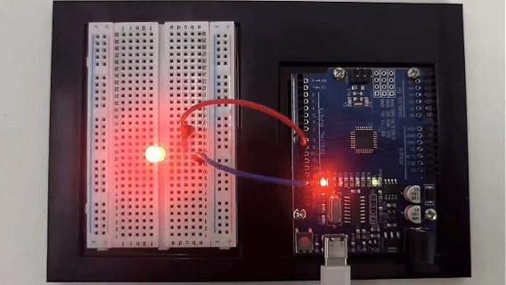

# Proyecto 5: PWM


#### Descripción

PWM (Modulación por Ancho de Pulso) es una tecnología común de control electrónico que controla el valor promedio del voltaje o corriente de salida cambiando el ancho del pulso. Para ponerlo de manera simple, controla la salida de energía controlando la proporción de tiempo de "encendido" y "apagado".

Este proyecto usará una placa de desarrollo Arduino y un LED para controlar el brillo del LED a través de PWM. Mediante la escritura de código Arduino, realizaremos el efecto de degradado del brillo del LED para entender el principio de funcionamiento y la aplicación del PWM.

#### Hardware

1\. Placa de desarrollo UNO R3 (ch340) x1

2\. LED x1

3\. Resistencia de 220 ohmios x1

4\. Protoboard x1

5\. Cables jumper

#### Principio de Funcionamiento

El PWM (Modulación por Ancho de Pulso) de Arduino se usa para controlar el brillo de LEDs, la velocidad de motores, etc. Puede controlar dispositivos analógicos conmutando rápidamente los pines digitales para simular diferentes niveles de voltaje. Este proyecto explorará cómo funciona el PWM en Arduino.

El principio básico del PWM es ajustar el valor promedio del voltaje de salida cambiando el ancho del pulso. Los pines digitales de Arduino solo pueden emitir nivel alto (5V) o nivel bajo (0V). Pero si conmutas rápidamente entre nivel alto y bajo y controlas la duración del nivel alto, puedes simular un voltaje entre 0V y 5V. La proporción de la duración del nivel alto respecto al ciclo completo se llama ciclo de trabajo. Cuanto mayor es el ciclo de trabajo, mayor es el voltaje de salida.


La función analogWrite() de Arduino puede implementar PWM fácilmente. Acepta dos parámetros: número de pin y ciclo de trabajo. El rango de valores del ciclo de trabajo es de 0 a 255, que corresponde a 0% a 100%. Por ejemplo, analogWrite(9, 127) significa emitir una señal PWM con un ciclo de trabajo del 50% en el pin 9.

El módulo temporizador/contador de Arduino se usa para generar señales PWM. Diferentes placas Arduino tienen diferentes cantidades de temporizadores/contadores. Cada temporizador/contador tiene múltiples canales, y cada canal puede generar un PWM de forma independiente. Arduino UNO tiene 3 temporizadores y 6 canales PWM, que están ubicados en los pines 3, 5, 6, 9, 10 y 11.


El núcleo del temporizador/contador es un registro contador (TCNTn). Este se incrementa automáticamente en uno cada ciclo de reloj hasta alcanzar el valor máximo establecido (TOP), luego se reinicia a cero y comienza de nuevo. Al mismo tiempo, existe un registro de comparación (OCRnA/B) usado para guardar el valor del ciclo de trabajo. Cada vez que el valor del contador es igual al registro de comparación, la salida PWM cambia de estado (de nivel alto a nivel bajo, o de nivel bajo a nivel alto). Al configurar diferentes valores TOP y valores de comparación, se pueden cambiar la frecuencia y el ciclo de trabajo del PWM.

La función analogWrite() de Arduino configura automáticamente el modo de trabajo del temporizador, generalmente usando el modo PWM rápido (Fast PWM). En este modo, el contador cuenta continuamente a una frecuencia fija y compara con el registro de comparación. Cuando el valor del contador es igual a TOP, el contador se reinicia a cero y la salida PWM cambia de estado.

Por ejemplo, si usamos un reloj de 16MHz y un contador de 8 bits con un valor TOP de 255, y un valor de comparación de 127, entonces la frecuencia del PWM es 16MHz/(255+1)=62.5kHz. El PWM emite nivel alto cuando el valor del contador es menor que 127, y nivel bajo cuando es mayor que 127. Como 127/256=50%, se emite una señal PWM con un ciclo de trabajo del 50%, que equivale a 2.5V DC.

En resumen, el PWM de Arduino conmuta rápidamente el nivel del pin a través del temporizador y ajusta el ciclo de trabajo, simulando así un voltaje analógico variable continuo en el pin digital. Esto proporciona un medio simple y flexible para controlar el brillo de LEDs, la velocidad de motores, etc. Entender el principio del PWM te ayudará a aplicar mejor esta tecnología y permitirá que Arduino cree proyectos más sorprendentes.

#### Diagrama de Conexiones

El cableado es el mismo que en el Proyecto 3.


#### Código de Ejemplo

```cpp

/*

Electronics Learning Starter Kit for Arduino

Project 5

PWM

Edit By Keyes

*/

int ledPin = 9; // Define el pin del LED

int brightness = 0; // Define la variable de brillo del LED

int fadeAmount = 5; // Define el tamaño del paso del cambio de brillo

void setup() {

pinMode(ledPin, OUTPUT); // Configura el pin del LED en modo salida

}

void loop() {

analogWrite(ledPin, brightness); // Usa la función analogWrite para emitir señal PWM

brightness = brightness + fadeAmount; // Ajusta la variable de brillo

if (brightness <= 0 || brightness >= 255) {

fadeAmount = -fadeAmount; // Cuando el brillo alcanza el valor máximo o mínimo, cambia la dirección del cambio de brillo

}

delay(30); // Retardo de 30ms para controlar la velocidad del cambio de brillo

}
```

#### Explicación del Código

El código define variables y constantes para controlar el comportamiento del LED:

```cpp

int ledPin = 9; // Pin del LED

int brightness = 0; // Brillo del LED

int fadeAmount = 5; // Paso de cambio del brillo

```

Aquí, `ledPin` está configurado en 9, lo que significa que el LED está conectado al pin digital 9 de la placa Arduino. `brightness` rastrea el brillo actual del LED, comenzando en 0 (apagado). `fadeAmount` es el incremento/decremento para los cambios de brillo, establecido en 5.

La función `setup()` inicializa las configuraciones:

```cpp
void setup() {

pinMode(ledPin, OUTPUT); // Configura el pin del LED en modo salida

}
```

En `setup()`, `pinMode()` establece `ledPin` en modo salida (`OUTPUT`), necesario para controlar el brillo del LED.

La función `loop()` controla los cambios de brillo del LED:

```cpp
void loop() {

analogWrite(ledPin, brightness); // Usa analogWrite para controlar el brillo del LED

brightness = brightness + fadeAmount; // Ajusta el brillo

if (brightness <= 0 || brightness >= 255) {

fadeAmount = -fadeAmount; // Invierte la dirección cuando alcanza el máximo/mínimo

}

delay(30); // Retardo para controlar la velocidad del cambio de brillo

}
```

En `loop()`, `analogWrite()` emite una señal PWM al `ledPin`, controlando el brillo del LED. `brightness` se ajusta con `fadeAmount`, creando un efecto de desvanecimiento.

Cuando `brightness` alcanza 0 o 255, `fadeAmount` se invierte usando `fadeAmount = -fadeAmount;`, haciendo que la dirección del cambio de brillo se invierta. Esto crea un desvanecimiento suave entre los estados más brillantes y más oscuros.

Finalmente, `delay(30);` pausa el programa por 30 milisegundos. Este retardo controla la velocidad de los cambios de brillo; retardos más cortos resultan en cambios más rápidos.

#### Resultado del Proyecto

Después de subir el código, el LED mostrará un efecto de degradado.



El brillo aumentará gradualmente de 0 a 255, luego disminuirá gradualmente a 0. Ajustando la variable `fadeAmount`, puedes cambiar la velocidad del cambio de brillo.