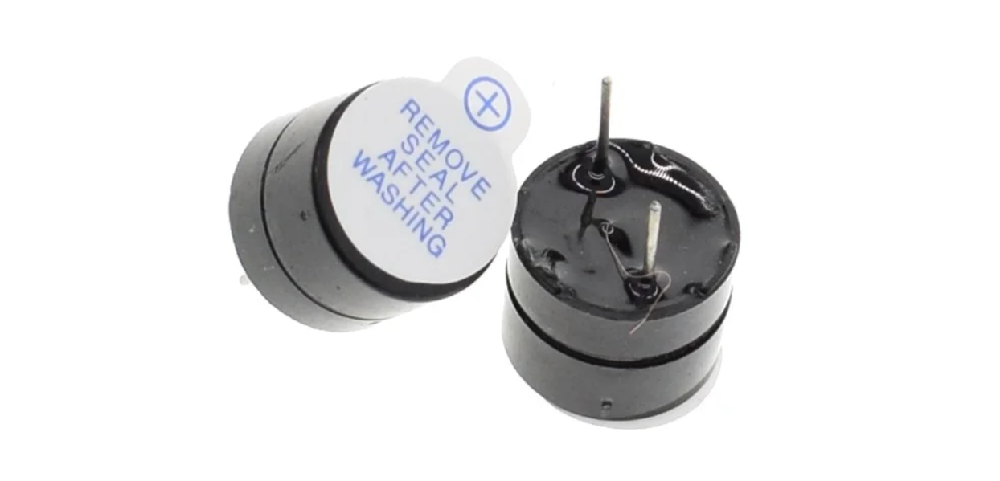
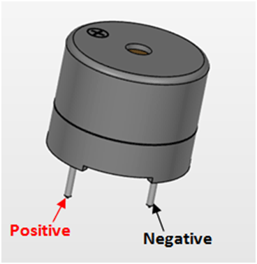
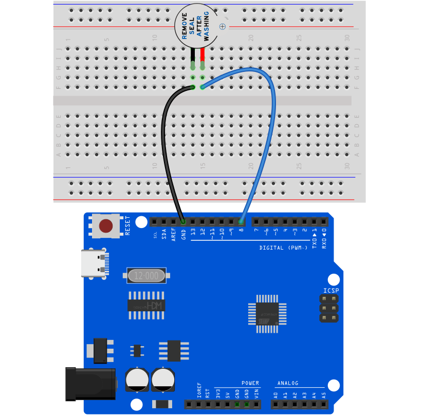
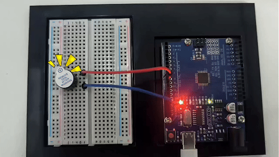

# Проект 6: Активный зуммер




#### Описание

Активный зуммер — это зуммер с встроенной схемой управления. По сравнению с традиционными пассивными зуммерами, он отличается небольшими размерами, регулируемым тоном и простотой управления. В повседневной жизни мы часто встречаем активные зуммеры, например, в мобильных телефонах, компьютерах и бытовой технике.

В этом проекте мы создадим простую систему сигнализации с помощью платы Arduino и активного зуммера. Эта система может использоваться в различных ситуациях, таких как оповещения дверного звонка и предупреждения о превышении температуры.

#### Аппаратное обеспечение

1\. Плата разработки UNO R3 (ch340) x1

2\. Активный зуммер x1

3\. Соединительные провода

#### Принцип работы

Активный зуммер — это распространённое электронное устройство для генерации звука, широко используемое в различной электронной технике. Вот как он работает:

1.  Генератор колебаний: Активный зуммер содержит внутри генератор колебаний, который обычно состоит из резисторов, конденсаторов, транзисторов и других компонентов. Когда зуммер включён, генератор колебаний создаёт электрический сигнал определённой частоты.
1.  Пьезоэлемент: В зуммере также есть пьезоэлемент, который обычно изготовлен из пьезокерамики или пьезоплёнки. Пьезоэлементы обладают уникальными свойствами: при приложении напряжения они деформируются механически; наоборот, при механическом воздействии они генерируют напряжение.

3. Генерация звука: Электрический сигнал, создаваемый генератором колебаний, подаётся на пьезоэлемент, заставляя его быстро механически деформироваться и сдвигать окружающий воздух, создавая звуковые волны. Частота звуковой волны зависит от частоты генератора колебаний, поэтому тон, издаваемый зуммером, можно регулировать изменением параметров генератора.

4. Схема управления: Активный зуммер имеет простую встроенную схему управления, которая усиливает сигнал генератора колебаний и обеспечивает достаточный ток для пьезоэлемента, чтобы звук был достаточно громким.


Короче говоря, активный зуммер генерирует электрический сигнал определённой частоты через внутренний генератор колебаний и использует пьезоэлемент для преобразования электрического сигнала в звук. Этот простой и эффективный принцип работы делает активный зуммер широко используемым электронным устройством для генерации звука.

#### Технические характеристики

Минимальное/максимальное рабочее напряжение: +3.3В до +5В

Максимальный ток: 30мА

Резонансная частота: 2500Гц ± 300Гц непрерывно

Минимальный уровень звука: 85дБ на расстоянии 4 дюйма (10 см)

Температура хранения: от -22°F до 221°F (-30°C до 105°C)

Рабочая температура: от -4°F до 158°F (-20°C до 70°C)

#### Распиновка



#### Схема подключения

1\. Подключите положительный вывод активного зуммера (обычно "S" или "+") к цифровому пину D8 на плате разработки.

2\. Подключите отрицательный вывод зуммера ("-") к GND.




#### Пример кода

```cpp

/*

Electronics Learning Starter Kit for Arduino

Project 6

Active Buzzer

Edit By Keyes

*/

const int BUZZER_PIN = 8;// Define the digital port to which the buzzer is connected

void setup() {

// Set the buzzer port to output mode

pinMode(BUZZER_PIN, OUTPUT);

}

void loop() {

// Make the buzzer sound

digitalWrite(BUZZER_PIN, HIGH);

delay(1000); // Sound lasts 1s

// Stop sounding

digitalWrite(BUZZER_PIN, LOW);

delay(1000); // Stop sounding for 1s

}
```

#### Объяснение кода

```cpp

const int BUZZER_PIN = 8; // Define a constant BUZZER_PIN with a value of 8, indicating the buzzer is connected to digital pin 8

```

Сначала в коде определяется константа `BUZZER_PIN`, в которой хранится номер пина 8, к которому подключён зуммер. Использование константы облегчает понимание и поддержку кода.

```cpp
void setup() {

// Set the buzzer pin to output mode

pinMode(BUZZER_PIN, OUTPUT);

}
```

Функция `setup()` — это специальная функция инициализации в Arduino, которая выполняется первой при запуске или сбросе программы. Здесь функция `pinMode()` устанавливает пин зуммера в режим вывода. Это означает, что пин будет выдавать напряжение для управления внешним устройством — в данном случае зуммером.

```cpp
void loop() {

// Make the buzzer sound

digitalWrite(BUZZER_PIN, HIGH);

delay(1000); // Sound for 1 second

// Stop the sound

digitalWrite(BUZZER_PIN, LOW);

delay(1000); // Stop for 1 second

}
```

Функция `loop()` выполняется непрерывно и является основной функциональной частью кода Arduino. В этом цикле код использует функцию `digitalWrite()`, чтобы установить пин в состояние `HIGH`, заставляя зуммер издавать звук. Затем используется `delay(1000)`, чтобы создать задержку в 1 секунду, позволяя зуммеру звучать 1 секунду. После этого код устанавливает пин в состояние `LOW`, чтобы прекратить звук, и снова делает задержку на 1 секунду. Таким образом, этот цикл заставляет зуммер звучать 1 секунду и молчать 1 секунду в регулярном чередовании.

#### Результат проекта

После загрузки приведённого выше кода на плату разработки активный зуммер будет издавать звук каждую секунду, формируя прерывистый сигнал.



Такой сигнал можно использовать в качестве различных оповещений или предупреждающих сигналов.