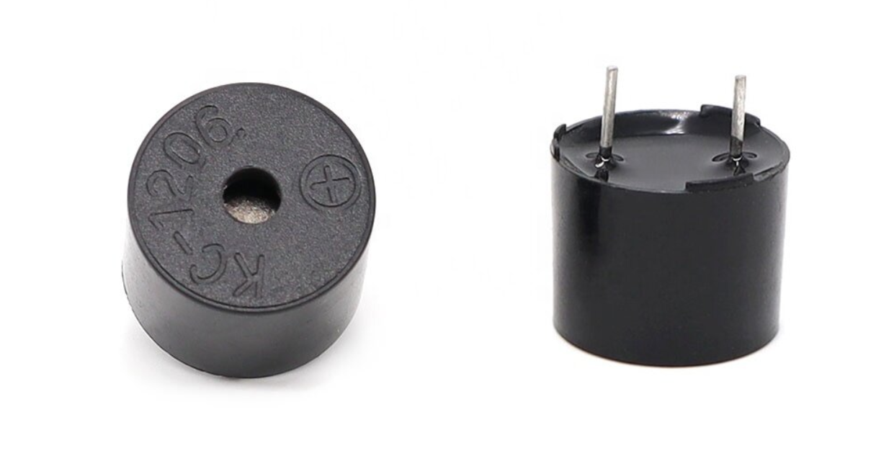
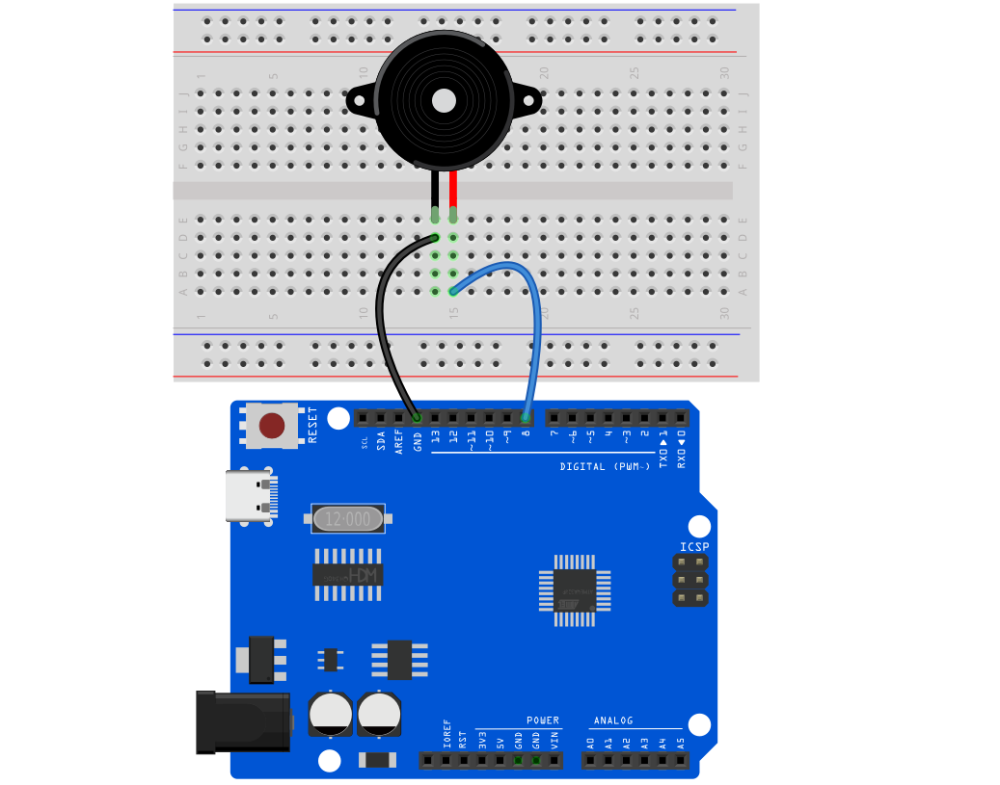
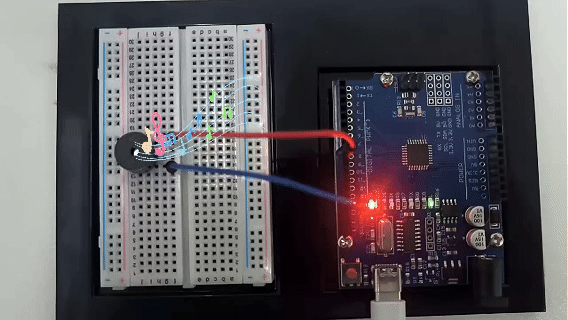

# Proyecto 7: Zumbador Pasivo




#### Descripción

El zumbador pasivo es un componente electrónico común que se utiliza ampliamente en varios dispositivos electrónicos para emitir señales sonoras o alarmas. A diferencia del zumbador activo, el zumbador pasivo no contiene un circuito de oscilación y requiere un circuito externo para proporcionar una señal de pulso para funcionar.

Este proyecto tiene como objetivo controlar un zumbador pasivo para emitir sonidos de diferentes frecuencias a través de una placa de desarrollo Arduino para reproducir una melodía simple.

#### Hardware

1\. Placa de desarrollo UNO R3 （ch340） x1

2\. Zumbador pasivo x1

3\. Protoboard x1

4\. Cables jumper

#### Principio de Funcionamiento

El zumbador pasivo es un componente electrónico común que se utiliza ampliamente en varios dispositivos electrónicos para emitir señales sonoras o alarmas. Su principio de funcionamiento se basa en el efecto piezoeléctrico.

Hay una pieza de cerámica piezoeléctrica dentro del zumbador pasivo. Cuando se aplica un voltaje, la pieza de cerámica piezoeléctrica se deforma mecánicamente, lo que provoca que vibre y emita sonido. Cuando la frecuencia del voltaje de CA coincide con la frecuencia natural de la pieza de cerámica piezoeléctrica, el zumbador producirá la máxima salida sonora.


Los zumbadores pasivos requieren un circuito externo para proporcionar una señal de conducción, que generalmente utiliza una señal de onda cuadrada o de pulso. La frecuencia de la señal de conducción determina el tono del sonido del zumbador, mientras que la amplitud de la señal afecta el volumen. Cambiando la frecuencia y el ciclo de trabajo de la señal de conducción, se puede controlar el zumbador para emitir diferentes efectos sonoros.

En comparación con los zumbadores activos, los zumbadores pasivos tienen una estructura simple y bajo costo, pero requieren circuitos externos para proporcionar señales de conducción. En aplicaciones prácticas, es necesario seleccionar un zumbador pasivo adecuado según las necesidades específicas y diseñar un circuito de conducción correspondiente para lograr el efecto sonoro requerido.

#### Especificaciones

Voltaje de operación mínimo/máximo: 1.5V a 5V DC

Corriente: <25mA

Frecuencia: <20Hz a >2.5kHz

#### Pinout


#### Diagrama de Conexiones

1\. Conectar el polo positivo del zumbador pasivo al pin digital D8 de la placa de desarrollo.

2\. Conectar el polo negativo del zumbador pasivo a GND del puerto.




#### Código de Ejemplo

```cpp

/*

Electronics Learning Starter Kit for Arduino

Project 7

Passive Buzzer

Edit By Keyes

*/

const int buzzerPin = 8; // Define the digital pin to which the buzzer is connected

// Define the frequency corresponding to the note

#define NOTE_C4 262

#define NOTE_D4 294

#define NOTE_E4 330

#define NOTE_F4 349

#define NOTE_G4 392

#define NOTE_A4 440

#define NOTE_B4 494

#define NOTE_C5 523

// Define a melody array containing notes and duration

int melody[] = {

NOTE_C4, NOTE_G4, NOTE_G4, NOTE_A4, NOTE_G4, 0, NOTE_B4, NOTE_C5

};

int noteDurations[] = {

4, 8, 8, 4, 4, 4, 4, 4

};

void setup() {

pinMode(buzzerPin, OUTPUT); // Set the buzzer pin to output mode

}

void loop() {

// Play a melody in a loop

for (int thisNote = 0; thisNote < 8; thisNote++) {

int noteDuration = 1000 / noteDurations[thisNote]; // Calculate note duration

tone(buzzerPin, melody[thisNote], noteDuration); // Play notes

int pauseBetweenNotes = noteDuration * 1.30; // Calculate the pause time between notes

delay(pauseBetweenNotes); // Wait for pause time

noTone(buzzerPin); // Stop playing notes

}

}
```

#### Explicación del Código

1\. Definir el pin del zumbador

```cpp

const int buzzerPin = 8; // Define el pin digital al que está conectado el zumbador

```

Esta línea de código define una constante `buzzerPin` y la establece en 8. Esto significa que el zumbador está conectado al pin digital I/O 8 en la placa Arduino. En la programación de Arduino, usar constantes puede mejorar la legibilidad y el mantenimiento del código.

2\. Definir las frecuencias de las notas

```cpp
#define NOTE_C4 262

#define NOTE_D4 294

#define NOTE_E4 330

#define NOTE_F4 349

#define NOTE_G4 392

#define NOTE_A4 440

#define NOTE_B4 494

#define NOTE_C5 523
```

Estas directivas del preprocesador definen las frecuencias (en Hertz) de varias notas musicales. Estos valores representan las frecuencias estándar de diferentes notas, como el Do medio (C4) a 262Hz. Estas definiciones hacen que sea más intuitivo y conveniente referirse a estas notas en el código.

3\. Definir la melodía y el ritmo

```cpp

int melody[] = {

NOTE_C4, NOTE_G4, NOTE_G4, NOTE_A4, NOTE_G4, 0, NOTE_B4, NOTE_C5

};

int noteDurations[] = {

4, 8, 8, 4, 4, 4, 4, 4

};

```

Estos dos arreglos definen las notas de la melodía y la duración de cada nota, respectivamente. El arreglo `melody` almacena una secuencia de frecuencias de notas, mientras que el arreglo `noteDurations` define la duración relativa de cada nota. Por ejemplo, `4` representa una negra, y `8` representa una corchea.

Inicialización en setup

```cpp
void setup() {

pinMode(buzzerPin, OUTPUT); // Configura el pin del zumbador como salida

}
```

En la función `setup()`, configuramos `buzzerPin` como salida usando la función `pinMode()`. Esto es porque el zumbador necesita recibir señales eléctricas desde el Arduino para producir sonido.

Bucle principal para reproducir la melodía

```cpp
void loop() {

for (int thisNote = 0; thisNote < 8; thisNote++) {

int noteDuration = 1000 / noteDurations[thisNote]; // Calcula la duración de la nota

tone(buzzerPin, melody[thisNote], noteDuration); // Reproduce la nota

int pauseBetweenNotes = noteDuration * 1.30; // Calcula la pausa entre notas

delay(pauseBetweenNotes); // Espera la duración de la pausa

noTone(buzzerPin); // Detiene la reproducción de la nota

}

}
```

El código en la función `loop()` es el núcleo de todo el programa. Itera a través de cada nota en el arreglo `melody` usando un bucle y reproduce cada nota en el zumbador usando la función `tone()`. La duración real de cada nota se calcula dividiendo 1000 milisegundos por el valor correspondiente en el arreglo `noteDurations`. Después de reproducir cada nota, el programa pausa por una cierta duración usando la función `delay()`. Esta pausa es ligeramente más larga que la duración de la nota para crear un espacio entre las notas. La función `noTone()` se usa para detener la reproducción de la nota actual, y luego el programa procede a la siguiente nota.

#### Resultado del Proyecto

Después de cargar el código, el zumbador pasivo reproducirá una melodía simple en secuencia según las notas y la duración en el arreglo de la melodía.

