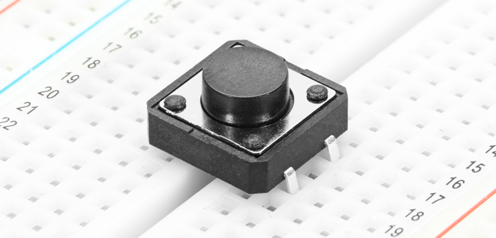
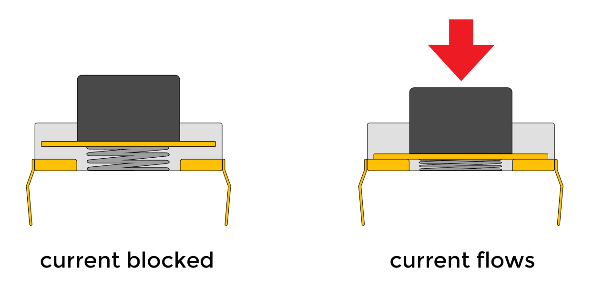
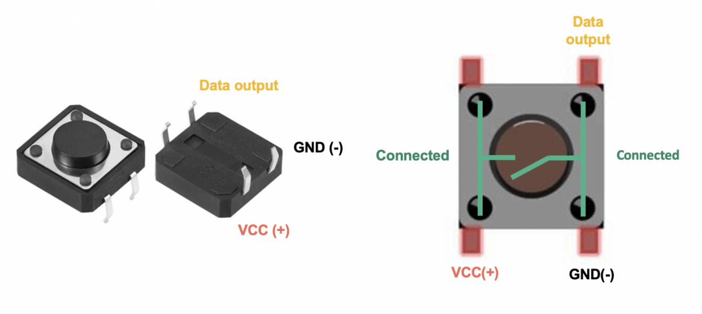
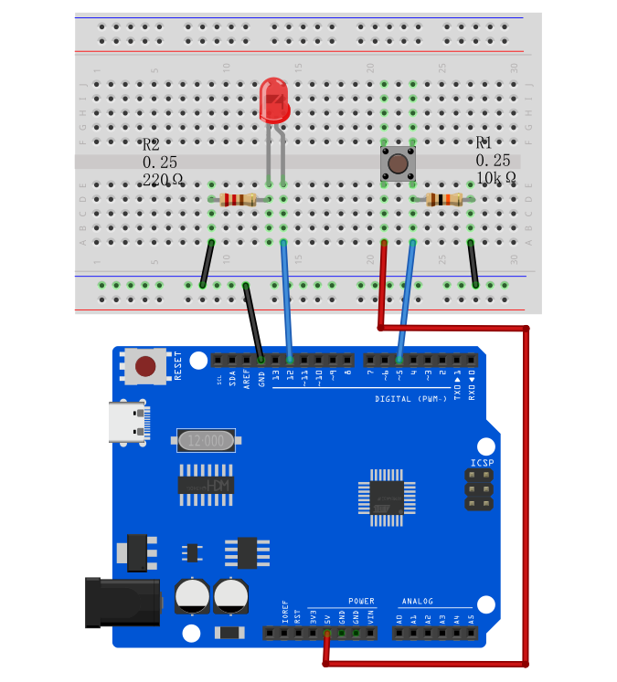
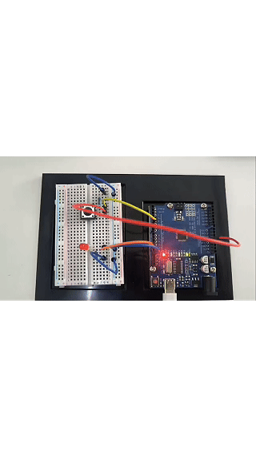

# Proyecto 8: LED Controlado por Botón




#### Descripción

El interruptor de botón es un componente eléctrico común que controla el encendido y apagado de un circuito al presionar un botón, y se utiliza ampliamente en diversos dispositivos electrónicos, como teléfonos móviles, computadoras, televisores, controles remotos, etc.

Este proyecto utilizará un interruptor de botón y un LED para hacer un proyecto de LED controlado por botón, que es un proyecto Arduino simple e interesante que controla el encendido y apagado del LED mediante un interruptor de botón. Este proyecto puede ayudar a los principiantes a entender cómo funciona un botón y cómo usar entradas y salidas digitales en Arduino.

#### Hardware

1\. Placa de desarrollo UNO R3 （ch340） x1

2\. Protoboard x1

3\. Botón x1

4\. LED x1

5\. Resistencia de 220 ohmios x1

6\. Resistencia de 10k ohmios x1

7\. Cables jumper

#### Principio de Funcionamiento

El interruptor de botón es un interruptor mecánico común. Cuando se presiona el botón, dos contactos se cierran, permitiendo el paso de corriente; cuando se suelta el botón, los contactos se abren y la corriente se detiene. En este proyecto, usaremos una resistencia pull-up para que cuando el botón no esté presionado, el pin digital del Arduino lea alto (5V); cuando se presione, el pin digital leerá nivel bajo (0V).


Los botones son un dispositivo de entrada común que se utilizan ampliamente en varios productos electrónicos, como teclados, controles remotos y teléfonos. El principio de funcionamiento del botón se basa en el conmutador del circuito. Cuando se presiona el botón, las láminas conductoras internas se ponen en contacto, cerrando el circuito y permitiendo el flujo de corriente; cuando se suelta el botón, las láminas conductoras se separan, el circuito se desconecta y la corriente deja de fluir.

La estructura interna del botón generalmente incluye componentes como láminas conductoras, partes elásticas y carcasas. La lámina conductora generalmente está hecha de materiales metálicos y se usa para conducir circuitos; las partes elásticas como resortes o caucho proporcionan una fuerza restauradora para que los botones puedan volver automáticamente a su posición original después de ser soltados; la carcasa cumple una función de protección y fijación, y determina la apariencia y sensación de los botones.



A través de las características de conmutación y el diseño del circuito de los botones, se pueden realizar diversas funciones, como entrada digital o de caracteres, control de dispositivos, ajuste de parámetros, etc. Como una de las formas importantes de interacción humano-computadora, los botones son indispensables en los equipos electrónicos modernos debido a su principio de funcionamiento simple y confiable.

#### Especificaciones

Modo de operación: Retroalimentación táctil

Calificación de potencia: MÁX 50mA 24V DC

Resistencia de aislamiento: 100MΩ a 100V

Fuerza de operación: 2.55±0.69 N

Resistencia de contacto: MÁX 100mΩ

Rango de temperatura de operación: -20 a +70 ℃

Rango de temperatura de almacenamiento: -20 a +70 ℃

#### Pinout



#### Diagrama de Conexiones

1\. Conectar un pin del botón a GND y el pin digital D5 de la placa de desarrollo a través de una resistencia de 10K respectivamente, y el otro pin a VCC.

2\. Conectar el ánodo (pin largo) del LED al pin digital D12 de la placa Arduino y el cátodo (pin corto) a GND a través de una resistencia de 220 ohmios.




#### Código de Ejemplo

```cpp

/*

Electronics Learning Starter Kit for Arduino

Project 8

Button Controlled LED

Edit By Keyes

*/

const int buttonPin = 5;

const int ledPin = 12;

int buttonState = 0;

void setup() {

pinMode(ledPin, OUTPUT);

pinMode(buttonPin, INPUT);

}

void loop() {

buttonState = digitalRead(buttonPin);

if (buttonState == LOW) {

digitalWrite(ledPin, LOW);

} else {

digitalWrite(ledPin, HIGH);

}

}
```

#### Explicación del Código

Definiciones de Variables

```cpp

const int buttonPin = 5; // Definición constante, número de pin del botón

const int ledPin = 12; // Definición constante, número de pin del LED

int buttonState = 0; // Definición de variable, usada para almacenar el estado del botón

```

Primero, definimos tres variables:

`buttonPin`: representa el número de pin donde el botón está conectado al Arduino, que es el pin 5.

`ledPin`: representa el número de pin donde el LED está conectado al Arduino, que es el pin 12.

`buttonState`: se usa para almacenar el valor del estado leído del botón.

Función setup

```cpp
void setup() {

pinMode(ledPin, OUTPUT); // Configura el pin del LED como modo salida

pinMode(buttonPin, INPUT); // Configura el pin del botón como modo entrada

}
```

La función `setup()` se ejecuta una vez cuando el Arduino inicia o se reinicia y se usa para configuraciones de inicialización. En esta función:

`pinMode(ledPin, OUTPUT)`: configura el pin del LED como modo salida, lo que significa que se puede controlar la corriente a través de este pin para encender o apagar el LED.

`pinMode(buttonPin, INPUT)`: configura el pin del botón como modo entrada, lo que significa que este pin se usa para leer el estado del botón.

Función loop

```cpp
void loop() {

buttonState = digitalRead(buttonPin); // Lee el estado del botón y lo almacena en la variable buttonState

if (buttonState == LOW) { // Si el botón está en estado no presionado (nivel bajo)

digitalWrite(ledPin, LOW); // Apaga el LED

} else { // De lo contrario (botón presionado, nivel alto)

digitalWrite(ledPin, HIGH); // Enciende el LED

}

}
```

La función `loop()` se ejecuta repetidamente durante la ejecución del programa. En esta función:

`buttonState = digitalRead(buttonPin)`: usa la función `digitalRead` para leer el nivel de voltaje del pin del botón y almacena el resultado en la variable `buttonState`.

`if (buttonState == LOW)`: verifica si el estado leído del botón es nivel bajo (botón no presionado).

`digitalWrite(ledPin, LOW)`: pone el LED en estado apagado (nivel bajo).

Si el estado del botón no es nivel bajo (es decir, nivel alto, indicando que el botón está presionado),

`digitalWrite(ledPin, HIGH)`: pone el LED en estado encendido (nivel alto).

#### Resultado del Proyecto

Después de subir el código a la placa de desarrollo, cuando el botón no está presionado, el LED se apaga; cuando el botón está presionado, el LED se enciende.

