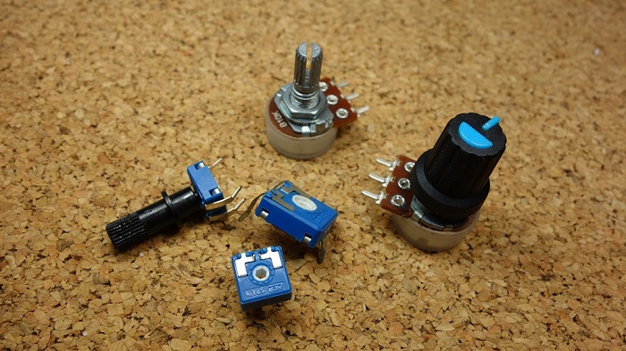
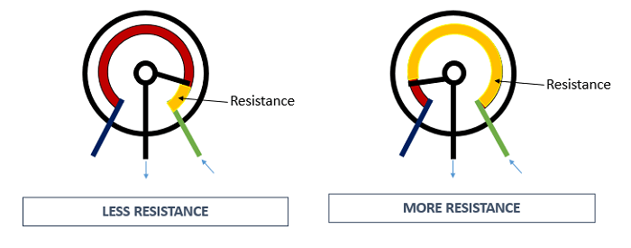
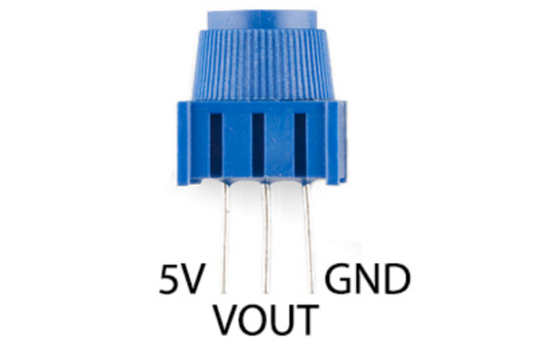
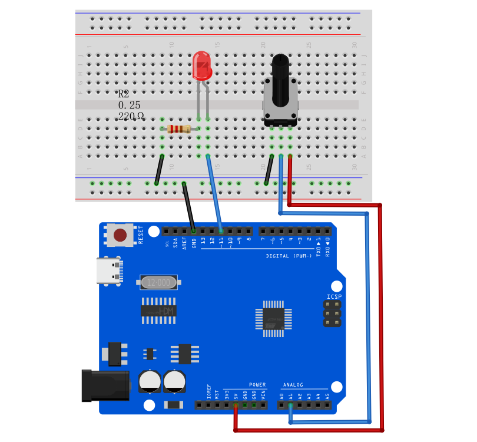
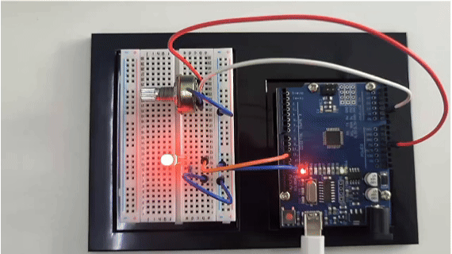

# Проект 9: Потенциометр




#### Описание

Потенциометр состоит из вращающейся ручки и резистора, значение сопротивления которого изменяется при повороте ручки, тем самым контролируя ток в цепи.

В этом проекте мы создаем схему, в которой яркость светодиода можно регулировать с помощью программирования на плате разработки и вращения потенциометра. Таким образом, мы можем понять, как работает потенциометр и как использовать аналоговые входы в Arduino.

#### Аппаратное обеспечение

1\. Плата разработки UNO R3 (ch340) x1

2\. Макетная плата x1

3\. Потенциометр (10kΩ) x1

4\. Светодиод x1

5\. Резистор 220Ω x1

6\. Перемычки

#### Принцип работы

Потенциометр имеет 3 вывода. Два крайних (синий и зеленый) подключены к резистивному элементу, а третий вывод (черный) подключен к регулируемому ползунку.


Потенциометр может работать как **реостат** (переменный резистор) или как **делитель напряжения**.

Реостат

Для использования потенциометра в качестве реостата используются только два вывода: один крайний и центральный. Положение ползунка определяет, какое сопротивление потенциометр оказывает цепи, как показано на рисунке:



Если у нас есть потенциометр на 10kΩ, это означает, что максимальное сопротивление переменного резистора — 10kΩ, а минимальное — 0Ω. Это значит, что изменяя положение ползунка, вы получаете значение сопротивления в диапазоне от 0Ω до 10kΩ.

Технические характеристики:

Стандартный диапазон сопротивления: от 10 до 2 мегом

Допуск сопротивления: ±10 % стандарт

Абсолютное минимальное сопротивление: максимум 2 ома

Изменение контактного сопротивления: 2 % или максимум 3 ома (в зависимости от того, что больше)

Напряжение: ±0.05 %

Сопротивление: ±0.15 %

Разрешающая способность: бесконечная

Изоляционное сопротивление: 500 В постоянного тока, минимум 1000 мегом

Мощность (максимум 300 вольт):

85 °C: 0.5 ватт

150 °C: 0 ватт

Диапазон температур: от -55 °C до +125 °C

Температурный коэффициент: ±100 ppm/°C

Крутящий момент: максимум 5.0 унций-дюйм

#### Распиновка



#### Схема подключения

1\. Вставьте три вывода потенциометра в отверстия макетной платы.

2\. Подключите один из крайних выводов потенциометра к пину 5V на плате разработки.

3\. Подключите другой крайний вывод потенциометра к пину GND на плате разработки.

4\. Подключите средний вывод потенциометра к аналоговому входу A1 на плате разработки.

5\. Подключите анод светодиода (длинный вывод) к цифровому пину 11 на плате через резистор 220Ω.

6\. Подключите катод светодиода (короткий вывод) к GND на плате.




#### Пример кода

```cpp

/*

Electronics Learning Starter Kit for Arduino

Project 9

Potentiometer

Edit By Keyes

*/

int potPin = A1; // Connect the potentiometer to analog pin A1

int ledPin = 11; // Connect LED to digital pin 11

int potValue = 0; // store the read values of potentiometer

int ledValue = 0; // store the brightness values of LED

void setup() {

pinMode(ledPin, OUTPUT); // set LED pin to output

}

void loop() {

potValue = analogRead(potPin); // Read the potentiometer value (range 0-1023)

ledValue = map(potValue, 0, 1023, 0, 255); // map the potentiometer value to the LED brightness(0-255)

analogWrite(ledPin, ledValue); // set LED brightness

delay(10); // delay

}
```

#### Объяснение кода

Сначала рассмотрим часть кода с определением и инициализацией переменных:

```cpp

int potPin = A1; // Connect the potentiometer to analog pin A1

int ledPin = 11; // Connect LED to digital pin 11

int potValue = 0; // store the read values of potentiometer

int ledValue = 0; // store the brightness values of LED

```

Здесь мы определяем четыре переменные:

`potPin`: определяет аналоговый вход A1 на плате Arduino, к которому подключен потенциометр.

`ledPin`: определяет цифровой пин 11, к которому подключен светодиод.

`potValue`: используется для хранения значений, считанных с потенциометра.

`ledValue`: используется для хранения значений яркости, соответствующих светодиоду.

Далее функция `setup()`:

```cpp
void setup() {

pinMode(ledPin, OUTPUT); // set LED pin to output

}
```

Функция `setup()` выполняется один раз при запуске Arduino и используется для установки режимов пинов или инициализации последовательной связи. Здесь мы устанавливаем `ledPin` в режим вывода, так как светодиоду нужно подавать сигналы питания с Arduino.

Затем основной цикл `loop()`:

```cpp
void loop() {

potValue = analogRead(potPin); // Read the potentiometer value (range 0-1023)

ledValue = map(potValue, 0, 1023, 0, 255); // map the potentiometer value to the LED brightness(0-255)

analogWrite(ledPin, ledValue); // set LED brightness

delay(10); // delay

}
```

Функция `loop()` выполняется непрерывно на Arduino после загрузки и выполняет следующие операции:

1\. Считывает значение потенциометра с `potPin` с помощью функции `analogRead()`. Значения потенциометра варьируются от 0 до 1023, что соответствует положению ручки потенциометра.

2\. Преобразует считанное значение потенциометра (0-1023) в значение яркости (0-255), которое может принимать светодиод, с помощью функции `map()`. Это необходимо, так как функция `analogWrite()`, используемая для ШИМ-выхода, принимает значения только от 0 до 255.

3\. Отправляет преобразованное значение яркости на `ledPin` с помощью функции `analogWrite()`, регулируя яркость светодиода.

4\. Вызов `delay(10)` приостанавливает цикл на 10 миллисекунд после каждого выполнения. Это снижает частоту считывания и предотвращает ненужное мерцание, вызванное слишком быстрым изменением яркости.

#### Результат проекта

После загрузки кода на плату разработки поверните потенциометр, и вы увидите, как изменяется яркость светодиода. Поворачивайте по часовой стрелке, чтобы сделать свет ярче, и против часовой стрелки — чтобы сделать его тусклее.


