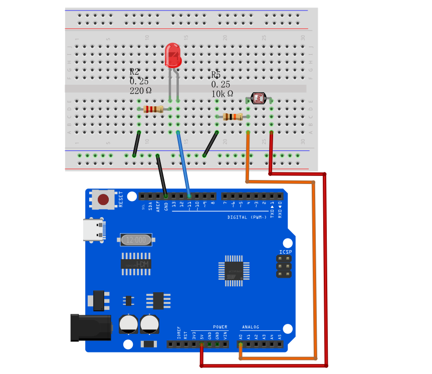
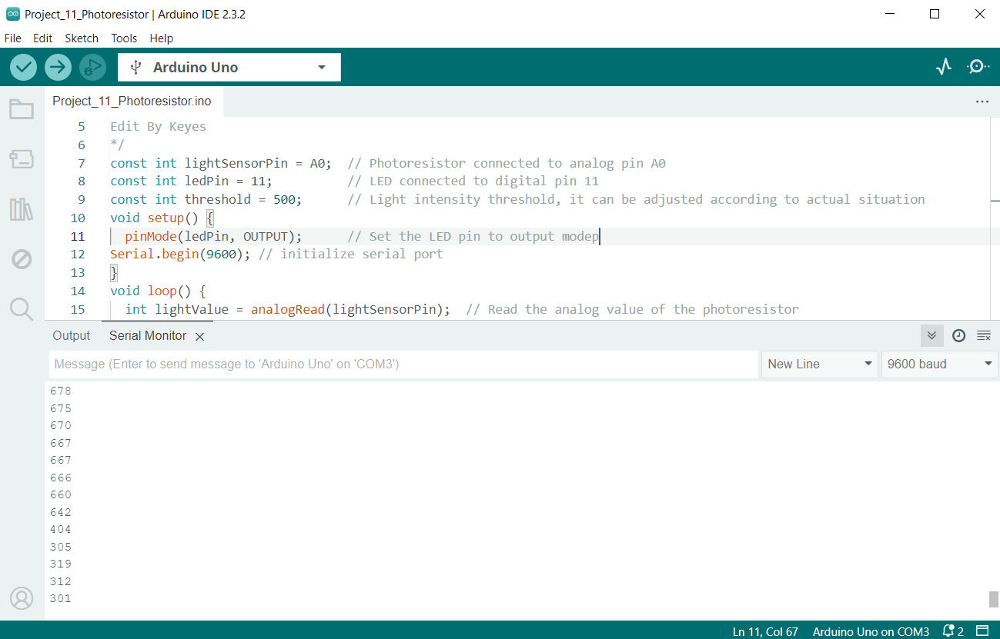
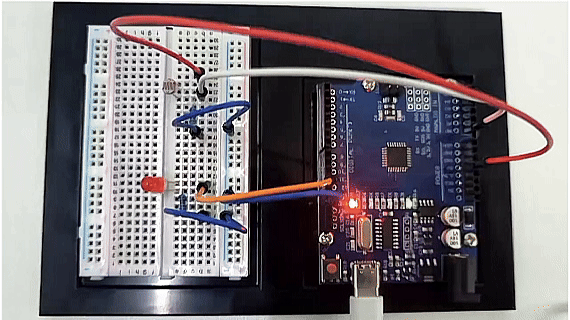

# Proyecto 10: Fotoresistor


#### Descripción

El fotoresistor es una resistencia sensible a la luz. Cuando la luz incide sobre un fotoresistor, su resistencia cambia. Cuanto más fuerte es la luz, menor es la resistencia; cuanto más débil es la luz, mayor es la resistencia. Esta característica hace que el fotoresistor sea un componente optoelectrónico importante y se utilice ampliamente en diversos circuitos de control de luz.

Este proyecto utilizará una placa de desarrollo UNO R3 (ch340) y un fotoresistor para implementar un circuito simple de LED controlado por luz. Cuando la luz ambiental se vuelve oscura, el LED se encenderá automáticamente; cuando se vuelve más brillante, el LED se apagará automáticamente.

#### Hardware

1\. Placa de desarrollo UNO R3 (ch340) x 1

2\. Fotoresistor x 1

3\. LED x 1

4\. Resistencia de 220Ω x 1

5\. Resistencia de 10kΩ x 1

6\. Protoboard x 1

7\. Cables de conexión

#### Principio de Funcionamiento

Para entender el principio de funcionamiento de un fotoresistor, repasemos un poco sobre los electrones de valencia y los electrones libres.

Como sabemos, los electrones de valencia son aquellos que se encuentran en la capa más externa de un átomo. Por lo tanto, están débilmente ligados al núcleo del átomo. Esto significa que se necesita solo una pequeña cantidad de energía para extraerlos de la órbita externa.

Los electrones libres, por otro lado, son aquellos que no están ligados al núcleo y, por lo tanto, son libres para moverse cuando se aplica una energía externa como un campo eléctrico. Así, cuando cierta energía hace que el electrón de valencia salga de la órbita externa, actúa como un electrón libre; listo para moverse siempre que se aplique un campo eléctrico. La energía luminosa se usa para convertir un electrón de valencia en un electrón libre.

Este principio básico es utilizado en el fotoresistor. La luz que incide sobre un material fotoconductor es absorbida por este, lo que a su vez genera muchos electrones libres a partir de los electrones de valencia.

La figura a continuación muestra una representación pictórica de lo mismo:

Principio de Funcionamiento del Fotoresistor

A medida que la energía luminosa que incide sobre el material fotoconductor aumenta, el número de electrones de valencia que ganan energía y abandonan el enlace con el núcleo también aumenta. Esto conduce a que un gran número de electrones de valencia salten a la banda de conducción, listos para moverse con la aplicación de cualquier fuerza externa como un campo eléctrico.

*Por lo tanto, a medida que la intensidad de la luz aumenta, el número de electrones libres también aumenta. Esto significa que la fotoconductividad aumenta, lo que implica una disminución en la fotoresistencia del material.*

Ahora que hemos cubierto el mecanismo de funcionamiento, tenemos una idea de que se utiliza un material fotoconductor para la construcción de un fotoresistor. Según el tipo de material fotoconductor, los fotoresistores son de dos tipos. Una breve introducción se da en la siguiente sección.

#### Especificaciones

Resistencia: 10kΩ

Voltaje de trabajo: 3.3-5V

Corriente de trabajo: 20mA

Potencia máxima: 0.1W

Temperatura de operación: -10 grados Celsius a +50 grados Celsius

#### Pinout


#### Diagrama de Conexiones

1\. Conecte un extremo del fotoresistor al pin de 5V de la placa de desarrollo, y el otro extremo del pin a la resistencia de 10kΩ,

2\. conecte esa resistencia de 10kΩ a GND de la placa.

3\. Conecte la unión del fotoresistor y la resistencia de 10kΩ al pin de entrada analógica A0 de la placa de desarrollo.

4\. Conecte el ánodo del LED (pin largo) al pin digital 13 en la placa a través de una resistencia de 220Ω, y el cátodo (pin corto) a GND.





#### Código de Ejemplo

```cpp

/*

Electronics Learning Starter Kit for Arduino

Project 10

Photoresistor

Edit By Keyes

*/

const int lightSensorPin = A0; // Photoresistor connected to analog pin A0

const int ledPin = 11; // LED connected to digital pin 11

const int threshold = 500; // Light intensity threshold, it can be adjusted according to actual situation

void setup() {

pinMode(ledPin, OUTPUT); // Set the LED pin to output mode

Serial.begin(9600); // initialize serial port

}

void loop() {

int lightValue = analogRead(lightSensorPin); // Read the analog value of the photoresistor

Serial.println(lightValue); // print the light sensor value on the serial monitor

if (lightValue < threshold) {

digitalWrite(ledPin, HIGH); // If the light intensity is less than the threshold, the LED will light up

} else {

digitalWrite(ledPin, LOW); // If the light intensity is greater than the threshold, the LED will light off

}

delay(100); // delay 100ms

}
```

#### Explicación del Código

1\. Definición de constantes y variables

```cpp

const int lightSensorPin = A0; // El sensor de luz está conectado al pin analógico A0

const int ledPin = 11; // El LED está conectado al pin digital 11

const int threshold = 500; // Umbral de intensidad de luz, puede ajustarse según las condiciones reales

```

`lightSensorPin` define el pin al que está conectado el sensor de luz, que es el pin analógico A0.

`ledPin` define el pin al que está conectado el LED, que es el pin digital 11.

`threshold` establece el umbral para la intensidad de luz. Cuando la luz ambiental está por debajo de este valor, el LED se encenderá; de lo contrario, el LED se apagará. Este umbral puede ajustarse según las necesidades reales.

2\. Configuración inicial

```cpp
void setup() {

pinMode(ledPin, OUTPUT); // Configura el pin del LED como salida

Serial.begin(9600); // Inicializa la comunicación serial con una velocidad de 9600 baudios

}
```

`pinMode(ledPin, OUTPUT)` configura el pin del LED en modo salida, para que el LED pueda ser controlado para encenderse o apagarse.

`Serial.begin(9600)` inicializa la comunicación serial para depuración y visualización de las lecturas del sensor de luz. La velocidad de baudios se establece en 9600.

3\. Lectura y control en el loop

```cpp
void loop() {

int lightValue = analogRead(lightSensorPin); // Lee el valor analógico del sensor de luz

Serial.println(lightValue); // Imprime el valor del sensor de luz en el monitor serial

if (lightValue < threshold) {

digitalWrite(ledPin, HIGH); // Si la intensidad de luz es menor que el umbral, enciende el LED

} else {

digitalWrite(ledPin, LOW); // Si la intensidad de luz es mayor o igual al umbral, apaga el LED

}

delay(100); // Retardo de 100 milisegundos

}
```

`analogRead(lightSensorPin)` lee el valor analógico del sensor de luz. Esto devuelve un entero entre 0 y 1023, que representa la intensidad de luz detectada por el sensor.

`Serial.println(lightValue)` imprime la lectura del sensor de luz en el monitor serial para depuración y observación de cambios en la intensidad de luz en tiempo real.

`if (lightValue < threshold)` verifica si la lectura es menor que el umbral preestablecido:

Si es menor que el umbral, se ejecuta `digitalWrite(ledPin, HIGH)` para encender el LED.

Si no es menor que el umbral, se ejecuta `digitalWrite(ledPin, LOW)` para apagar el LED.

`delay(100)` establece un tiempo de retardo de 100 milisegundos para evitar que el programa se ejecute demasiado rápido y cause parpadeo en el LED.

#### Resultado del Proyecto

Después de cargar el código en la placa de desarrollo, el LED se encenderá automáticamente cuando la luz ambiental se vuelva oscura; cuando la luz ambiental se vuelva más brillante, el LED se apagará automáticamente. Puede observar los cambios en el LED bloqueando o iluminando el fotoresistor.



