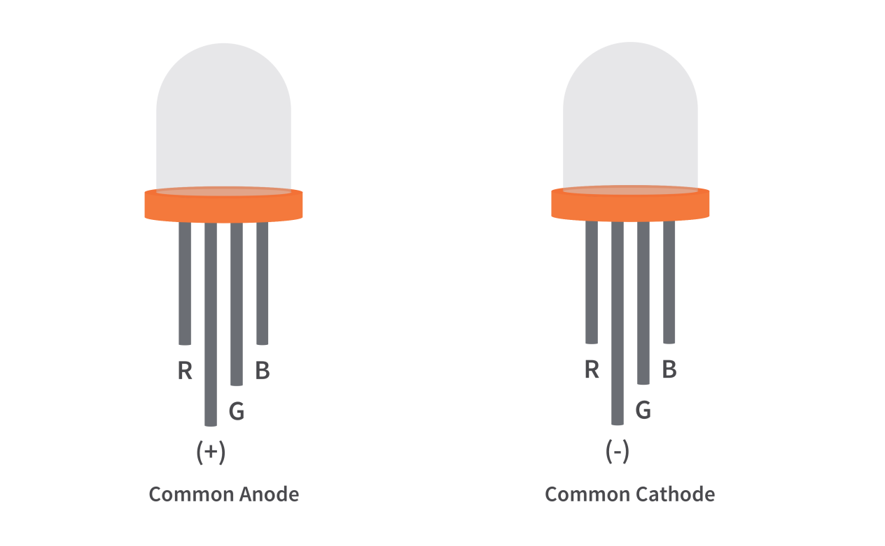
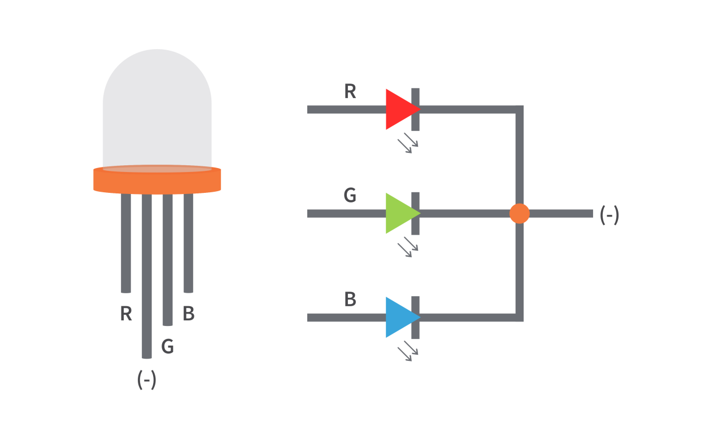
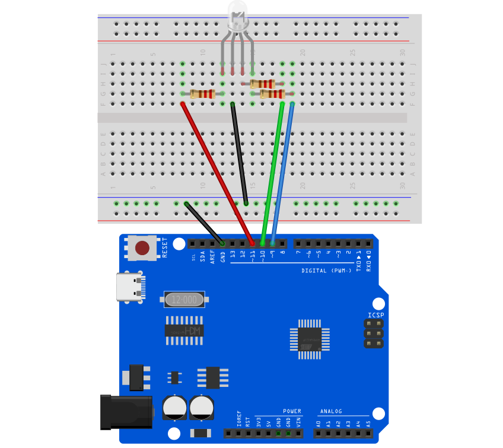
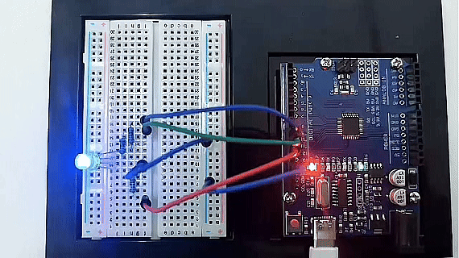

# Proyecto 11: LED RGB


#### Descripción

El LED RGB (Diodo Emisor de Luz Rojo Verde Azul) es un diodo emisor de luz que puede emitir luz en tres colores básicos: rojo, verde y azul, y producir varios otros colores mediante diferentes combinaciones de estos tres colores.

Este proyecto utilizará un LED RGB para lograr cambios de color y efectos de degradado del LED RGB mediante programación en Arduino.

#### Hardware

1\. Placa de desarrollo UNO R3 (ch340) x1

2\. LED RGB x1

3\. Resistencia de 220 ohm x3

4\. Protoboard x1

5\. Cables jumper

#### Principio de Funcionamiento

Un LED RGB es básicamente un paquete LED que puede producir casi cualquier color. Puede usarse en diferentes aplicaciones como iluminación decorativa exterior, diseños de iluminación para escenarios, iluminación decorativa para el hogar, pantalla de matriz LED y más.

Los LEDs RGB tienen tres LEDs internos (Rojo, Verde y Azul) que pueden combinarse para producir casi cualquier salida de color. Para producir diferentes tipos de colores, necesitamos ajustar la intensidad de cada LED interno y combinar las tres salidas de color. En este proyecto, usaremos PWM para ajustar la intensidad de los LEDs rojo, verde y azul individualmente y el truco aquí es que nuestros ojos verán la combinación de los colores, en lugar de los colores individuales porque los LEDs están muy cerca uno del otro en el interior.

**Tipos y Estructura del LED RGB**

Como se mencionó anteriormente, los LEDs RGB tienen tres LEDs en su interior y usualmente, estos tres LEDs internos comparten un ánodo común o un cátodo común, especialmente en un paquete de orificio pasante. Básicamente, podemos categorizar los LEDs RGB como tipo ánodo común o cátodo común, al igual que en los displays de siete segmentos.



Cuando miras un LED RGB, verás que tiene cuatro terminales. Si lo colocas de modo que su terminal más largo esté en segundo lugar desde la izquierda, los terminales deberían estar en el siguiente orden: rojo, ánodo o cátodo, verde y azul.

**LED RGB Ánodo Común**

En un LED RGB de ánodo común, los ánodos de los LEDs internos están todos conectados al terminal ánodo externo. Para controlar cada color, necesitas aplicar una señal LOW o tierra a los terminales rojo, verde y azul y conectar el terminal ánodo al terminal positivo de la fuente de alimentación.


**LED RGB Cátodo Común**

En un LED RGB de cátodo común, los cátodos de los LEDs internos están todos conectados al terminal cátodo externo. Para controlar cada color, necesitas aplicar una señal HIGH o VCC a los terminales rojo, verde y azul y conectar el terminal ánodo al terminal negativo de la fuente de alimentación.

#### Especificaciones

Baja resistencia térmica

Sin rayos UV

Salida de flujo super alta y alta luminancia

Corriente directa para color rojo, azul y verde: 20mA

Voltaje directo

Rojo: 2v (típico)

Azul: 3.2 (típico)

Verde: 3.2 (típico)

Intensidad luminosa

Rojo: 800 mcd

Azul: 4000 mcd

Verde: 900 mcd

Longitud de onda

Rojo: 625 nm

Azul: 520 nm

Verde: 467.5 nm

Temperatura de operación: -25 ℃ a 85 ℃

Temperatura de almacenamiento: -30 ℃ a 85 ℃

#### Diagrama de Conexiones

Conecta el pin R del LED RGB al pin digital D9 en la placa

Conecta el pin G del LED RGB al pin digital D10 en la placa

Conecta el pin B del LED RGB al pin digital D11 en la placa

Conecta el pin GND del LED RGB a GND en la placa




#### Código de Ejemplo

```cpp

/*

Electronics Learning Starter Kit for Arduino

Project 11

RGB LED

Edit By Keyes

*/

int redPin = 9; // red pin

int greenPin = 10; // green pin

int bluePin = 11; // blue pin

void setup() {

pinMode(redPin, OUTPUT);

pinMode(greenPin, OUTPUT);

pinMode(bluePin, OUTPUT);

}

void loop() {

// red gradient

for (int i = 0; i <= 255; i++) {

analogWrite(redPin, i);

delay(10);

}

for (int i = 255; i >= 0; i--) {

analogWrite(redPin, i);

delay(10);

}

// green gradient

for (int i = 0; i <= 255; i++) {

analogWrite(greenPin, i);

delay(10);

}

for (int i = 255; i >= 0; i--) {

analogWrite(greenPin, i);

delay(10);

}

// blue gradient

for (int i = 0; i <= 255; i++) {

analogWrite(bluePin, i);

delay(10);

}

for (int i = 255; i >= 0; i--) {

analogWrite(bluePin, i);

delay(10);

}

}
```

#### Explicación del Código

El código define tres variables enteras, `redPin`, `greenPin` y `bluePin`, a las que se les asignan los valores 9, 10 y 11, respectivamente. Estos números representan los pines correspondientes en la placa Arduino conectados al LED RGB. Estos pines se configurarán en modo salida para enviar señales analógicas y controlar el brillo de los LEDs.

```cpp

int redPin = 9; // Pin conectado al LED rojo

int greenPin = 10; // Pin conectado al LED verde

int bluePin = 11; // Pin conectado al LED azul

```

En la función `setup()`, usamos la función `pinMode()` para configurar cada pin de color como salida (OUTPUT). Esto es necesario porque los pines del Arduino están configurados en modo entrada por defecto.

```cpp
void setup() {

pinMode(redPin, OUTPUT);

pinMode(greenPin, OUTPUT);

pinMode(bluePin, OUTPUT);

}
```

La función `loop()` contiene la lógica principal para controlar el degradado de color del LED RGB. Se usan tres bucles for separados para controlar el brillo de los LEDs rojo, verde y azul, respectivamente. Cada bucle primero aumenta gradualmente de 0 a 255 y luego disminuye gradualmente de nuevo a 0. Este proceso crea un efecto de fundido de encendido y apagado desde completamente apagado hasta el máximo brillo y luego de nuevo apagado. La función `analogWrite()` se usa para establecer el valor PWM (Modulación por Ancho de Pulso) de un pin específico, lo que ajusta el brillo del LED.

```cpp
void loop() {

// Red fade

for (int i = 0; i <= 255; i++) {

analogWrite(redPin, i);

delay(10);

}

for (int i = 255; i >= 0; i--) {

analogWrite(redPin, i);

delay(10);

}

// Green fade

for (int i = 0; i <= 255; i++) {

analogWrite(greenPin, i);

delay(10);

}

for (int i = 255; i >= 0; i--) {

analogWrite(greenPin, i);

delay(10);

}

// Blue fade

for (int i = 0; i <= 255; i++) {

analogWrite(bluePin, i);

delay(10);

}

for (int i = 255; i >= 0; i--) {

analogWrite(bluePin, i);

delay(10);

}

}
```

#### Resultado del Proyecto

Después de cargar el código en la placa de desarrollo, el LED RGB mostrará un efecto de degradado de rojo, verde y azul en secuencia.



El brillo de cada color aumentará gradualmente de 0 a 255, y luego disminuirá gradualmente a 0.