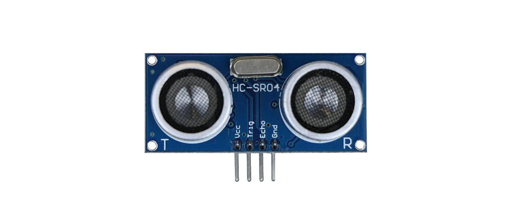
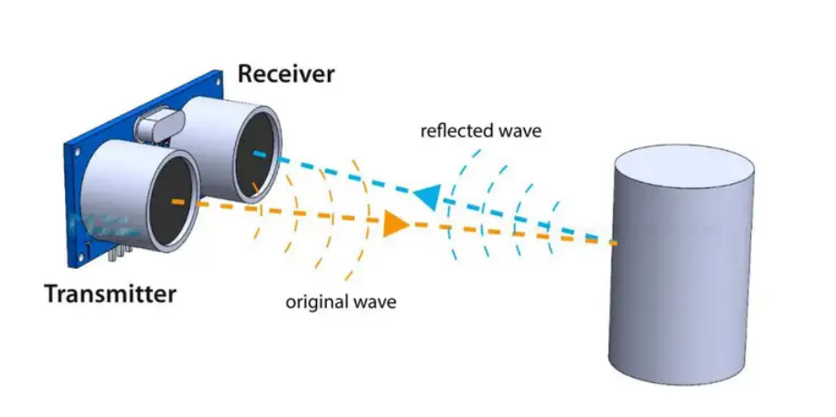
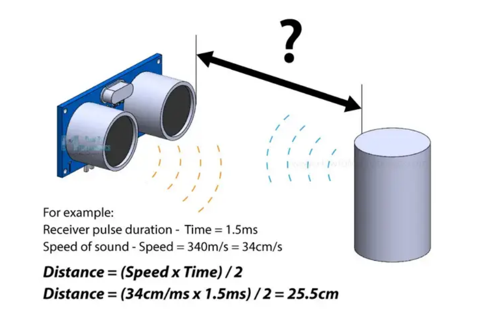
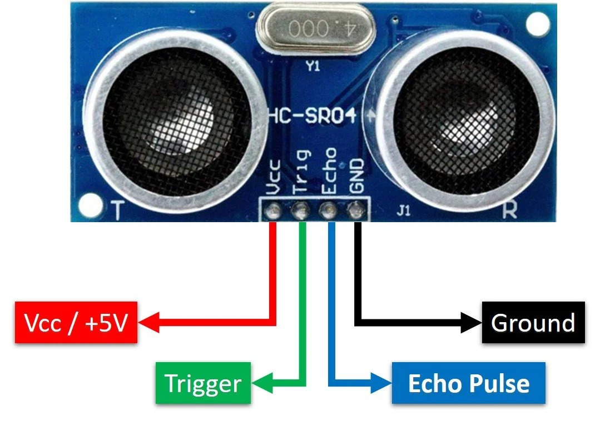
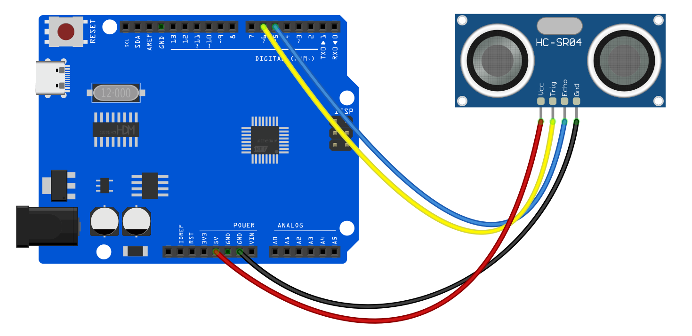
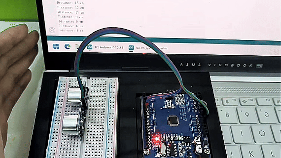

# Проект 13: Ультразвуковой датчик




#### Описание

Ультразвуковой датчик HC-SR04 — это широко используемый датчик для измерения расстояния, который измеряет расстояние между объектом и датчиком. Датчик имеет небольшой размер, низкую цену и прост в использовании, поэтому он получил широкое применение в робототехнике, умном доме и промышленном контроле.

В этом проекте мы создаём систему измерения расстояния с помощью платы разработки UNO R3 (ch340) и ультразвукового датчика HC-SR04. В ходе проекта вы научитесь измерять расстояние между объектом и датчиком с использованием HC-SR04 и отображать результаты измерений в серийном мониторе.

#### Аппаратное обеспечение

1\. Плата разработки UNO R3 (ch340) x1

2\. Ультразвуковой датчик HC-SR04 x1

3\. Провода DuPont

#### Принцип работы

Датчик излучает ультразвук с частотой 40 000 Гц, который распространяется в воздухе, и если на его пути есть объект или препятствие, сигнал отражается обратно к модулю. Учитывая время прохождения сигнала и скорость звука, можно вычислить расстояние.



Для генерации ультразвука необходимо установить пин Trig в высокий уровень на 10 мкс. Это отправит 8 циклов ультразвукового сигнала, который будет распространяться со скоростью [звука](https://en.wikipedia.org/wiki/Speed_of_sound). Пин Echo сразу же переходит в высокий уровень после отправки этих 8 циклов и начинает ожидать отражённую волну от объекта.

Если отражённого сигнала нет, пин Echo перейдёт в низкий уровень по тайм-ауту через 38 мс.


Если отражённый сигнал получен, пин Echo перейдёт в низкий уровень раньше 38 мс. По времени, в течение которого пин Echo был в высоком состоянии, можно определить расстояние, которое прошла звуковая волна, а значит, и расстояние от датчика до объекта.

Для этого используется базовая формула расчёта расстояния:

*Расстояние = Скорость x Время*

Мы знаем как скорость, так и время. Время — это продолжительность высокого уровня на пине Echo, а скорость — скорость звука, равная 340 м/с. Дополнительно нужно разделить результат на 2, так как измеряется время прохождения волны туда и обратно.



Предположим, пин Echo был в высоком состоянии 2 мс. Чтобы получить результат в сантиметрах, скорость звука переводим из 340 м/с в 34 см/мс.

*Расстояние = (Скорость x Время) / 2* **= (34 см/мс x 1.5 мс) / 2 = 25.5 см.**

Таким образом, если пин Echo был высоким 2 мс (что измеряется функцией **pulseIn()**), расстояние от датчика до объекта составляет 34 см.

#### Технические характеристики

Рабочее напряжение: DC 5V

Рабочий ток: 15 мА

Рабочая частота: 40 КГц

Максимальный диапазон: 4 м

Минимальный диапазон: 2 см

Угол измерения: 15 градусов

Сигнал запуска (Trigger): импульс TTL длительностью 10 мкс

Сигнал эха (Echo): входной TTL сигнал, пропорциональный расстоянию

#### Распиновка



VCC подаёт питание на ультразвуковой датчик HC-SR04. Его можно подключить к выходу 5V на Arduino.

Пин Trig (Trigger) используется для запуска ультразвуковых импульсов. Установка этого пина в высокий уровень на 10 мкс инициирует ультразвуковой импульс.

Пин Echo становится высоким при передаче ультразвукового импульса и остаётся высоким до получения отражённого сигнала, после чего переходит в низкий уровень. Измеряя время высокого уровня на пине Echo, можно вычислить расстояние.

GND — это земля. Подключите его к земле Arduino.

#### Схема подключения

1\. Подключите VCC ультразвукового датчика к 5V на плате

2\. Подключите пин Trig ультразвукового датчика к цифровому пину D6 на плате

3\. Подключите пин Echo ультразвукового датчика к цифровому пину D5 на плате

4\. Подключите пин GND ультразвукового датчика к GND на плате




#### Пример кода

```cpp

/*

Electronics Learning Starter Kit for Arduino

Project 13

Ultrasonic Sensor

Edit By Keyes

*/

const int trigPin = 6; // Define trigger pin number

const int echoPin = 5; // Define echo pin number

long duration; // Declare a long integer variable for storing the round-trip time of the ultrasonic pulse

int distance; // Declare an integer variable for storing the calculated distance

void setup() {

pinMode(trigPin, OUTPUT); // Set trigPin as output

pinMode(echoPin, INPUT); // Set echoPin as input

Serial.begin(9600); // Initialize serial communication with a baud rate of 9600

}

void loop() {

digitalWrite(trigPin, LOW); // Ensure the trigger pin is low

delayMicroseconds(2); // Wait for 2 microseconds

digitalWrite(trigPin, HIGH); // Send a 10-microsecond pulse

delayMicroseconds(10); // Keep the pulse for 10 microseconds

digitalWrite(trigPin, LOW); // End the pulse

duration = pulseIn(echoPin, HIGH); // Read the length of the pulse from the echo pin

// Calculate distance: sound speed is 0.034 cm per microsecond, divide the round-trip distance by 2

distance = duration * 0.034 / 2;

Serial.print("Distance: "); // Print text "Distance: "

Serial.print(distance); // Print the measured distance

Serial.println(" cm"); // Print the unit " cm" and go to the next line

delay(500); // Wait for 0.5 seconds before measuring again

}
```

#### Объяснение кода

Определение пинов и переменных

```cpp

const int trigPin = 6;

const int echoPin = 5;

long duration;

int distance;

```

В этом разделе определяются две константы `trigPin` и `echoPin`, которые соответствуют номерам цифровых пинов на плате Arduino, подключённых к пинам Trig и Echo датчика HC-SR04. Также объявляются две переменные `duration` и `distance` для хранения времени сигнала эха и вычисленного расстояния.

Функция настройки

```cpp
void setup() {

pinMode(trigPin, OUTPUT);

pinMode(echoPin, INPUT);

Serial.begin(9600);

}
```

Функция `setup()` — стандартная функция инициализации в коде Arduino, которая устанавливает режимы пинов и инициализирует последовательную связь. `pinMode(trigPin, OUTPUT)` и `pinMode(echoPin, INPUT)` устанавливают пин Trig как выход, а пин Echo как вход. `Serial.begin(9600)` запускает последовательный порт и задаёт скорость передачи данных 9600 бит в секунду, что позволяет выводить данные в серийный монитор на компьютере.

Основной цикл

```cpp
void loop() {

digitalWrite(trigPin, LOW);

delayMicroseconds(2);

digitalWrite(trigPin, HIGH);

delayMicroseconds(10);

digitalWrite(trigPin, LOW);

duration = pulseIn(echoPin, HIGH);

distance = duration * 0.034 / 2;

Serial.print("Distance: ");

Serial.print(distance);

Serial.println(" cm");

delay(500);

}
```

Функция `loop()` содержит основную логику программы и выполняется повторно. Сначала пин Trig устанавливается в низкий уровень и удерживается 2 микросекунды для стабилизации сигнала. Затем пин Trig устанавливается в высокий уровень на 10 микросекунд, что запускает отправку ультразвукового импульса. После этого пин Trig возвращается в низкий уровень и ждёт получения эха на пине Echo.

`duration = pulseIn(echoPin, HIGH);` измеряет время, в течение которого пин Echo находится в высоком уровне (то есть время прохождения ультразвуковой волны туда и обратно). `distance = duration * 0.034 / 2;` вычисляет расстояние, исходя из скорости звука (примерно 340 метров в секунду или 0.034 сантиметра в микросекунду). Поскольку волна проходит путь туда и обратно, результат делится на 2.

В конце вычисленное расстояние выводится через последовательный порт, после чего происходит задержка в 500 миллисекунд перед следующим измерением.

#### Результат проекта

После загрузки кода откройте серийный монитор и установите скорость передачи 9600. Значение расстояния будет выводиться в мониторе в сантиметрах. При приближении или удалении объекта от датчика значение будет изменяться.


