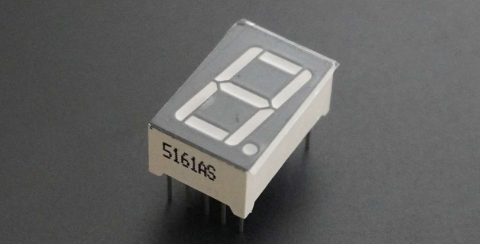
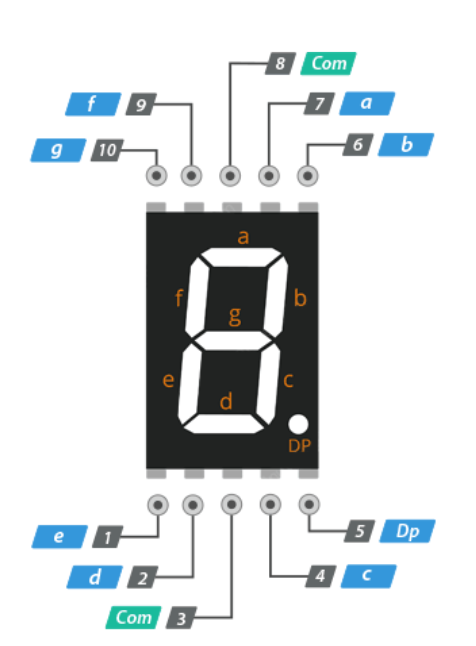
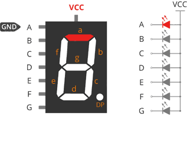
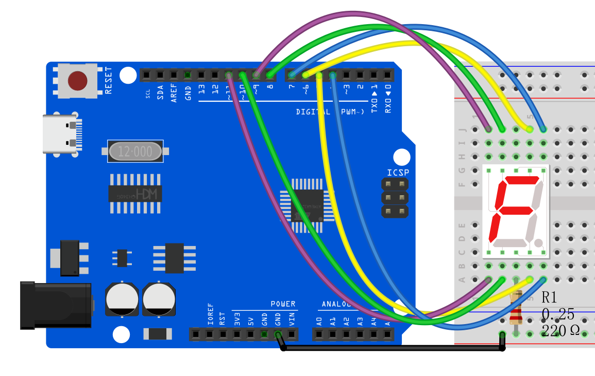
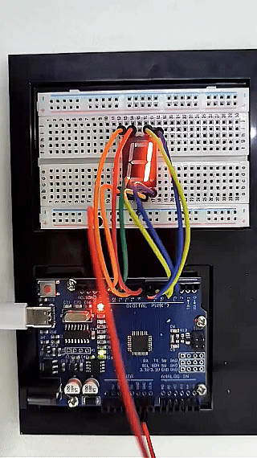

# Proyecto 14: Display de 1 dígito con LED Segmentado




#### Descripción

Un tubo digital es una pantalla electrónica común que muestra números, letras y símbolos mediante la emisión de luz. Los tubos de 1 dígito son el tipo más sencillo, que solo pueden mostrar un número o símbolo.

Este proyecto te guiará para crear un proyecto simple con Arduino usando la placa de desarrollo UNO R3 (ch340) y un display de tubo de 1 dígito. A través de este proyecto, aprenderás cómo controlar este tubo para mostrar números del 0 al 9.

#### Hardware

1\. Placa de desarrollo UNO R3 (ch340) x1

2\. Display LED segmentado de 1 dígito x1

3\. Resistencia de 220Ω x1

4\. Protoboard x1

5\. Cables jumper

#### Principio de Funcionamiento

El display de 7 segmentos, también escrito como “seven segment display”, consiste en siete LEDs dispuestos en un patrón con forma de ‘8’. Cada LED se denomina segmento, porque cuando se ilumina, forma parte de un dígito. A veces se usa un octavo LED para indicar un punto decimal.


Cada LED segmento tiene uno de sus pines de conexión sacado directamente del paquete plástico rectangular. Estos pines están etiquetados con las letras ‘a’ a ‘g’. Los pines restantes de los LEDs están conectados juntos para formar un pin común.

Cada segmento puede encenderse o apagarse individualmente configurando el pin correspondiente en HIGH o LOW, igual que un LED normal. Al iluminar segmentos individuales, puedes crear cualquier carácter numérico e incluso algunas representaciones básicas de letras.

#### Especificaciones

Disponible en dos modos: Cátodo Común (CC) y Ánodo Común (CA)

Disponible en muchos tamaños diferentes como 9.14mm, 14.20mm, 20.40mm, 38.10mm, 57.0mm y 100mm (el tamaño comúnmente usado/disponible es 14.20mm)

Colores disponibles: Blanco, Azul, Rojo, Amarillo y Verde (el rojo es comúnmente usado)

Operación con baja corriente

Pantalla mejor, más brillante y más grande que las pantallas LCD convencionales.

Consumo de corriente: 30mA / segmento

Corriente pico: 70mA

#### Pinout

Ahora, revisemos la configuración de los segmentos para que sepas qué pin corresponde a qué segmento. El pinout del display de 7 segmentos es el siguiente.



a, b, c, d, e, f, g y DP están conectados a los pines digitales de un Arduino para operar los segmentos individuales del display. Al iluminar segmentos individuales, puedes crear cualquier carácter numérico.

COM Los pines 3 y 8 están conectados internamente para formar un pin común. Dependiendo del tipo de display, este pin debe conectarse a GND (cátodo común) o a 5V (ánodo común).

Cátodo Común (CC) vs Ánodo Común (CA)

Existen dos tipos de displays de siete segmentos: cátodo común (CC) y ánodo común (CA).

La estructura interna de ambos tipos es casi idéntica. La diferencia es la polaridad de los LEDs y el terminal común. Como su nombre indica, en los displays de cátodo común, todos los cátodos (o terminales negativos) de los LEDs de segmento están unidos, mientras que en los displays de ánodo común, todos los ánodos (o terminales positivos) de los LEDs de segmento están unidos.

En un display de cátodo común, el pin com está conectado a GND, y se aplica un voltaje positivo a cada segmento (a-g) para iluminarlo.


Funcionamiento de 7 segmentos con Cátodo Común

En un display de ánodo común, el pin com está conectado a VCC, y cada segmento (a-g) se conecta a tierra individualmente para iluminarlo.



Funcionamiento de 7 segmentos con Ánodo Común

#### Diagrama de Conexiones


Conecta el pin a al pin digital D6

Conecta el pin b al pin digital D7

Conecta el pin c al pin digital D5

Conecta el pin d al pin digital D10

Conecta el pin e al pin digital D11

Conecta el pin f al pin digital D8

Conecta el pin g al pin digital D9

Conecta el pin DP al pin digital D4

Conecta el pin COM al pin GND con una resistencia de 220Ω




#### Código de Ejemplo

```cpp

/*

Electronics Learning Starter Kit for Arduino

Project 14

1 digit LED Segment Display

Edit By Keyes

*/

// define the pins of each segments

const int a = 6;

const int b = 7;

const int c = 5;

const int d = 10;

const int e = 11;

const int f = 8;

const int g = 9;

const int dp = 4;

// Define the segment combination of number 0 to 9

const int num[10][7] = {

{1, 1, 1, 1, 1, 1, 0}, // 0

{0, 1, 1, 0, 0, 0, 0}, // 1

{1, 1, 0, 1, 1, 0, 1}, // 2

{1, 1, 1, 1, 0, 0, 1}, // 3

{0, 1, 1, 0, 0, 1, 1}, // 4

{1, 0, 1, 1, 0, 1, 1}, // 5

{1, 0, 1, 1, 1, 1, 1}, // 6

{1, 1, 1, 0, 0, 0, 0}, // 7

{1, 1, 1, 1, 1, 1, 1}, // 8

{1, 1, 1, 1, 0, 1, 1} // 9

};

void setup() {

// set pins to output

pinMode(a, OUTPUT);

pinMode(b, OUTPUT);

pinMode(c, OUTPUT);

pinMode(d, OUTPUT);

pinMode(e, OUTPUT);

pinMode(f, OUTPUT);

pinMode(g, OUTPUT);

pinMode(dp, OUTPUT);

}

void loop() {

// show number 0 to 9 in loop

for (int i = 0; i < 10; i++) {

displayNumber(i);

delay(1000);

}

}

// show numbers

void displayNumber(int n) {

// set the on and off of each segment

digitalWrite(a, num[n][0]);

digitalWrite(b, num[n][1]);

digitalWrite(c, num[n][2]);

digitalWrite(d, num[n][3]);

digitalWrite(e, num[n][4]);

digitalWrite(f, num[n][5]);

digitalWrite(g, num[n][6]);

digitalWrite(dp, LOW); // Decimal point is off

}
```

#### Explicación del Código

Definición de Pines

Al inicio del código se definen los pines de Arduino conectados a cada segmento del display de siete segmentos:

```cpp

const int a = 6;

const int b = 7;

const int c = 5;

const int d = 10;

const int e = 11;

const int f = 8;

const int g = 9;

const int dp = 4;

```

Aquí, las variables `a` a `g` corresponden a los siete segmentos del display, mientras que `dp` representa el punto decimal. Cada variable tiene asignado un número que indica el pin específico al que están conectados en el Arduino.

Definición de Números

A continuación, se define un arreglo `num` que representa cómo se muestra cada número en el display de siete segmentos:

```cpp

const int num[10][7] = {

{1, 1, 1, 1, 1, 1, 0}, // 0

{0, 1, 1, 0, 0, 0, 0}, // 1

...

{1, 1, 1, 1, 0, 1, 1} // 9

};

```

Cada fila del arreglo representa un número (del 0 al 9), y los siete valores (0 o 1) en cada fila indican si el segmento correspondiente (`a` a `g`) debe estar encendido. 1 significa que el segmento está encendido, mientras que 0 significa que está apagado.

Función Setup

En la función `setup()`, todos los pines se configuran como salida:

```cpp
void setup() {

pinMode(a, OUTPUT);

pinMode(b, OUTPUT);

...

pinMode(dp, OUTPUT);

}
```

Esta función se ejecuta una vez cuando el Arduino inicia, asegurando que todos los pines que controlan el display de siete segmentos estén configurados como salidas.

Bucle Principal

La función `loop()` contiene un ciclo que muestra continuamente los números del 0 al 9:

```cpp
void loop() {

for (int i = 0; i < 10; i++) {

displayNumber(i);

delay(1000);

}

}
```

Aquí, la función `displayNumber()` es responsable de controlar el display de siete segmentos para mostrar un número específico, mientras que `delay(1000)` hace que cada número se muestre durante 1 segundo.

Mostrando Números

Finalmente, la función `displayNumber()` controla la iluminación de cada segmento basado en el parámetro de número de entrada `n` usando la función `digitalWrite()`:

```cpp
void displayNumber(int n) {

digitalWrite(a, num[n][0]);

...

digitalWrite(g, num[n][6]);

digitalWrite(dp, LOW); // Punto decimal apagado

}
```

Cada llamada a `digitalWrite()` configura un segmento específico en alto o bajo, controlando si el segmento está encendido o apagado. El punto decimal permanece apagado en este proyecto.

#### Resultado del Proyecto

Sube el código y verás que el tubo digital muestra números del 0 al 9 en secuencia, con cada número iluminándose durante 1 segundo.

