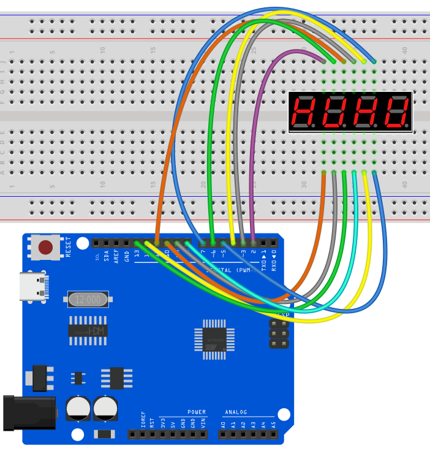
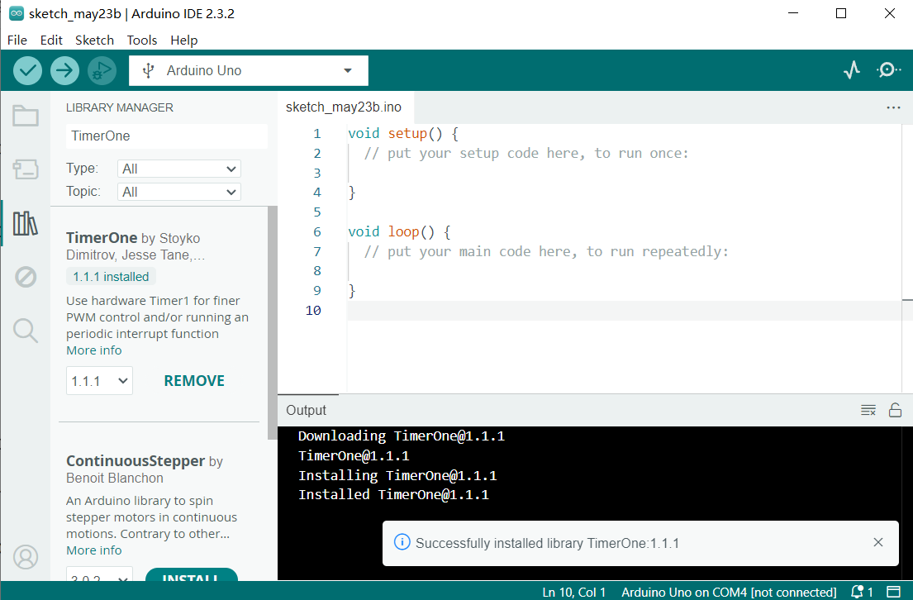
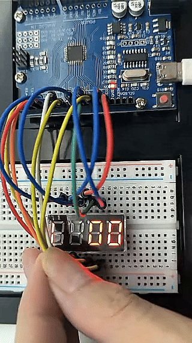

# Proyecto 15: Display de 4 dígitos con segmentos LED


#### Descripción

El tubo de cuatro dígitos consiste en cuatro tubos digitales de siete segmentos separados que pueden mostrar cuatro números o caracteres.

En este proyecto, presentaremos cómo crear un proyecto Arduino que muestre los números que desees mediante la placa de desarrollo UNO R3 （ch340） y un display de 4 dígitos con segmentos LED.

#### Hardware

1\. Placa de desarrollo UNO R3 （ch340） x1

2\. Display de 4 dígitos con segmentos LED x1

3\. Protoboard x1

4\. Cables jumper

#### Principio de Funcionamiento

El tubo de cuatro dígitos consiste en cuatro tubos digitales de siete segmentos separados que pueden mostrar cuatro números o caracteres.


Esto reduce el número de pines de un display de múltiples dígitos pero aumenta la complejidad de su control. Por ejemplo, con este cableado, si aplicamos voltaje al pin A del display de 4 dígitos, los segmentos A de todos los bloques LED se encenderán. Para controlar qué bloque LED permitirá que esa señal pase, tenemos otro pin para cada uno de los bloques LED, el pin de dígito. Por lo tanto, en un display de 4 dígitos también tendremos 4 pines de dígito que controlan los bloques LED individualmente. A continuación mostramos el display LED de 4 dígitos con los 4 pines de entrada de control adicionales, uno para cada bloque LED.

Conectividad interna del display LED de 4 dígitos *7-segmentos* mostrando los pines de segmento y los pines de control de dígito que controlan si la señal de los pines de segmento se mostrará o no en el bloque LED correspondiente.

Como resultado, si queremos mostrar el número 1111, tenemos que aplicar voltaje a D1, D2, D3 y D4 porque todos los displays mostrarán un dígito. También necesitamos aplicar voltaje a las entradas B y C como se muestra a continuación:

Imagen que muestra en color rojo los cables que deben activarse para mostrar el número ‘1111’

#### Especificaciones

Función: SDK

Color del segmento: Blanco lechoso o igual que el color de emisión

Altura del dígito: 0.28 pulgadas

Color de la cara: Negro, gris o rojo

Número de dígitos: 4

Característica: Ahorro de energía y alta estabilidad

#### Pinout

Un display típico de 4 dígitos y 7 segmentos tiene 12 pines, con seis pines a cada lado, como se muestra en la figura a continuación.


Pinout del display LED de 4 dígitos *7-segmentos*

Cuatro de estos pines (D1, D2, D3 y D4) se usan para controlar los dígitos individuales y determinar qué señales pasan a través de los bloques LED. Los pines restantes corresponden a los segmentos individuales.

#### Diagrama de Conexiones

Conecta los pines cátodo (D1, D2, D3, D4) del tubo digital a los pines digitales (D2, D3, D4, D5) de la placa.

Conecta los pines ánodo (a, b, c, d, e, f, g, dp) del tubo digital a los pines digitales (D6, D7, D8, D9, D10, D11, D12, D13) de la placa.




#### Instalar la Biblioteca

Antes de comenzar a programar, necesitamos instalar primero la biblioteca TimerOne.

**Navegar al Gestor de Bibliotecas**: Haz clic en el menú “Herramientas”, luego selecciona “Gestionar bibliotecas…”.


**Buscar Bibliotecas**:

En la ventana del Gestor de Bibliotecas que aparece, verás un cuadro de búsqueda. Escribe el nombre de la biblioteca "TimerOne".


**Seleccionar e Instalar Bibliotecas**:

Encuentra la biblioteca deseada en los resultados de búsqueda y haz clic en ella.

Aparecerá un botón “Instalar” en el lado derecho de la ventana. Haz clic en el botón “Instalar”.



**Esperar la Instalación**: El IDE de Arduino descargará e instalará automáticamente la biblioteca seleccionada. Una vez completada la instalación, el botón “Instalar” cambiará a “Instalado”, indicando que la instalación fue exitosa.

#### Código de Ejemplo

```cpp

/*

Electronics Learning Starter Kit for Arduino

Project 15

4 digit LED Segment Display

Edit By Keyes

*/

#include <TimerOne.h>

//the pins of 4-digit 7-segment display attach to pin2-13 respectively

int a = 6;

int b = 7;

int c = 8;

int d = 9;

int e = 10;

int f = 11;

int g = 12;

int p = 13;

int d4 = 5;

int d3 = 4;

int d2 = 3;

int d1 = 2;

long n = 0;// n represents the value displayed on the LED display. For example, when n=0, 0000 is displayed. The maximum value is 9999.

int x = 100;

int del = 5;//Set del as 5; the value is the degree of fine tuning for the clock

int count = 0;//Set count=0. Here count is a count value that increases by 1 every 0.1 second, which means 1 second is counted when the value is 10

void setup()

{

//set all the pins of the LED display as output

pinMode(d1, OUTPUT);

pinMode(d2, OUTPUT);

pinMode(d3, OUTPUT);

pinMode(d4, OUTPUT);

pinMode(a, OUTPUT);

pinMode(b, OUTPUT);

pinMode(c, OUTPUT);

pinMode(d, OUTPUT);

pinMode(e, OUTPUT);

pinMode(f, OUTPUT);

pinMode(g, OUTPUT);

pinMode(p, OUTPUT);

Timer1.initialize(100000); // set a timer of length 100000 microseconds (or 0.1 sec - or 10Hz => the led will blink 5 times, 5 cycles of on-and-off, per second)

Timer1.attachInterrupt( add ); // attach the service routine here

}

/*************************************\**/

void loop()

{

clearLEDs();//clear the 7-segment display screen

pickDigit(0);//Light up 7-segment display d1

pickNumber((n/1000));// get the value of thousand

delay(del);//delay 5ms

clearLEDs();//clear the 7-segment display screen

pickDigit(1);//Light up 7-segment display d2

pickNumber((n%1000)/100);// get the value of hundred

delay(del);//delay 5ms

clearLEDs();//clear the 7-segment display screen

pickDigit(2);//Light up 7-segment display d3

pickNumber(n%100/10);//get the value of ten

delay(del);//delay 5ms

clearLEDs();//clear the 7-segment display screen

pickDigit(3);//Light up 7-segment display d4

pickNumber(n%10);//Get the value of single digit

delay(del);//delay 5ms

}

/**************************************/

void pickDigit(int x) //light up a 7-segment display

{

//The 7-segment LED display is a common-cathode one. So also use digitalWrite to set d1 as high and the LED will go out

digitalWrite(d1, HIGH);

digitalWrite(d2, HIGH);

digitalWrite(d3, HIGH);

digitalWrite(d4, HIGH);

switch(x)

{

case 0:

digitalWrite(d1, LOW);//Light d1 up

break;

case 1:

digitalWrite(d2, LOW); //Light d2 up

break;

case 2:

digitalWrite(d3, LOW); //Light d3 up

break;

default:

digitalWrite(d4, LOW); //Light d4 up

break;

}

}

//The function is to control the 7-segment LED display to display numbers. Here x is the number to be displayed. It is an integer from 0 to 9

void pickNumber(int x)

{

switch(x)

{

default:

zero();

break;

case 1:

one();

break;

case 2:

two();

break;

case 3:

three();

break;

case 4:

four();

break;

case 5:

five();

break;

case 6:

six();

break;

case 7:

seven();

break;

case 8:

eight();

break;

case 9:

nine();

break;

}

}

void clearLEDs() //clear the 7-segment display screen

{

digitalWrite(a, LOW);

digitalWrite(b, LOW);

digitalWrite(c, LOW);

digitalWrite(d, LOW);

digitalWrite(e, LOW);

digitalWrite(f, LOW);

digitalWrite(g, LOW);

digitalWrite(p, LOW);

}

void zero() //the 7-segment led display 0

{

digitalWrite(a, HIGH);

digitalWrite(b, HIGH);

digitalWrite(c, HIGH);

digitalWrite(d, HIGH);

digitalWrite(e, HIGH);

digitalWrite(f, HIGH);

digitalWrite(g, LOW);

}

void one() //the 7-segment led display 1

{

digitalWrite(a, LOW);

digitalWrite(b, HIGH);

digitalWrite(c, HIGH);

digitalWrite(d, LOW);

digitalWrite(e, LOW);

digitalWrite(f, LOW);

digitalWrite(g, LOW);

}

void two() //the 7-segment led display 2

{

digitalWrite(a, HIGH);

digitalWrite(b, HIGH);

digitalWrite(c, LOW);

digitalWrite(d, HIGH);

digitalWrite(e, HIGH);

digitalWrite(f, LOW);

digitalWrite(g, HIGH);

}

void three() //the 7-segment led display 3

{

digitalWrite(a, HIGH);

digitalWrite(b, HIGH);

digitalWrite(c, HIGH);

digitalWrite(d, HIGH);

digitalWrite(e, LOW);

digitalWrite(f, LOW);

digitalWrite(g, HIGH);

}

void four() //the 7-segment led display 4

{

digitalWrite(a, LOW);

digitalWrite(b, HIGH);

digitalWrite(c, HIGH);

digitalWrite(d, LOW);

digitalWrite(e, LOW);

digitalWrite(f, HIGH);

digitalWrite(g, HIGH);

}

void five() //the 7-segment led display 5

{

digitalWrite(a, HIGH);

digitalWrite(b, LOW);

digitalWrite(c, HIGH);

digitalWrite(d, HIGH);

digitalWrite(e, LOW);

digitalWrite(f, HIGH);

digitalWrite(g, HIGH);

}

void six() //the 7-segment led display 6

{

digitalWrite(a, HIGH);

digitalWrite(b, LOW);

digitalWrite(c, HIGH);

digitalWrite(d, HIGH);

digitalWrite(e, HIGH);

digitalWrite(f, HIGH);

digitalWrite(g, HIGH);

}

void seven() //the 7-segment led display 7

{

digitalWrite(a, HIGH);

digitalWrite(b, HIGH);

digitalWrite(c, HIGH);

digitalWrite(d, LOW);

digitalWrite(e, LOW);

digitalWrite(f, LOW);

digitalWrite(g, LOW);

}

void eight() //the 7-segment led display 8

{

digitalWrite(a, HIGH);

digitalWrite(b, HIGH);

digitalWrite(c, HIGH);

digitalWrite(d, HIGH);

digitalWrite(e, HIGH);

digitalWrite(f, HIGH);

digitalWrite(g, HIGH);

}

void nine() //the 7-segment led display 9

{

digitalWrite(a, HIGH);

digitalWrite(b, HIGH);

digitalWrite(c, HIGH);

digitalWrite(d, HIGH);

digitalWrite(e, LOW);

digitalWrite(f, HIGH);

digitalWrite(g, HIGH);

}

/*****************************************\**/

void add()

{

// Toggle LED

count ++;

if(count == 10)

{

count = 0;

n++;

if(n == 10000)

{

n = 0;

}

}

}
```

#### Explicación del Código

```cpp
#include <TimerOne.h>
```

Esta línea incluye una biblioteca llamada `TimerOne`, que se usa para crear temporizadores e interrupciones.

```cpp

int a = 6;

int b = 7;

int c = 8;

int d = 9;

int e = 10;

int f = 11;

int g = 12;

int p = 13;

int d4 = 5;

int d3 = 4;

int d2 = 3;

int d1 = 2;

long n = 0;

int x = 100;

int del = 5;

int count = 0;

```

Estas líneas definen una serie de variables y constantes:

`a` hasta `g` y `p` son pines usados para conectar el LED de 7 segmentos.

`d1` hasta `d4` son pines usados para seleccionar el dígito a mostrar.

`n` almacena el número que se mostrará.

`x` define la frecuencia de parpadeo del LED, configurada a 100 veces por segundo.

`del` es el retardo entre cada actualización del dígito, medido en milisegundos.

`count` se usa para contar intervalos de 0.1 segundos para actualizar la pantalla.

```cpp
void setup() {

pinMode(d1, OUTPUT);

pinMode(d2, OUTPUT);

pinMode(d3, OUTPUT);

pinMode(d4, OUTPUT);

pinMode(a, OUTPUT);

pinMode(b, OUTPUT);

pinMode(c, OUTPUT);

pinMode(d, OUTPUT);

pinMode(e, OUTPUT);

pinMode(f, OUTPUT);

pinMode(g, OUTPUT);

pinMode(p, OUTPUT);

Timer1.initialize(100000);

Timer1.attachInterrupt( add );

}
```

En la función `setup()`:

Todos los pines de LED y dígitos se configuran como salidas.

El temporizador se inicializa con un intervalo de 100,000 microsegundos (0.1 segundo).

La función de servicio de interrupción `add` se adjunta al temporizador.

```cpp
void loop() {

clearLEDs();

pickDigit(0);

pickNumber((n/1000));

delay(del);

clearLEDs();

pickDigit(1);

pickNumber((n%1000)/100);

delay(del);

clearLEDs();

pickDigit(2);

pickNumber(n%100/10);

delay(del);

clearLEDs();

pickDigit(3);

pickNumber(n%10);

delay(del);

}
```

En la función `loop()`, se repiten los siguientes pasos para mostrar los dígitos:

Limpiar la pantalla LED.

Seleccionar cada dígito secuencialmente y mostrar el número correspondiente.

```cpp
void pickDigit(int x) {

digitalWrite(d1, HIGH);

digitalWrite(d2, HIGH);

digitalWrite(d3, HIGH);

digitalWrite(d4, HIGH);

switch(x) {

case 0:

digitalWrite(d1, LOW);

break;

case 1:

digitalWrite(d2, LOW);

break;

case 2:

digitalWrite(d3, LOW);

break;

default:

digitalWrite(d4, LOW);

break;

}

}
```

La función `pickDigit(int x)` se usa para iluminar un dígito específico:

Primero, apaga todos los LEDs de dígito.

Según el valor del parámetro `x`, selecciona el dígito a iluminar.

```cpp

void pickNumber(int x) {

switch(x) {

default:

zero();

break;

case 1:

one();

break;

case 2:

two();

break;

case 3:

three();

break;

case 4:

four();

break;

case 5:

five();

break;

case 6:

six();

break;

case 7:

seven();

break;

case 8:

eight();

break;

case 9:

nine();

break;

}

}

```

La función `pickNumber(int x)` se usa para seleccionar el número que se mostrará según el parámetro `x`, y llama a la función correspondiente para mostrar ese número.

```cpp
void clearLEDs() {

digitalWrite(a, LOW);

digitalWrite(b, LOW);

digitalWrite(c, LOW);

digitalWrite(d, LOW);

digitalWrite(e, LOW);

digitalWrite(f, LOW);

digitalWrite(g, LOW);

digitalWrite(p, LOW);

}
```

La función `clearLEDs()` se usa para apagar todos los LEDs y limpiar la pantalla.

```cpp

void add() {

count ++;

if(count == 10) {

count = 0;

n++;

if(n == 10000) {

n = 0;

}

}

}

```

La función `add()` es la rutina de servicio de interrupción para el temporizador, usada para actualizar el número mostrado:

Incrementa `count` cada 0.1 segundos.

Cuando `count` llega a 10, lo reinicia a 0 e incrementa `n`.

Si `n` llega a 10,000, lo reinicia a 0 para ciclar la pantalla.

#### Resultado del Proyecto

Después de subir el código a la placa Arduino, verás un display LED de 7 segmentos y cuatro dígitos que comienza a mostrar números intermitentes en intervalos especificados. Los números mostrados aumentarán gradualmente de 0 a 9999 y luego reiniciarán desde 0. El LED parpadeará 5 veces por segundo, actualizando el número cada 0.1 segundos.

