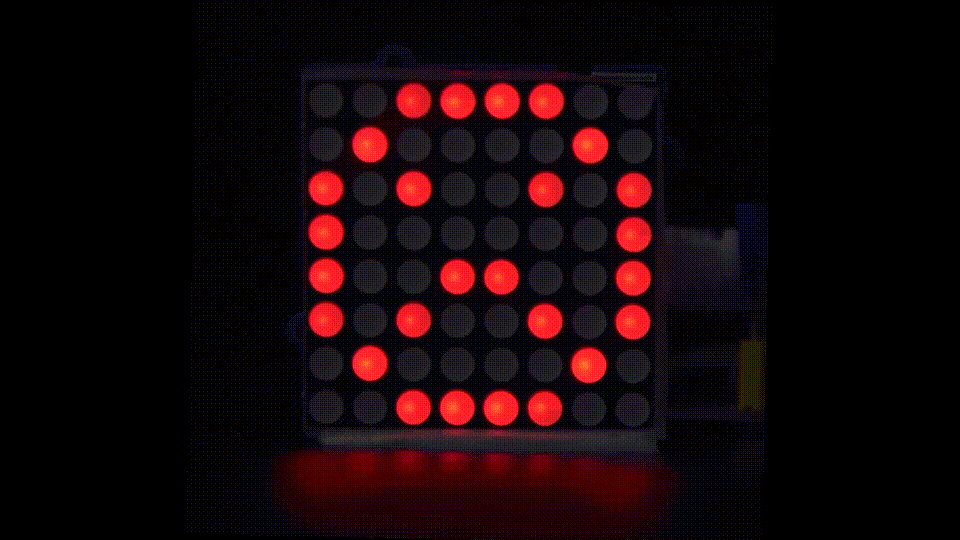
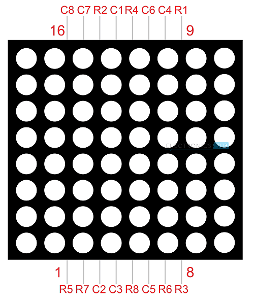
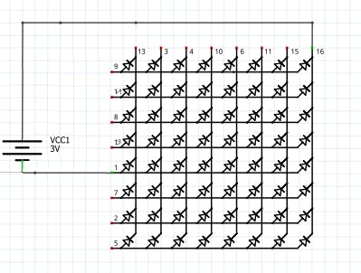
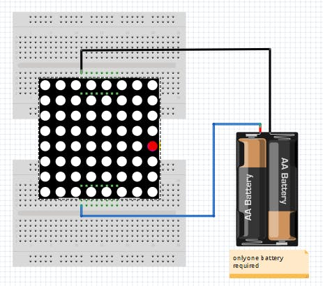
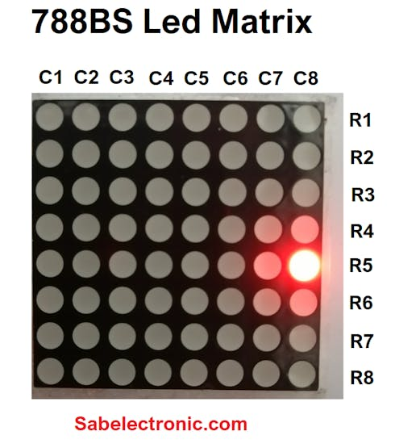
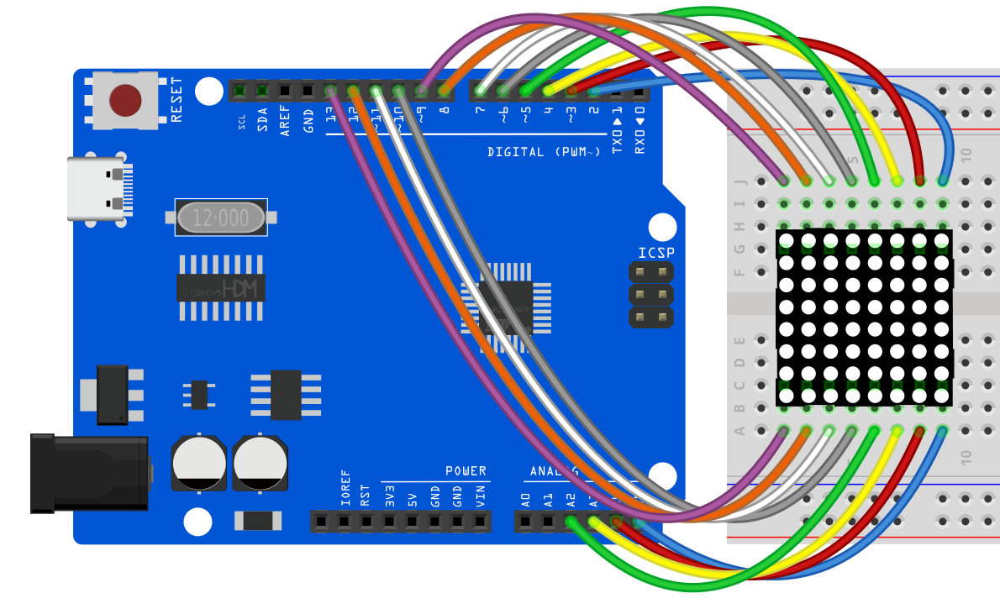
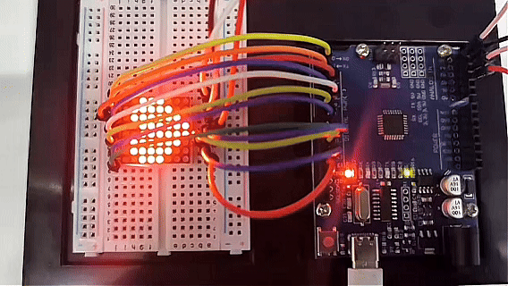

# Proyecto 16: Matriz LED 8x8




#### Descripción

La matriz de puntos LED 8\*8 consta de 8 filas y 8 columnas de LEDs, un total de 64 LEDs. Cada uno puede ser controlado de forma independiente, encendido o apagado, formando así diferentes patrones y caracteres.

En este proyecto, aprenderás a programar en la placa de desarrollo UNO R3 （ch340） para controlar una pantalla de matriz LED 8×8, mostrando patrones de un corazón grande y un corazón pequeño.

#### Hardware

1\. Placa de desarrollo UNO R3 （ch340） x 1

2\. Matriz LED 8*8 x 1

3\. Protoboard x 1

4\. Cables jumper

#### Principio de Funcionamiento

La vista externa de una matriz de puntos se muestra a continuación



La matriz de puntos 8*8 está compuesta por sesenta y cuatro LEDs, y cada LED está ubicado en el punto de intersección de una fila y una columna.

Cuando el nivel eléctrico de cierta fila es 1 y el nivel eléctrico de cierta columna es 0, el LED correspondiente se encenderá. Si quieres encender el LED en el primer punto, debes configurar el pin 9 a nivel alto y el pin 13 a nivel bajo.

Si quieres encender los LEDs en la primera fila, debes configurar el pin 9 a nivel alto y los pines 13, 3, 4, 10, 6, 11, 15 y 16 a nivel bajo.

Si quieres encender los LEDs en la primera columna, configura el pin 13 a nivel bajo y los pines 9, 14, 8, 12, 1, 7, 2 y 5 a nivel alto.

La vista interna de una matriz de puntos se muestra a continuación


Si tenemos una matriz de puntos 8x8, ¿cómo sabemos dónde está el pin 1? Como en los chips IC cerca del Pin 1, se menciona un punto en el chip IC/Microcontrolador. Pero aquí, ¿cómo lo sabemos?


Los pines comienzan en el lado de la perilla

En el módulo de matriz LED, el fabricante escribe la etiqueta o marca en el lado del pin 1, como se muestra en la figura. Definitivamente podemos encontrarlo. También hay una curva mencionada en el lado del número de pin 1.



Conexión de batería

Fila = + Suministro positivo

Columna = - Suministro negativo

La fuente de alimentación de prueba debe ser de 1.5V DC. Por lo tanto, una sola celda de batería es suficiente o se usa una resistencia de 130 ohm en serie en el lado positivo/negativo.



Prueba de matriz LED con celda de batería

Después de conectar el LED a la fuente de alimentación, encontramos que el LED de la columna 8 y la fila 5 se enciende como se muestra en la figura. Así es como se conecta la celda de batería con una pantalla de matriz.


Conexión de pines de columna y fila

#### Prueba de Pines de la Matriz LED

Como se muestra en la figura, el pin 1 y el pin 16 están energizados y el LED de la columna 8 y fila 5 se enciende. Debemos verificar la matriz de puntos antes de usarla porque si algún LED está quemado, podemos reemplazarlo por uno bueno.



Matriz LED encendida

Si quieres mostrar una cara feliz, esto es lo que debes hacer:


#### Diagrama de Conexiones


Fila 1--8> pines digitales D2--D9

Columna 1--8> pines digitales D10--D17




#### Código de Ejemplo

```cpp

/*

Electronics Learning Starter Kit for Arduino

Project 16

8x8 LED Matrix

Edit By Keyes

*/

// 2-dimensional array of row pin numbers:

int R[] = {2,7,A5,5,13,A4,12,A2};

// 2-dimensional array of column pin numbers:

int C[] = {6,11,10,3,A3,4,8,9};

unsigned char biglove[8][8] = //the big "heart"

{

0,0,0,0,0,0,0,0,

0,1,1,0,0,1,1,0,

1,1,1,1,1,1,1,1,

1,1,1,1,1,1,1,1,

1,1,1,1,1,1,1,1,

0,1,1,1,1,1,1,0,

0,0,1,1,1,1,0,0,

0,0,0,1,1,0,0,0,

};

unsigned char smalllove[8][8] = //the small "heart"

{

0,0,0,0,0,0,0,0,

0,0,0,0,0,0,0,0,

0,0,1,0,0,1,0,0,

0,1,1,1,1,1,1,0,

0,1,1,1,1,1,1,0,

0,0,1,1,1,1,0,0,

0,0,0,1,1,0,0,0,

0,0,0,0,0,0,0,0,

};

void setup()

{

// iterate over the pins:

for(int i = 0;i<8;i++)

// initialize the output pins:

{

pinMode(R[i],OUTPUT);

pinMode(C[i],OUTPUT);

}

}

void loop()

{

for(int i = 0 ; i < 100 ; i++) //Loop display 100 times

{

Display(biglove); //Display the "Big Heart"

}

for(int i = 0 ; i < 50 ; i++) //Loop display 50 times

{

Display(smalllove); //Display the "small Heart"

}

}

void Display(unsigned char dat[8][8])

{

for(int c = 0; c<8;c++)

{

digitalWrite(C[c],LOW);//use thr column

//loop

for(int r = 0;r<8;r++)

{

digitalWrite(R[r],dat[r][c]);

}

delay(1);

Clear(); //Remove empty display light

}

}

void Clear() //clear the display

{

for(int i = 0;i<8;i++)

{

digitalWrite(R[i],LOW);

digitalWrite(C[i],HIGH);

}

}
```

#### Explicación del Código

1\. Configuración de Pines

Primero, necesitamos configurar los pines de filas y columnas:

```cpp

// 2-dimensional array of row pin numbers:

int R[] = {2, 7, A5, 5, 13, A4, 12, A2};

// 2-dimensional array of column pin numbers:

int C[] = {6, 11, 10, 3, A3, 4, 8, 9};

```

En el código, se definen dos arreglos `R[]` y `C[]` para representar los números de pines para las filas y columnas de la matriz LED respectivamente. Los arreglos `R[]` y `C[]` contienen cada uno 8 pines, que se usan para controlar una matriz LED 8x8.

2\. Definición de Patrones

A continuación, definimos dos arreglos bidimensionales, `biglove` y `smalllove`, que representan los patrones para un corazón grande y un corazón pequeño:

```cpp

unsigned char biglove[8][8] = {

0,0,0,0,0,0,0,0,

0,1,1,0,0,1,1,0,

1,1,1,1,1,1,1,1,

1,1,1,1,1,1,1,1,

1,1,1,1,1,1,1,1,

0,1,1,1,1,1,1,0,

0,0,1,1,1,1,0,0,

0,0,0,1,1,0,0,0,

};

unsigned char smalllove[8][8] = {

0,0,0,0,0,0,0,0,

0,0,0,0,0,0,0,0,

0,0,1,0,0,1,0,0,

0,1,1,1,1,1,1,0,

0,1,1,1,1,1,1,0,

0,0,1,1,1,1,0,0,

0,0,0,1,1,0,0,0,

0,0,0,0,0,0,0,0,

};

```

En estos arreglos, `1` indica que el LED está encendido, y `0` indica que el LED está apagado. Usando estos arreglos, los LEDs en la matriz pueden manipularse para formar patrones de corazón.

3\. Configuración de Inicialización

En la función `setup()`, todos los pines se inicializan como pines de salida:

```cpp
void setup() {

for (int i = 0; i < 8; i++) {

pinMode(R[i], OUTPUT);

pinMode(C[i], OUTPUT);

}

}
```

4\. Función Principal Loop

En la función `loop()`, las operaciones principales son mostrar secuencialmente el patrón del corazón grande y el patrón del corazón pequeño:

```cpp
void loop() {

for (int i = 0; i < 100; i++) {

Display(biglove);

}

for (int i = 0; i < 50; i++) {

Display(smalllove);

}

}
```

Usando bucles `for`, el patrón del corazón grande se muestra 100 veces y el patrón del corazón pequeño 50 veces.

5\. Función de Visualización

La función `Display(unsigned char dat[8][8])` es responsable de las operaciones específicas de visualización:

```cpp
void Display(unsigned char dat[8][8]) {

for (int c = 0; c < 8; c++) {

digitalWrite(C[c], LOW);

for (int r = 0; r < 8; r++) {

digitalWrite(R[r], dat[r][c]);

}

delay(1);

Clear();

}

}
```

Esta función escanea cada columna una por una, usando `dat[r][c]` para determinar si cada LED debe estar encendido o apagado. Luego se llama a la función `Clear()` para limpiar la pantalla y evitar efectos de imagen fantasma.

6\. Función para Limpiar la Pantalla

La función `Clear()` se usa para limpiar el contenido actual de la pantalla:

```cpp
void Clear() {

for (int i = 0; i < 8; i++) {

digitalWrite(R[i], LOW);

digitalWrite(C[i], HIGH);

}

}
```

Todos los pines de fila se ponen a voltaje bajo y los pines de columna a voltaje alto, apagando así todos los LEDs.

#### Resultado del Proyecto

Después de cargar el código en la placa Arduino, la matriz LED puede mostrar claramente los patrones de corazones grandes y pequeños. A medida que los patrones cambian, hay un cambio notable en la iluminación, haciendo que el efecto sea muy intuitivo.

