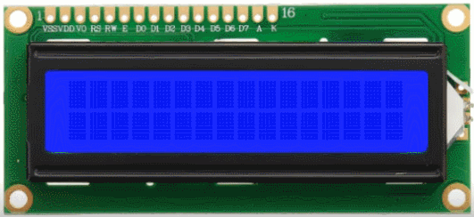
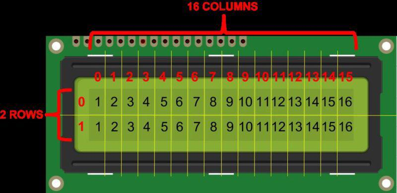
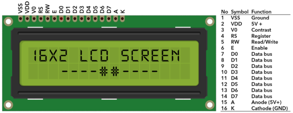
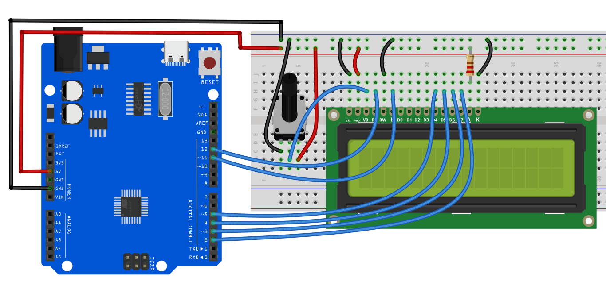
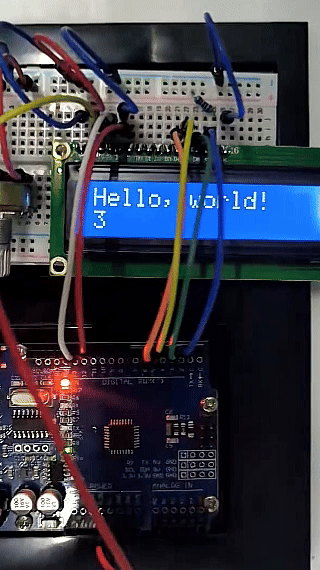

# Проект 17: 1602 LCD




#### Описание

1602 LCD имеет 16 столбцов и 2 строки, которые могут отображать всего 32 символа. Он прост в использовании и отличается низкой стоимостью, поэтому широко применяется в различном электронном оборудовании.

В этом проекте мы напишем программы для платы Arduino, чтобы управлять 1602 LCD и отображать нужную нам информацию.

#### Аппаратное обеспечение

1\. Плата разработки UNO R3 (ch340) x1

2\. Дисплей 1602 LCD x1

3\. Потенциометр 10K x1

4\. Макетная плата x1

5\. Соединительные провода

#### Принцип работы

ЖК-экран — это электронный дисплейный модуль, который использует жидкие кристаллы для создания видимого изображения. Дисплей 16×2 — это очень базовый модуль, часто используемый в [DIY-проектах](https://www.electronicsforu.com/category/electronics-projects/hardware-diy) и схемах. 16×2 означает отображение 16 символов в строке и 2 таких строки. В этом ЖК-дисплее каждый символ отображается в матрице 5×7 пикселей.



#### Технические характеристики

Тип дисплея: Алфавитно-цифровой дисплей

Формат символов: матрица 5x8 точек

Размер дисплея: 16 символов x 2 строки

Цвет дисплея: синий или зеленый

Подсветка: светодиодная подсветка

Питание: 5V DC

Рабочая температура: от -20°C до +70°C

Интерфейс: 4-битный или 8-битный режим

Размеры: 84.0 x 44.0 x 13.0 мм

#### Распиновка



| **№** | **Обозначение** | **Описание контакта**       | **№** | **Обозначение** | **Описание контакта**       |
|-------|-----------------|-----------------------------|-------|-----------------|-----------------------------|
| 1     | VSS             | Общий провод питания (GND)  | 9     | D2              | Данные ввода/вывода          |
| 2     | VDD             | Положительное питание       | 10    | D3              | Данные ввода/вывода          |
| 3     | V0              | Сигнал регулировки контраста| 11    | D4              | Данные ввода/вывода          |
| 4     | RS              | Выбор данных/команды (В/Н)  | 12    | D5              | Данные ввода/вывода          |
| 5     | R/W             | Выбор чтения/записи (В/Н)   | 13    | D6              | Данные ввода/вывода          |
| 6     | E               | Сигнал разрешения           | 14    | D7              | Данные ввода/вывода          |
| 7     | D0              | Данные ввода/вывода          | 15    | A               | Плюс питания подсветки       |
| 8     | D1              | Данные ввода/вывода          | 16    | K               | Минус питания подсветки      |

Два контакта питания: один для питания модуля, другой для подсветки, обычно используется 5V. В этом проекте для подсветки используется 3.3V.

**V0** — контакт для регулировки контрастности. Обычно к нему подключают потенциометр (не более 5KΩ) для настройки. В этом эксперименте используется резистор 1KΩ. Существует два способа подключения: к высокому потенциалу и к низкому потенциалу. Здесь используется метод с низким потенциалом: резистор подключается к GND.

**RS** — очень распространённый контакт в ЖК-дисплеях. Он выбирает режим: данные или команда. Когда контакт в высоком уровне, дисплей в режиме данных; в низком — в режиме команд.

**RW** — также часто встречающийся контакт. Выбирает режим чтения/записи. При высоком уровне — чтение, при низком — запись.

**E** — контакт разрешения. Обычно при стабилизации сигнала на шине он посылает положительный импульс, требующий операции чтения. Когда контакт в высоком уровне, изменения на шине не допускаются.

**D0-D7** — 8-битная двунаправленная параллельная шина, используется для передачи команд и данных.

**BLA** — анод подсветки; **BLK** — катод подсветки.

#### Схема подключения

Подключите контакт VSS 1602 LCD к GND

Подключите контакт VDD 1602 LCD к 5V

Подключите контакт V0 1602 LCD к среднему контакту потенциометра 10K, два крайних контакта потенциометра подключите к 5V и GND соответственно.

Подключите контакт RS 1602 LCD к цифровому пину D12 Arduino

Подключите контакт RW 1602 LCD к GND

Подключите контакт E 1602 LCD к цифровому пину D11 Arduino

Подключите контакт D4 1602 LCD к цифровому пину D5 Arduino

Подключите контакт D5 1602 LCD к цифровому пину D4 Arduino

Подключите контакт D6 1602 LCD к цифровому пину D3 Arduino

Подключите контакт D7 1602 LCD к цифровому пину D2 Arduino

Подключите контакт A 1602 LCD к 5V, а K к GND





#### Пример кода

```cpp

/*

Electronics Learning Starter Kit for Arduino

Project 17

1602 LCD

Edit By Keyes

*/

#include <LiquidCrystal.h>

// Initialize 1602 LCD and set the Arduino pin

LiquidCrystal lcd(12, 11, 5, 4, 3, 2);

void setup() {

// set the numbers of row and column of 1602 LCD

lcd.begin(16, 2);

// Print character strings on 1602 LCD

lcd.print("Hello, world!");

}

void loop() {

// set the the cursor to row 2 column 0

lcd.setCursor(0, 1);

// Print the current operating time in ms

lcd.print(millis() / 1000);

}
```

#### Объяснение кода

Введение в библиотеку LiquidCrystal

```cpp
#include <LiquidCrystal.h>
```

Эта строка кода является началом программы. Она подключает библиотеку LiquidCrystal с помощью директивы `#include`. Эта библиотека предоставляет функции и методы для управления жидкокристаллическими дисплеями (LCD), особенно совместимыми с контроллером HD44780. Такой тип ЖК-дисплеев очень распространён и широко используется для отображения текстовой информации на различных устройствах.

Инициализация LCD

```cpp

LiquidCrystal lcd(12, 11, 5, 4, 3, 2);

```

Эта строка кода создаёт объект `LiquidCrystal` с именем `lcd`. Числа в скобках обозначают пины Arduino, подключённые к ЖК-дисплею. Эти пины — RS, E, D4, D5, D6 и D7 соответственно. Такой способ подключения называется 4-битным режимом, где для передачи данных используются только четыре линии (D4-D7).

Функция setup

```cpp
void setup() {

lcd.begin(16, 2);

lcd.print("Hello, world!");

}
```

Функция `setup()` — обязательная часть каждой программы Arduino. Она выполняется один раз после сброса платы Arduino. В этой функции сначала вызывается `lcd.begin(16, 2);`, чтобы задать количество столбцов и строк ЖК-дисплея. В данном примере установлено 16 столбцов и 2 строки.

Сразу после этого `lcd.print("Hello, world!");` выводит текст "Hello, world!" на дисплей. Это демонстрирует, как вывести строку на LCD.

Функция loop

```cpp
void loop() {

lcd.setCursor(0, 1);

lcd.print(millis() / 1000);

}
```

Функция `loop()` — ещё одна основная часть кода Arduino. Она выполняется бесконечно после сброса устройства. В этой функции `lcd.setCursor(0, 1);` устанавливает позицию курсора в начало второй строки (нумерация строк и столбцов начинается с 0).

Затем `lcd.print(millis() / 1000);` вычисляет количество секунд, прошедших с начала работы программы, и выводит это значение на дисплей. Здесь функция `millis()` возвращает количество миллисекунд с запуска программы, а деление на 1000 переводит это значение в секунды.

#### Результат проекта

После загрузки кода 1602 LCD отобразит две строки: "Hello, world!" в первой строке и текущее время работы платы Arduino (в секундах) во второй строке.



В этом проекте вы научились использовать 1602 LCD через плату разработки UNO R3 (ch340). Вы можете изменить код, чтобы попробовать более сложные функции, например, отображать разные сообщения и добавлять другие модули, такие как кнопки или датчики температуры.