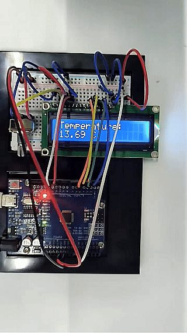

# Проект 18: Термометр


#### Описание

Цель этого проекта — создать простой умный термометр на базе Arduino с использованием термистора NTC-MF52AT 10K и ЖК-дисплея. Датчик термистора измеряет окружающую температуру, а ЖК-дисплей отображает значение температуры в реальном времени. Этот проект является отличным упражнением для начинающих, так как помогает понять базовый принцип работы датчиков и практиковать взаимодействие между дисплеем и датчиком.

#### Аппаратное обеспечение

1\. Плата разработки UNO R3 (ch340) x1

2\. Термистор NTC-MF52AT 10K x1

3\. ЖК-дисплей 16x2 x1

4\. Резисторы (220 Ом) x1

5\. Макетная плата x1

6\. Соединительные провода

#### Принцип работы

Принцип работы данного проекта следующий:

Термистор NTC-MF52AT 10K обнаруживает окружающую температуру и преобразует её в соответствующий аналоговый напряженческий сигнал.

Аналоговый входной пин платы Arduino (в данном случае A0) считывает аналоговое напряжение, выходящее с термистора.

Аналого-цифровой преобразователь (ADC) внутри Arduino преобразует аналоговое напряжение в цифровое значение.

На основе формулы преобразования термистора (где каждые 10 мВ соответствуют 1 градусу Цельсия) Arduino преобразует цифровое значение в температуру.

Затем Arduino отображает вычисленное значение температуры на ЖК-дисплее LCD1602.

#### Схема подключения

**Датчик термистора**

VCC: 5V Arduino

GND: GND Arduino

VOUT: A0 (аналоговый вход)

**LCD1602**

RS: Подключить к цифровому пину 11

EN: Подключить к цифровому пину 12

D4-D7: Подключить к цифровым пинам 5, 4, 3, 2 соответственно


#### Пример кода

```cpp

/*

Electronics Learning Starter Kit for Arduino

Project 18

Thermometer

Edit By Keyes

*/

#include <LiquidCrystal.h>

// Initialize the GPIO pins: RS, E, D4, D5, D6, D7

LiquidCrystal lcd(12, 11, 5, 4, 3, 2);

const int sensorPin = A0; // Thermistor connected to A0

void setup() {

// Set LCD column and row count

lcd.begin(16, 2);

// Display text on the first line

lcd.print("Temperature:");

}

void loop() {

// Read the analog value from Thermistor (0-1023)

int sensorValue = analogRead(sensorPin);

// Convert the analog value to voltage (unit: mV)

float voltage = sensorValue * (5000.0 / 1023.0);

// Calculate the temperature value (unit: Celsius)

float temperatureC = voltage / 10.0;

// Display the temperature value on the LCD second line

lcd.setCursor(0, 1);

lcd.print(temperatureC);

lcd.print(" C ");

// Update every second

delay(1000);

}
```

#### Объяснение кода

**Подключение библиотеки и инициализация**

```cpp
#include <LiquidCrystal.h>

LiquidCrystal lcd(12, 11, 5, 4, 3, 2);

const int sensorPin = A0; // Thermistor connected to A0
```

`#include <LiquidCrystal.h>`: Подключает библиотеку LiquidCrystal для управления ЖК-дисплеем.

`LiquidCrystal lcd(...)`: Инициализирует объект lcd на основе подключенных пинов ЖК-дисплея.

`const int sensorPin = A0;`: Определяет аналоговый пин, к которому подключен датчик термистора (A0).

**Функция настройки setup()**

```cpp
void setup() {

lcd.begin(16, 2);

lcd.print("Temperature:");

}
```

`lcd.begin(16, 2);`: Устанавливает режим дисплея с 16 столбцами и 2 строками.

`lcd.print("Temperature:");`: Отображает текст «Temperature:» на первой строке ЖК-дисплея.

**Основной цикл loop()**

```cpp
void loop() {

int sensorValue = analogRead(sensorPin);

float voltage = sensorValue * (5000.0 / 1023.0);

float temperatureC = voltage / 10.0;

lcd.setCursor(0, 1);

lcd.print(temperatureC);

lcd.print(" C ");

delay(1000);

}
```

**Считывание значения с датчика**

```cpp

int sensorValue = analogRead(sensorPin);

```

`analogRead(sensorPin)`: Считывает аналоговое напряжение с датчика термистора, возвращая целое число от 0 до 1023.

**Преобразование в напряжение**

```cpp

float voltage = sensorValue * (5000.0 / 1023.0);

```

Преобразует значение с датчика в реальное напряжение в милливольтах.

`5000.0` соответствует опорному напряжению Arduino 5 В, преобразованному в 5000 мВ.

`1023.0` — максимальное значение АЦП (10-битный АЦП с диапазоном 0-1023).

**Вычисление температуры**

```cpp

float temperatureC = voltage / 10.0;

```

Согласно спецификациям термистора, каждый градус Цельсия соответствует 10 мВ.

Поэтому деление напряжения на 10 дает текущую температуру в градусах Цельсия.

**Отображение температуры на ЖК-дисплее**

```cpp

lcd.setCursor(0, 1);

lcd.print(temperatureC);

lcd.print(" C ");

```

`lcd.setCursor(0, 1);`: Перемещает курсор на вторую строку, первый столбец ЖК-дисплея.

`lcd.print(temperatureC);`: Отображает значение температуры.

`lcd.print(" C ");`: Отображает символ градуса Цельсия с пробелами для замены оставшихся символов.

**Задержка в одну секунду**

```cpp

delay(1000);

```

Задержка на 1000 миллисекунд (1 секунду) для контроля частоты обновления.

#### Результат проекта

После завершения этого проекта у вас будет полностью функциональный измеритель температуры. Это устройство может отображать окружающую температуру в реальном времени и предоставлять визуальную обратную связь при изменении температуры.

