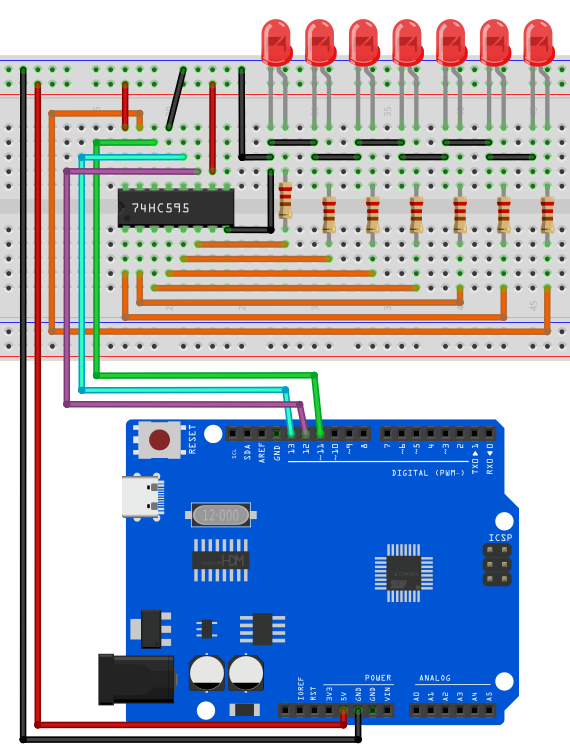
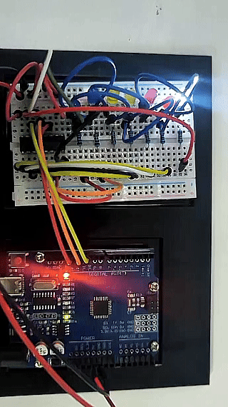

# Proyecto 19: Chip 74HC595


#### Descripción

El 74HC595 es un chip IO común que controla múltiples salidas con un pequeño número de pines de control, lo que lo hace ideal para escenarios donde se necesitan controlar varios LEDs o dispositivos de salida.

En este proyecto, controlamos 7 LEDs encendiéndolos y apagándolos a través del chip 74HC595 para lograr el efecto de luces de flujo de agua.

#### Hardware

1\. Placa de desarrollo UNO R3 (ch340) x1

2\. Chip 74HC595 x1

3\. LED x7

4\. Resistencia de 220 ohmios x7

5\. Protoboard x1

6\. Cables jumper

#### Principio de funcionamiento

El 74HC595 tiene dos registros de 8 bits (que pueden considerarse como “contenedores de memoria”). El primero se denomina Registro de Desplazamiento, y el segundo Registro de Almacenamiento/Retención.

Cada vez que el 74HC595 recibe un pulso de reloj, ocurren dos cosas:

Los bits contenidos en el registro de desplazamiento se desplazan a la izquierda una posición. El valor del bit 0 se empuja al bit 1, mientras que el valor del bit 1 se empuja al bit 2, y así sucesivamente.

El bit 0 en el registro de desplazamiento acepta el valor actual en el pin DATA. En el flanco ascendente del pulso de reloj, si el pin DATA está en alto, se empuja un 1 al registro de desplazamiento, de lo contrario un 0.

Este proceso continuará mientras el 74HC595 reciba pulsos de reloj.

Cuando se habilita el pin latch, el contenido del registro de desplazamiento se copia al registro de almacenamiento/retención. Cada bit del registro de almacenamiento está vinculado a uno de los pines de salida QA-QH del CI. Como resultado, cada vez que cambia el valor en el registro de almacenamiento, la salida cambia.

La animación a continuación te ayudará a entenderlo mejor.


#### Especificaciones

Entrada serial de 8 bits

Salida serial o paralela de 8 bits

Registro de almacenamiento con salidas en estado de tres estados

Registro de desplazamiento con borrado directo

Frecuencia típica de desplazamiento de 100 MHz

#### Pinout


GND es el pin de tierra.

VCC es la alimentación para el registro de desplazamiento 74HC595, que debe conectarse a 5V.

El pin SER (Entrada Serial) se usa para enviar datos al registro de desplazamiento un bit a la vez.

SRCLK (Reloj del Registro de Desplazamiento) es el reloj para el registro de desplazamiento y es activado por flanco positivo. Esto significa que los bits se introducen en el flanco ascendente del reloj.

RCLK (Reloj del Registro / Latch) es un pin muy importante. Cuando este pin se pone en ALTO, el contenido del Registro de Desplazamiento se copia en el Registro de Almacenamiento/Retención, que finalmente aparece en la salida. Por lo tanto, el pin latch puede verse como el último paso antes de ver nuestros resultados en la salida.

El pin SRCLR (Borrado del Registro de Desplazamiento) nos permite reiniciar todo el Registro de Desplazamiento, estableciendo todos los bits a cero. Debido a que es un pin activo en bajo, debemos poner el pin SRCLR en BAJO para realizar el reinicio.

OE (Habilitación de Salida) también es un pin activo en bajo: cuando se pone en ALTO, los pines de salida se deshabilitan (se ponen en estado de alta impedancia). Cuando se pone en BAJO, los pines de salida funcionan normalmente.

QA–QH (Habilitación de Salida) son los pines de salida.

El pin QH’ saca el bit 7 del registro de desplazamiento. Esto permite encadenar en serie los 74HC595. Si conectas este pin al pin SER de otro 74HC595, y alimentas ambos CIs con la misma señal de reloj, se comportarán como si fueran un solo CI con 16 salidas. Por supuesto, con esta técnica, puedes encadenar en serie tantos CIs como quieras.

#### Diagrama de conexión

1\. Conecta el pin VCC del chip 74HC595 a 5V en la placa, y el pin GND a GND en la placa.

2\. Conecta DS(pin 14) del chip 74HC595 a D11 en la placa, SHCP(pin 11) a D12, y STCP(pin 12) a D13.

3\. Conecta Q0-Q7(pin 15, pin 1-6) del 74HC595 a los ánodos de 7 LEDs a través de resistencias de 220 ohmios, conecta los cátodos de los LEDs a GND.




#### Código de ejemplo

```cpp

/*

Electronics Learning Starter Kit for Arduino

Project 19

74HC595 Chip

Edit By Keyes

*/

const int DS = 11; // serial data input

const int SHCP = 12; // Shift register clock input

const int STCP = 13; // Latch clock input

void setup() {

pinMode(DS, OUTPUT);

pinMode(SHCP, OUTPUT);

pinMode(STCP, OUTPUT);

}

void loop() {

for (int i = 0; i < 7; i++) {

digitalWrite(STCP, LOW);

shiftOut(DS, SHCP, MSBFIRST, 1 << i); // Move data into the shift register by serial

digitalWrite(STCP, HIGH); // Output shift register data to the latch in parallel

delay(200);

}

}
```

#### Explicación del código

Primero, el código define tres variables de pines: DS, SHCP y STCP, que se usan para la entrada de datos serial, la entrada del reloj del registro de desplazamiento y la entrada del reloj del registro latch, respectivamente. Estos pines están asignados a pines específicos en la placa Arduino mediante definiciones digitales.

```cpp

const int DS = 11; // Entrada de datos serial

const int SHCP = 12; // Entrada del reloj del registro de desplazamiento

const int STCP = 13; // Entrada del reloj del registro latch

```

Luego, en la función `setup()`, los tres pines se configuran en modo salida porque se usarán para enviar señales al registro de desplazamiento.

```cpp
void setup() {

pinMode(DS, OUTPUT);

pinMode(SHCP, OUTPUT);

pinMode(STCP, OUTPUT);

}
```

Lógica principal del bucle

En la función `loop()`, el código controla el encendido secuencial de los LEDs mediante un bucle. El bucle itera siete veces, y cada iteración controla el estado de un LED a través del registro de desplazamiento y el registro latch.

```cpp
void loop() {

for (int i = 0; i < 7; i++) {

digitalWrite(STCP, LOW);

shiftOut(DS, SHCP, MSBFIRST, 1 << i);

digitalWrite(STCP, HIGH);

delay(200);

}

}
```

**Poner STCP en nivel bajo**: Antes de enviar datos, el pin STCP se pone en nivel bajo para preparar el registro de desplazamiento para recibir datos.

```cpp
digitalWrite(STCP, LOW);
```

**Desplazar los datos**: La función `shiftOut()` se usa para enviar datos bit a bit desde el pin DS al registro de desplazamiento. El parámetro `MSBFIRST` indica que los datos se envían comenzando por el bit más significativo. `1 << i` es una operación a nivel de bits que representa que solo un bit está en nivel alto (1) mientras que los otros bits están en nivel bajo (0). Esta operación controla efectivamente qué LED se enciende.

```cpp

shiftOut(DS, SHCP, MSBFIRST, 1 << i);

```

**Poner STCP en nivel alto**: Después de enviar los datos, el pin STCP se pone en nivel alto. Esta acción provoca que el contenido del registro de desplazamiento se copie al registro latch, actualizando el estado de visualización de los LEDs.

```cpp
digitalWrite(STCP, HIGH);
```

**Retardo**: La llamada a la función `delay(200)` mantiene cada LED encendido durante 200 milisegundos, permitiendo a los usuarios ver claramente la secuencia de encendido de los LEDs.

#### Resultado del proyecto

Después de subir el código, los 7 LEDs se encenderán en secuencia, lo que parece un flujo de agua. Con el chip 74HC595, controlamos 7 salidas solo a través de tres pines del Arduino, lo que ahorra muchos pines.

