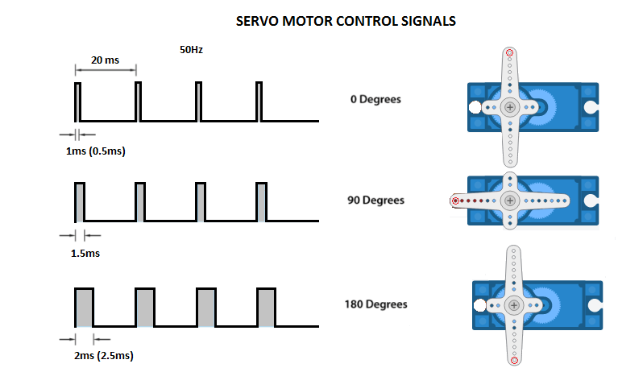
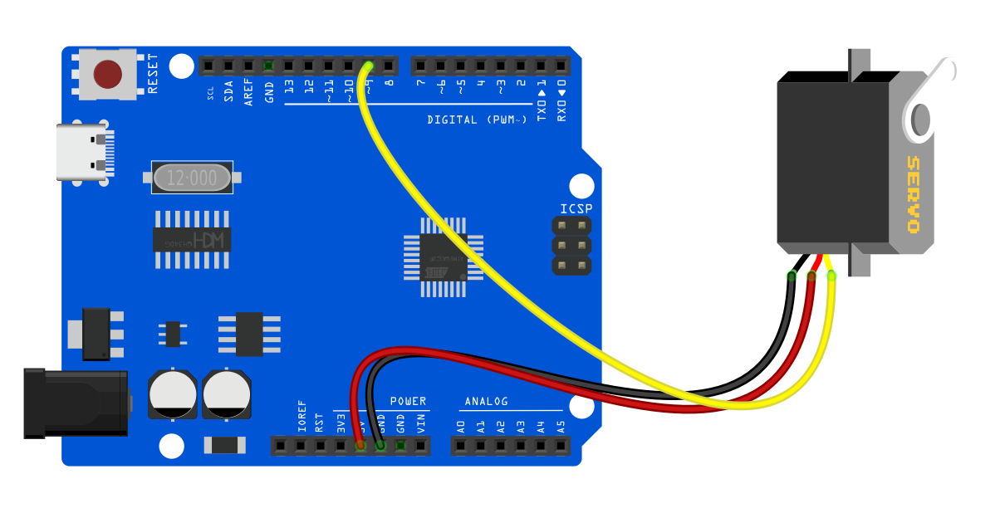
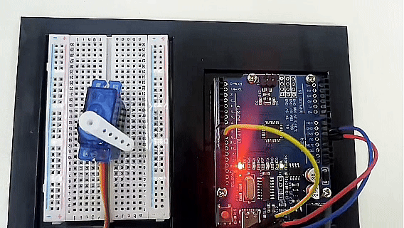

# Проект 20: Серво


#### Описание

Серво — это исполнительный механизм, который преобразует электрические сигналы в механическое перемещение. Он играет важную роль в жизни и широко используется в робототехнике, дронах, умных домах, а также в промышленном управлении.

В этом проекте мы пишем код для Arduino, чтобы управлять сервоприводом с помощью платы разработки UNO R3 (ch340).

#### Аппаратное обеспечение

1\. Плата разработки UNO R3 (ch340) x1

2\. Серво x1

3\. Провода DuPont

#### Принцип работы

Внутри хоббийного серво есть четыре основных компонента: электродвигатель постоянного тока, редуктор, потенциометр и управляющая схема. Электродвигатель постоянного тока имеет высокую скорость и низкий крутящий момент, но редуктор снижает скорость примерно до 60 об/мин и одновременно увеличивает крутящий момент.


Потенциометр прикреплен к последней шестерне или выходному валу, поэтому при вращении мотора потенциометр тоже вращается, создавая напряжение, связанное с абсолютным углом выходного вала. В управляющей схеме это напряжение потенциометра сравнивается с напряжением, поступающим с сигнальной линии. При необходимости контроллер активирует интегрированный H-мост, который позволяет мотору вращаться в любом направлении до тех пор, пока разница между двумя сигналами не станет равна нулю.

Сервопривод управляется путем передачи серии импульсов через сигнальную линию. Частота управляющего сигнала должна быть 50 Гц, то есть импульс должен повторяться каждые 20 мс. Ширина импульса определяет угловое положение серво, и такие серво обычно могут поворачиваться на 180 градусов (имеют физические ограничения по углу поворота).



Обычно импульсы длительностью 1 мс соответствуют положению 0 градусов, 1,5 мс — 90 градусам, а 2 мс — 180 градусам. Однако минимальная и максимальная длительность импульсов может варьироваться у разных производителей и составлять, например, 0,5 мс для 0 градусов и 2,5 мс для 180 градусов.

#### Технические характеристики

T-pro Mini Servo Motor SG-90 9g Servo

Лучший выбор для радиоуправляемых моделей

Прилагаемые аксессуары

Соответствие стандарту ROHS

Размеры: 23x12.2x29 мм

Крутящий момент: 0.5 кг/см

Максимальный крутящий момент: 1.5 кг/см при 5В

Скорость работы: 0.3 с/60 градусов при 4.8В

Рабочее напряжение: 4.2-6В

Диапазон температур: 0-55 °C

Ширина мертвой зоны: 10 мкс

Материал шестерен: нейлон

#### Распиновка


GND Земля (коричневый провод) – это контакт земли.

VCC +5В (красный провод) – питание подается на сервопривод через этот контакт.

Control (оранжевый провод) – через этот провод принимаются управляющие сигналы позиционирования через ШИМ.

#### Схема подключения

1\. Подключите красный провод (плюс) серво к пину 5V на плате

2\. Подключите черный провод (минус) серво к GND на плате

3\. Подключите оранжевый провод (сигнал) серво к цифровому пину D9 на плате




#### Пример кода

```cpp

/*

Electronics Learning Starter Kit for Arduino

Project 20

Servo

Edit By Keyes

*/

#include <Servo.h>

Servo myservo; // create a Servo object

void setup() {

myservo.attach(9); // connect servo to digital pin 9

}

void loop() {

myservo.write(0); // rotate servo to 0 degree

delay(1000); // delay 1s

myservo.write(90); // rotate servo to 90 degree

delay(1000); // delay 1s

myservo.write(180); // rotate servo to 180 degree

delay(1000); // delay 1s

}
```

#### Объяснение кода

Импорт библиотек и создание объекта серво

Сначала, в начале программы Arduino, необходимо подключить библиотеку `Servo.h`, что делается с помощью директивы препроцессора `#include <Servo.h>`. Затем создается объект класса `Servo`, в данном примере с именем `myservo`. Этот объект будет использоваться для всех последующих операций, связанных с сервоприводом.

```cpp
#include <Servo.h>

Servo myservo; // Создаем объект сервопривода
```

Функция setup

В функции `setup()` мы подключаем сервопривод к определенному цифровому пину на плате Arduino. В этом примере используется цифровой пин 9. Строка `myservo.attach(9);` связывает объект сервопривода с цифровым пином 9, что позволяет выходному сигналу с этого пина управлять сервоприводом.

```cpp
void setup() {

myservo.attach(9); // Подключаем сервопривод к цифровому пину 9

}
```

Функция loop

В функции `loop()` прописывается логика управления сервоприводом. Эта функция выполняется непрерывно, образуя бесконечный цикл. В данном примере сервопривод поворачивается на 0 градусов, затем на 90 градусов, и затем на 180 градусов. После каждого поворота программа делает паузу на одну секунду (1000 миллисекунд), что достигается с помощью функции `delay(1000);`.

```cpp
void loop() {

myservo.write(0); // Повернуть сервопривод на 0 градусов

delay(1000); // Задержка 1 секунда

myservo.write(90); // Повернуть сервопривод на 90 градусов

delay(1000); // Задержка 1 секунда

myservo.write(180); // Повернуть сервопривод на 180 градусов

delay(1000); // Задержка 1 секунда

}
```

В этом процессе функция `myservo.write(angle);` используется для задания целевого угла поворота сервопривода. Параметр `angle` — это целое число, обозначающее угол, на который должен повернуться мотор. Библиотека Servo обеспечивает генерацию сигналов, чтобы мотор переместился в указанное положение.

#### Результат проекта

После загрузки кода сервопривод поворачивается на 0°, 90° и 180°, удерживая каждую позицию по 1 секунде. Эти действия повторяются.

