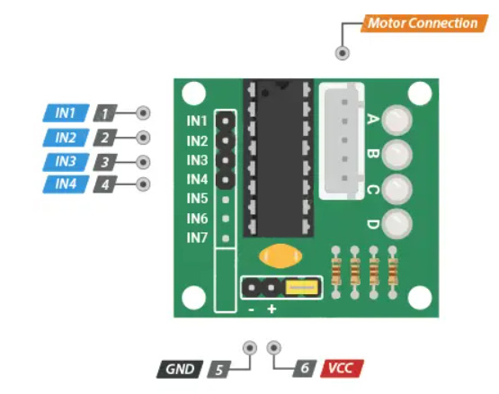
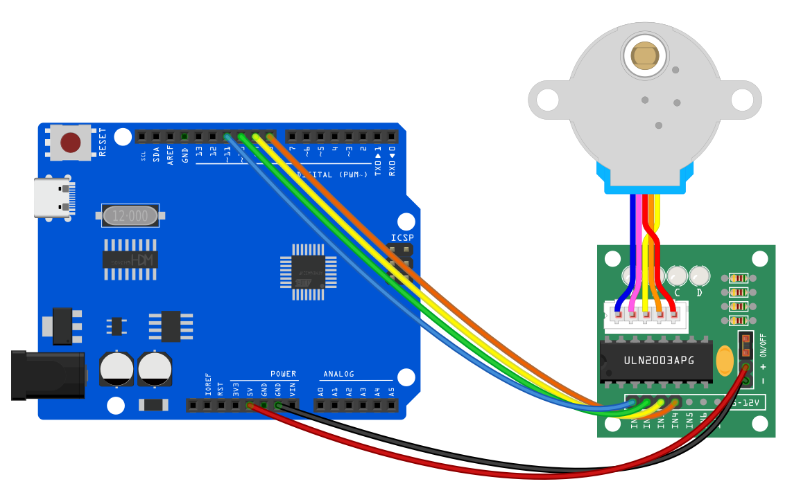
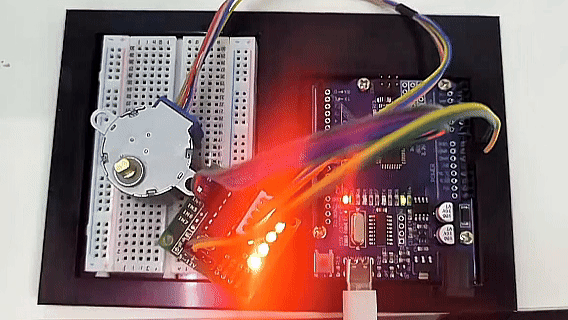

# Proyecto 21: Motor Paso a Paso


#### Descripción

El motor paso a paso puede convertir señales eléctricas en desplazamientos angulares precisos para realizar un control de posicionamiento exacto. El motor paso a paso de 5V solo requiere un voltaje de 5 voltios, por lo que se caracteriza por su tamaño pequeño, peso ligero y operación sencilla, y se utiliza ampliamente en muchos equipos electrónicos y sistemas de automatización.

En este proyecto, controlamos con precisión el motor paso a paso mediante la placa de desarrollo UNO R3 (ch340). A través de este proyecto, comprenderás el **Principio de Funcionamiento** del motor paso a paso, aprenderás cómo controlar el motor paso a paso y ajustar su velocidad, dirección de rotación y ángulo de rotación según sea necesario.

#### Hardware

1\. Placa de desarrollo UNO R3 (ch340) x1

2\. Motor Paso a Paso 28BYJ-48 x1

3\. Placa de control para motor paso a paso ULN2003 x1

4\. Protoboard x1

5\. Cables DuPont

#### Principio de Funcionamiento

El 28BYJ-48 es un motor paso a paso unipolar de 5 cables que funciona a 5V. Es perfecto para proyectos que requieren posicionamiento preciso, como abrir y cerrar una ventilación.


Debido a que el motor no utiliza escobillas de contacto, tiene un movimiento relativamente preciso y es bastante confiable.

A pesar de su tamaño pequeño, el motor entrega un torque decente de 34.3 mN.m a una velocidad de alrededor de 15 RPM. Proporciona buen torque incluso en reposo y lo mantiene mientras el motor reciba energía.

La única desventaja es que consume bastante energía incluso cuando está detenido.

#### Pinout del Motor Paso a Paso

El motor paso a paso 28BYJ-48 tiene cinco cables. El pinout es el siguiente:


El 28BYJ-48 tiene dos bobinas, cada una con un punto medio. Estos dos puntos medios están conectados internamente y salen como el quinto cable (cable rojo).

Juntos, un extremo de la bobina y el punto medio forman una **Fase**. Por lo tanto, el 28BYJ-48 tiene un total de cuatro fases.

El cable rojo siempre está en estado ALTO, por lo que cuando el otro cable está en estado BAJO, la fase se energiza.

El motor paso a paso gira solo cuando las fases se energizan en una secuencia lógica conocida como **secuencia de pasos**.

La Placa Controladora ULN2003

Debido a que el motor paso a paso 28BYJ-48 consume una cantidad significativa de energía, no puede ser controlado directamente por un microcontrolador como Arduino. Para controlar el motor, se requiere un circuito controlador como el ULN2003; por lo tanto, este motor típicamente viene con una placa controladora basada en ULN2003.

El ULN2003, conocido por su alta capacidad de corriente y voltaje, proporciona una ganancia de corriente mayor que un transistor individual y permite que la salida de bajo voltaje y baja corriente de un microcontrolador controle un motor paso a paso de alta corriente.

El ULN2003 consta de un arreglo de siete pares de transistores Darlington, cada uno capaz de manejar una carga de hasta 500mA y 50V. Esta placa utiliza cuatro de los siete pares.


La placa tiene cuatro entradas de control y una conexión de alimentación.

Además, hay un conector Molex compatible con el conector del motor, lo que permite conectar el motor directamente.

La placa incluye cuatro LEDs que indican la actividad en las cuatro líneas de entrada de control. Proporcionan una buena indicación visual durante el paso.

Hay un jumper de encendido/apagado en la placa para deshabilitar el motor paso a paso si es necesario.

#### Pinout del Driver del Motor Paso a Paso

La placa controladora ULN2003 tiene el siguiente pinout:



IN1 – IN4 son pines de entrada para el control del motor. Conéctalos a los pines digitales de salida del Arduino.

GND es el pin de tierra.

El pin VCC alimenta el motor. Debido a que el motor consume una cantidad significativa de energía, es preferible usar una fuente de alimentación externa de 5V en lugar de la del Arduino.

out1-out4 es donde se conecta el motor. El conector tiene una llave, por lo que solo se puede insertar de una manera.

#### Diagrama de Conexiones

1.Conecta el motor paso a paso a los pines out1, out2, out3, out4 en la placa controladora ULN2003.

2.Conecta la placa controladora ULN2003 + y - a 5V y GND en la placa de desarrollo respectivamente.

3.Conecta los pines digitales D8, D9, D10, D11 en la placa de desarrollo a los pines IN1, IN2, IN3, IN4 en la placa controladora.




#### Código de Ejemplo

```cpp

/*

Electronics Learning Starter Kit for Arduino

Project 21

Stepper Motor

Edit By Keyes

*/

#include <Stepper.h>

const int stepsPerRevolution = 2048; // the steps of a cycle

// initialization

Stepper myStepper(stepsPerRevolution, 8, 10, 9, 11);

void setup() {

// Set motor speed(rpm)

myStepper.setSpeed(5);

// initialize serial port

Serial.begin(9600);

}

void loop() {

// rotate a cycle clockwise

Serial.println("clockwise");

myStepper.step(stepsPerRevolution);

delay(500);

// rotate half a cycle counterclockwise

Serial.println("counterclockwise");

myStepper.step(-stepsPerRevolution / 2);

delay(500);

}
```

#### Explicación del Código

Importación de la Biblioteca

```cpp
#include <Stepper.h>
```

Esta línea de código importa la biblioteca Stepper en Arduino, que proporciona funciones y métodos para controlar motores paso a paso, simplificando la complejidad de la programación.

Definición de Constantes y Creación de un Objeto Stepper

```cpp

const int stepsPerRevolution = 2048; // Number of steps per revolution

Stepper myStepper(stepsPerRevolution, 8, 10, 9, 11);

```

Aquí, se define una constante `stepsPerRevolution`, que representa el número de pasos necesarios para que el motor complete una revolución. Este valor depende del modelo específico y la configuración del motor. A continuación, se crea un objeto `myStepper` de la clase `Stepper`, inicializado con el número de pasos y los cuatro números de pines (8, 10, 9, 11) que controlan el motor. Estos cuatro pines están conectados a la interfaz de control del controlador del motor paso a paso.

Función Setup

```cpp
void setup() {

myStepper.setSpeed(5); // Set the motor speed (rpm)

Serial.begin(9600); // Initialize the serial port

}
```

En la función `setup()`, el código primero llama a `myStepper.setSpeed(5);` para establecer la velocidad de rotación del motor a 5 revoluciones por minuto (rpm). Luego, inicializa el puerto de comunicación serial usando `Serial.begin(9600);`, configurando la tasa de baudios a 9600 para la transmisión de datos y la salida de información para depuración.

Función Principal Loop

```cpp
void loop() {

Serial.println("clockwise"); // Output clockwise rotation information

myStepper.step(stepsPerRevolution); // Rotate the motor clockwise by one revolution

delay(500); // Delay for 500 milliseconds

Serial.println("counterclockwise"); // Output counterclockwise rotation information

myStepper.step(-stepsPerRevolution / 2);// Rotate the motor counterclockwise by half a revolution

delay(500); // Delay for 500 milliseconds

}
```

En la función `loop()`, el código primero muestra el mensaje "clockwise" usando `Serial.println("clockwise");`, luego llama a `myStepper.step(stepsPerRevolution);` para girar el motor en sentido horario una revolución completa. La función `delay(500);` pausa el programa durante 500 milisegundos.

A continuación, muestra el mensaje "counterclockwise" y usa `myStepper.step(-stepsPerRevolution / 2);` para girar el motor en sentido antihorario media revolución. El signo negativo indica que la dirección de rotación es antihoraria. Después, se realiza otra pausa de 500 milisegundos.

#### Resultado del Proyecto

Después de subir el código, el motor paso a paso girará una revolución completa en sentido horario y luego media revolución en sentido antihorario, en un ciclo continuo. Mientras tanto, la dirección de rotación en tiempo real se puede verificar en el monitor.

