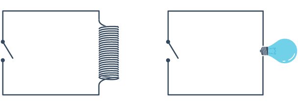
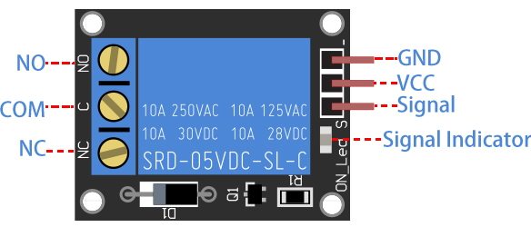
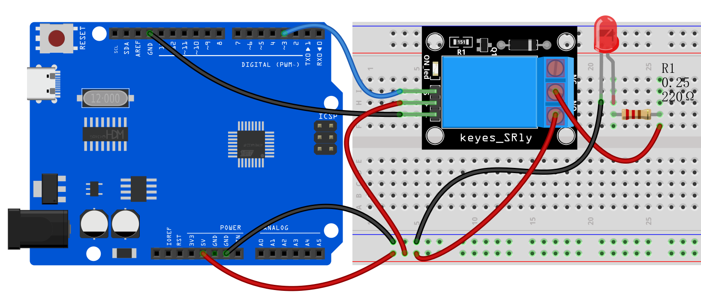
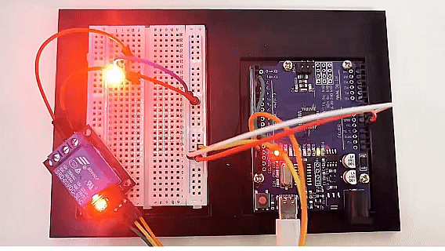

# Проект 22: Реле на 5В


#### Описание

Модуль реле используется для управления высоким током или напряжением в цепи. Он состоит из катушки и контакта. Когда катушка возбуждается, контакты замыкаются, и цепь подключается. Когда питание катушки отключается, контакт размыкается, тем самым разрывая цепь.

В этом проекте мы управляем модулем реле на 5В через плату разработки Arduino, чтобы реализовать управление включением/выключением внешней цепи или оборудования. Когда Arduino выдаёт высокий уровень, реле срабатывает, и нормально разомкнутый контакт замыкается, подключая внешнюю цепь; когда Arduino выдаёт низкий уровень, реле возвращается в исходное состояние и размыкает внешнюю цепь.

#### Аппаратное обеспечение

1. Плата разработки UNO R3 (ch340) x1

2. Реле 5В x1

3. Светодиод (LED) x1

4. Резистор 220 Ом x1

5. Провода DuPont

#### Принцип работы

В основе реле лежит электромагнит (катушка провода, которая становится временным магнитом при прохождении через неё электричества). Реле можно представить как электрический рычаг: вы включаете его относительно небольшим током, и он включает другое устройство с гораздо большим током.

Основы реле

Вот небольшая анимация, показывающая, как реле связывает две цепи вместе.



Для иллюстрации представьте две простые цепи: одну с электромагнитом и выключателем или датчиком, и другую с магнитным выключателем и лампочкой.

Изначально обе цепи разомкнуты, ток через них не течёт.

Когда небольшой ток проходит через первую цепь, электромагнит возбуждается, создавая вокруг себя магнитное поле. Возбуждённый электромагнит притягивает контакт второй цепи, замыкая выключатель и позволяя протекать большому току.

Когда ток в первой цепи прекращается, контакт возвращается в исходное положение, размыкая вторую цепь.

Технические характеристики

Напряжение питания – 3.3В до 5В

Ток покоя: 2мА

Ток при активном реле: ~70мА

Максимальное напряжение контактов реле – 250VAC или 30VDC

Максимальный ток реле – 10А

#### Распиновка



GND – общий контакт земли.

Вывод VCC подаёт питание на модуль.

Вывод S используется для управления реле. Это активный низкий вывод, что означает, что при подаче LOW реле активируется, а при подаче HIGH – деактивируется.

Выходные клеммы:

Клемма COM подключается к устройству, которым вы хотите управлять.

Клемма NC обычно соединена с COM, если реле не активировано, при активации реле соединение разрывается.

Клемма NO обычно разомкнута, если реле не активировано, при активации реле соединяется с COM.

#### Схема подключения

1\. Подключите вывод VCC реле к 5V Arduino

2\. Подключите вывод GND реле к GND Arduino

3\. Подключите вывод S реле к цифровому выводу D3 Arduino

4\. Подключите внешнюю цепь или устройство к нормально разомкнутым и общим контактам реле

К этому винтовому клеммнику можно подключать цепи с высоким напряжением. Например: лампочку, потолочный вентилятор и т.п. Но в этом проекте мы используем только светодиод.

Когда вы соединяете точки a) и b), подключённый светодиод всегда включён, пока не получит сигнал от Arduino выключиться.

Когда вы соединяете точки b) и c), подключённый светодиод выключен, пока не получит сигнал от Arduino включиться.




#### Пример кода

```cpp

/*

Набор для изучения электроники для Arduino

Проект 22

Реле на 5В

Редактировал Keyes

*/

const int relayPin = 3; // назначаем пин реле

void setup() {

pinMode(relayPin, OUTPUT); // устанавливаем пин как выход

}

void loop() {

digitalWrite(relayPin, HIGH); // подаём высокий уровень для срабатывания реле

delay(1000); // задержка 1 секунда

digitalWrite(relayPin, LOW); // подаём низкий уровень для отключения реле

delay(1000); // задержка 1 секунда

}
```

#### Объяснение кода

Сначала рассмотрим первую строку кода:

```cpp

const int relayPin = 3; // назначаем пин реле

```

Эта строка определяет константу с именем `relayPin` и присваивает ей значение 3. В Arduino `const int` используется для определения целочисленной константы, что означает, что после присвоения `relayPin` нельзя изменить во время выполнения программы. Число 3 здесь указывает, что реле подключено к цифровому входу/выходу 3 на плате Arduino.

Далее функция `setup()`:

```cpp
void setup() {

pinMode(relayPin, OUTPUT); // устанавливаем пин как выход

}
```

Функция `setup()` является обязательной частью каждой программы Arduino. Она выполняется только один раз и используется для инициализации. В этой функции мы вызываем `pinMode()`, встроенную функцию языка Arduino, которая устанавливает режим работы конкретного пина. Функция `pinMode()` принимает два параметра: номер пина и режим. Здесь мы устанавливаем режим пина `relayPin` (то есть цифрового пина 3) как `OUTPUT`, что означает, что этот пин будет использоваться как выход для подачи напряжения.

Далее функция `loop()`:

```cpp
void loop() {

digitalWrite(relayPin, HIGH); // подаём высокий уровень для срабатывания реле

delay(1000); // задержка 1 секунда

digitalWrite(relayPin, LOW); // подаём низкий уровень для отключения реле

delay(1000); // задержка 1 секунда

}
```

Функция `loop()` — это ядро программы Arduino. Она выполняется повторно после включения платы Arduino. В этой функции мы используем функцию `digitalWrite()` для управления реле. Функция `digitalWrite()` также принимает два параметра: номер пина и состояние (HIGH или LOW). Сначала мы устанавливаем `relayPin` в состояние `HIGH`, что подаёт напряжение 5В на реле, заставляя его замкнуться. Затем программа приостанавливается на 1000 миллисекунд (то есть 1 секунду) с помощью `delay(1000);`, чтобы реле оставалось замкнутым некоторое время.

После этого `digitalWrite(relayPin, LOW);` устанавливает состояние пина в `LOW`, отключая питание реле, и оно возвращается в разомкнутое состояние. Функция `delay(1000);` снова приостанавливает программу на 1 секунду, после чего цикл повторяется.

#### Результат проекта

После загрузки кода реле меняет своё состояние (включено или выключено) каждую секунду. Когда реле включено, NO соединяется с COM и внешняя цепь замыкается. Когда реле выключено, NO размыкается с COM и цепь разрывается.

