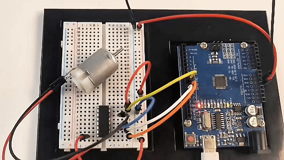

# Proyecto 23: Driver de Motor L293D

## Introducción al Proyecto
Este proyecto tiene como objetivo lograr el control totalmente automático de un motor de corriente continua utilizando una placa Arduino combinada con un chip driver de motor L293D (o compatible SN754410). Una vez que el programa se ejecuta, el motor funcionará sin intervención manual (no es necesario enviar comandos a través del monitor serial), ejecutando automáticamente y de forma cíclica la secuencia: "rotación hacia adelante -> detener -> rotación hacia atrás -> detener." Este proyecto es una excelente práctica básica para aprender el manejo de motores, control de velocidad por PWM y control lógico de puente H.

## Hardware del Proyecto
Se requieren los siguientes componentes básicos de hardware para completar este proyecto:
*   **Placa Arduino** (por ejemplo, Arduino UNO) × 1
*   **Chip driver de motor L293D o SN754410** × 1
*   **Motor DC estándar** × 1
*   **Protoboard** × 1
*   **Cables Dupont** (macho a macho) × varios
*   **Fuente de alimentación externa independiente** (altamente recomendada, como un portapilas de 4 pilas AA o batería de 9V, usada para alimentar el motor por separado)

## Principio del Proyecto
El estado de funcionamiento del motor DC (dirección y velocidad) es controlado por el chip driver L293D, con los principios básicos siguientes:
1.  **Control de Dirección (Principio de Puente H):** El chip integra internamente un circuito puente H. Para un canal de motor, el chip proporciona dos pines de entrada de dirección (Input 1 y Input 2). Cuando estos dos pines reciben niveles lógicos opuestos (uno ALTO, otro BAJO), el motor gira; intercambiar el ALTO y BAJO invierte la dirección del motor; si ambos pines están ALTO o ambos BAJO, el motor se detiene (frena).
2.  **Control de Velocidad (PWM):** El pin de habilitación del chip (Enable) recibe una señal PWM (salida analógica) desde el Arduino. Ajustando el ciclo de trabajo del PWM (un valor de 0 a 255), se controla el voltaje promedio entregado al motor, permitiendo una regulación de velocidad continua.

## Diagrama de Conexiones
Por favor, conecte los componentes en la protoboard estrictamente según las siguientes correspondencias de pines:

**1. Pines de Señal de Control (lado Arduino)**
*   `Arduino D10`  ➔ conectado a **Pin 1 del chip (Enable 1,2)** —— *Control de velocidad PWM*
*   `Arduino D11`  ➔ conectado a **Pin 2 del chip (Input 1)** —— *Control de dirección 1*
*   `Arduino D9`   ➔ conectado a **Pin 7 del chip (Input 2)** —— *Control de dirección 2*

**2. Pines del Motor**
*   **Un terminal del motor DC** ➔ conectado a **Pin 3 del chip (Output 1)**
*   **Otro terminal del motor DC** ➔ conectado a **Pin 6 del chip (Output 2)**
*(Nota: El cableado del motor DC no es polarizado; invertir los cables solo afecta la dirección inicial adelante/atrás.)*

**3. Pines de Alimentación y Tierra**
*   `Arduino 5V` ➔ conectado a **Pin 16 del chip (VCC1 alimentación lógica)**
*   `Terminal positivo de la batería externa` ➔ conectado a **Pin 8 del chip (VCC2 alimentación motor)** ⚠️ *Advertencia de seguridad: No se recomienda conectar este pin al 5V del Arduino. La corriente de arranque del motor puede causar que la placa se reinicie o dañar el regulador de voltaje.*
*   `GND del Arduino` & `Terminal negativo de la batería` ➔ conectados juntos a **tierra común en la protoboard (GND)**, que también está conectada a **los pines 4, 5, 12, 13 del chip**.


## Código de Ejemplo
Copia y sube el siguiente código a tu Arduino:

```cpp
/*

Electronics Learning Starter Kit for Arduino

Project 23

L293D Motor Driver

Edit By Keyes

*/

// Define pins
const int enablePin = 10; // D10: controls motor speed (PWM)
const int in1Pin = 11;    // D11: controls motor direction 1
const int in2Pin = 9;     // D9:  controls motor direction 2

void setup() {
  // Set control pins as output
  pinMode(enablePin, OUTPUT);
  pinMode(in1Pin, OUTPUT);
  pinMode(in2Pin, OUTPUT);
}

void loop() {
  // 1. Full speed forward for 2 seconds
  setMotor(255, false); 
  delay(2000);

  // 2. Stop for 1 second
  setMotor(0, false);   
  delay(1000);

  // 3. Full speed reverse for 2 seconds
  setMotor(255, true);  
  delay(2000);

  // 4. Stop for 1 second
  setMotor(0, false);   
  delay(1000);
}

// Custom motor control function
// Parameter speed: speed (0~255)
// Parameter reverse: direction (false = forward, true = reverse)
void setMotor(int speed, boolean reverse) {
  // Send PWM signal to set speed
  analogWrite(enablePin, speed);
  
  // Use negation logic to control direction, ensuring the two pins always have opposite levels
  digitalWrite(in1Pin, !reverse); 
  digitalWrite(in2Pin, reverse);  
}
```

## Explicación del Código
Este programa consta de tres partes principales:
1.  **Definición e inicialización de pines (`setup`)**: Al inicio del código, los pines físicos de hardware D10, D11 y D9 se asignan a variables correspondientes, y todos se configuran en modo `OUTPUT` en `setup()` para enviar señales de control al chip.
2.  **Función de control personalizada (`setMotor`)**: Esta es la esencia del código. Encapsulamos la velocidad (`speed`) y la dirección (`reverse`) como parámetros. La línea `digitalWrite(in1Pin, !reverse);` utiliza inteligentemente la lógica de negación booleana (`!`). Cuando se pasa `false`, `in1Pin` emite ALTO y `in2Pin` emite BAJO; cuando se pasa `true`, las salidas se invierten. Esto evita completamente el riesgo de que ambos pines estén ALTO simultáneamente por errores de programación, haciendo que las llamadas en el programa principal sean muy simples.
3.  **Control del bucle principal (`loop`)**: Llama a la función `setMotor()` como bloques de construcción. Envía secuencialmente comandos para rotación hacia adelante (velocidad 255), detener (velocidad 0), rotación hacia atrás (velocidad 255) y detener (velocidad 0), usando `delay()` entre cada paso para mantener la duración del estado correspondiente, logrando así una operación totalmente automatizada.

## Fenómeno Experimental
Después de subir el código y alimentar el circuito, observarás lo siguiente:
1.  El motor comienza a girar a máxima velocidad en una dirección (por ejemplo, en sentido horario) durante **2 segundos**.
2.  El motor se apaga y se detiene completamente, permaneciendo quieto durante **1 segundo**.
3.  El motor se reinicia y gira a máxima velocidad en la dirección opuesta (por ejemplo, antihorario) durante **2 segundos**.
4.  El motor se apaga y se detiene nuevamente, permaneciendo quieto durante **1 segundo**.
5.  El sistema regresa automáticamente al paso 1, repitiendo este ciclo indefinidamente hasta que se apague la alimentación.

