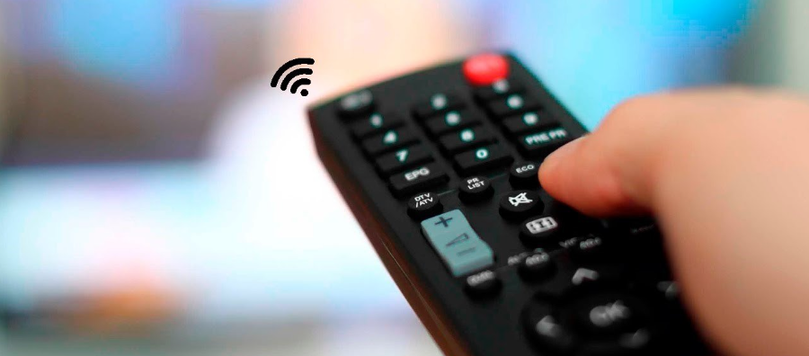
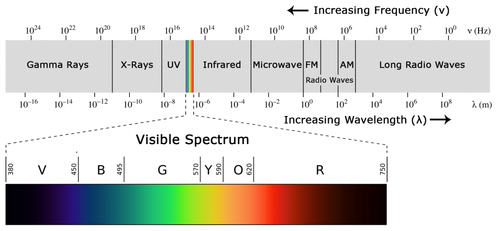
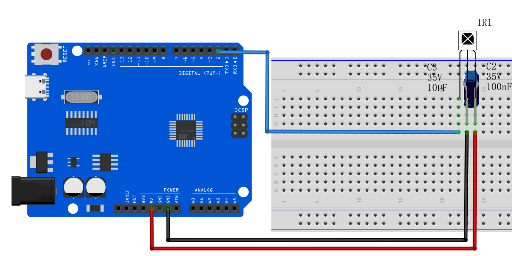
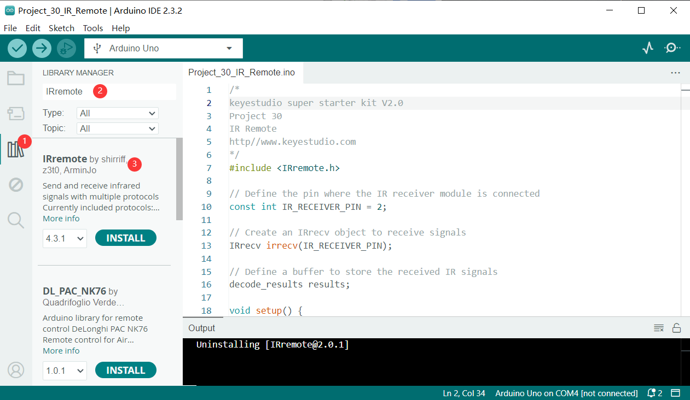
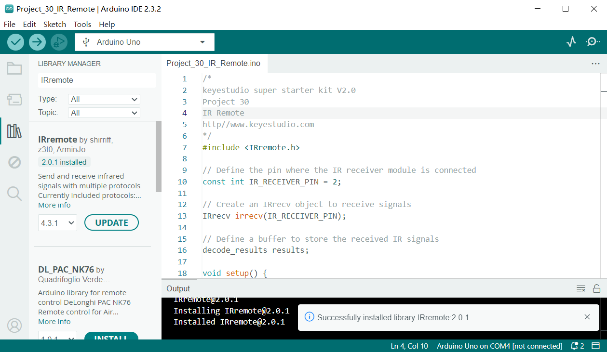
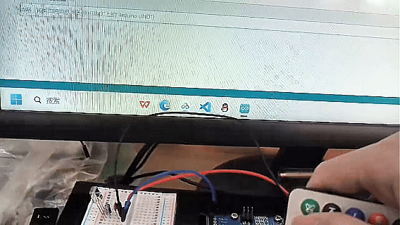

# Проект 25: ИК-пульт дистанционного управления




#### Описание

ИК-управление — это беспроводное оборудование дистанционного управления для передачи сигналов. Оно широко используется в телевизорах, кондиционерах, аудиосистемах и другой бытовой технике. Посредством передачи инфракрасных сигналов оно управляет приёмником для выполнения соответствующих операций.

В этом проекте мы реализуем функцию инфракрасного дистанционного управления с помощью программирования Arduino на плате разработки UNO R3 (ch340).

#### Аппаратное обеспечение

1. Плата разработки UNO R3 (ch340) x1

2. Инфракрасный пульт дистанционного управления x1
   
3. Инфракрасный приёмник x1
   
4. Конденсатор 100нФ x1
   
5. Конденсатор 10μF x1
   
6. Макетная плата x1
   
7. Соединительные провода

#### Принцип работы

**ЧТО ТАКОЕ ИНФРАКРАСНЫЙ СВЕТ?**

Инфракрасное излучение — это форма света, похожая на тот свет, который мы видим вокруг себя. Единственное отличие ИК-света от видимого света — это частота и длина волны. Инфракрасное излучение находится за пределами видимого спектра, поэтому человек его не видит:



Поскольку ИК — это тип света, для ИК-связи требуется прямая видимость от приёмника к передатчику. Он не может передаваться через стены или другие материалы, как WiFi или Bluetooth.

**КАК РАБОТАЮТ ИК-ПУЛЬТЫ И ПРИЁМНИКИ**

Типичная система инфракрасной связи требует ИК-передатчик и ИК-приёмник. Передатчик выглядит как обычный светодиод, но он излучает свет в ИК-спектре, а не в видимом. Если посмотреть на переднюю часть пульта телевизора, вы увидите ИК-светодиод передатчика:


ИК-приёмник — это фотодиод и предусилитель, который преобразует ИК-свет в электрический сигнал. Диоды ИК-приёмников обычно выглядят так:


**МОДУЛЯЦИЯ ИК-СИГНАЛА**

ИК-свет излучают солнце, лампы и любые другие источники тепла. Это означает, что вокруг нас много ИК-шумов. Чтобы предотвратить помехи от этого шума, используется техника модуляции сигнала.

При модуляции ИК-сигнала кодировщик на ИК-пульте преобразует бинарный сигнал в модулированный электрический сигнал. Этот электрический сигнал подается на передающий светодиод. Передающий светодиод преобразует модулированный электрический сигнал в модулированный ИК-световой сигнал. Затем ИК-приёмник демодулирует ИК-световой сигнал и преобразует его обратно в бинарный сигнал, прежде чем передать информацию микроконтроллеру:


Модулированный ИК-сигнал — это серия импульсов ИК-света, которые включаются и выключаются с высокой частотой, известной как несущая частота. Несущая частота, используемая большинством передатчиков, составляет 38 кГц, потому что она редко встречается в природе и поэтому может быть отличена от фонового шума. Таким образом, ИК-приёмник будет знать, что сигнал 38 кГц был отправлен передатчиком, а не получен из окружающей среды.

Диод приёмника обнаруживает все частоты ИК-света, но имеет полосовой фильтр и пропускает только ИК на 38 кГц. Затем он усиливает модулированный сигнал с помощью предусилителя и преобразует его в бинарный сигнал перед отправкой микроконтроллеру.

**ПРОТОКОЛЫ ПЕРЕДАЧИ ИК**

Шаблон, в котором модулированный ИК-сигнал преобразуется в бинарный, определяется протоколом передачи. Существует множество протоколов ИК-передачи. Sony, Matsushita, NEC и RC5 — одни из наиболее распространённых протоколов.

Протокол NEC также является самым распространённым в проектах Arduino, поэтому я использую его в качестве примера, чтобы показать, как приёмник преобразует модулированный ИК-сигнал в бинарный.

Логическая «1» начинается с импульса высокого уровня длительностью 562,5 мкс с частотой 38 кГц, за которым следует импульс низкого уровня длительностью 1687,5 мкс. Логический «0» передаётся с импульсом высокого уровня длительностью 562,5 мкс, за которым следует импульс низкого уровня длительностью 562,5 мкс:


Вот как протокол NEC кодирует и декодирует бинарные данные в модулированный сигнал. Другие протоколы отличаются только длительностью отдельных импульсов высокого и низкого уровня.

#### Технические характеристики

Рабочее напряжение: 2.5В — 5.5В

Несущая частота (38 кГц)

Рабочий ток: 5 мА

Большой радиус действия и широкая зона покрытия.

Повышенная устойчивость к ВЧ и РЧ-помехам

Встроенный предусилитель

Совместимость с TTL и CMOS

#### Распиновка


VCC: 5В платы разработки

GND: земля платы разработки

OUT: цифровой пин платы разработки

#### Схема подключения

1.  Подключите VCC ИК-приёмника к 5В на плате
2.  Подключите GND ИК-приёмника к GND на плате
3.  Подключите OUT ИК-приёмника к цифровому пину D2 на плате

4. Подключите конденсаторы 100нФ и 10μF между VCC и GND ИК-приёмника.




### Установка библиотеки

Перед началом программирования необходимо сначала установить библиотеку IRremote.

**Откройте менеджер библиотек**: Нажмите на меню «Инструменты», затем выберите «Управление библиотеками…».


**Поиск библиотеки**:

В появившемся окне менеджера библиотек вы увидите поле поиска. Введите название библиотеки "IRremote".



**Выбор и установка библиотеки**:

В списке найдите библиотеку IRremote, выберите версию 2.0.1, нажмите и установите.


Справа появится кнопка «Установить». Нажмите на неё.



**Ожидание установки**: Arduino IDE автоматически загрузит и установит выбранную библиотеку. После завершения установки кнопка «Установить» изменится на «Установлено», что означает успешную установку.

#### Объяснение кода

Сначала подключаем библиотеку IRremote:

```cpp
#include <IRremote.h>
```

Эта строка импортирует библиотеку IRremote. Библиотека IRremote позволяет Arduino взаимодействовать с внешними устройствами через инфракрасные сигналы. Она поддерживает несколько инфракрасных протоколов и может декодировать сигналы от распространённых устройств, таких как пульты телевизоров и кондиционеров.

Определение пина приёма и объектов

Далее в коде определяется пин для приёма инфракрасных сигналов и необходимые объекты:

```cpp

const int RECV_PIN = 2; // пин приёмника ИК-пульта

IRrecv irrecv(RECV_PIN); // создаём объект IRrecv

decode_results results; // объект для хранения декодированного результата

```

Здесь `RECV_PIN` задаёт номер пина Arduino для приёма ИК-сигналов — пин 2. Объект `IRrecv` с именем `irrecv` инициализируется с указанием пина и используется для настройки и чтения ИК-сигналов. Объект `decode_results` с именем `results` хранит данные декодированного ИК-сигнала.

Инициализация и настройка

В функции `setup()` выполняется базовая инициализация и настройка:

```cpp
void setup() {

Serial.begin(9600); // инициализация последовательного порта

irrecv.enableIRIn(); // включение ИК-приёмника

}
```

`Serial.begin(9600);` запускает последовательную связь с скоростью 9600 бод для вывода данных и отображения. `irrecv.enableIRIn();` активирует ИК-приёмник, позволяя ему начать приём сигналов с ИК-пульта.

Основной цикл

В функции `loop()` происходит обработка полученных ИК-сигналов:

```cpp
void loop() {

if (irrecv.decode(&results)) { // если получен ИК-сигнал

Serial.println(results.value, HEX); // выводим полученный ИК-код в шестнадцатеричном формате

irrecv.resume(); // готовимся к приёму следующего сигнала

}

delay(100); // задержка 100 мс

}
```

Эта часть кода — основа программы, которая непрерывно проверяет, был ли получен ИК-сигнал. `irrecv.decode(&results)` проверяет наличие сигнала и, если он есть, возвращает `true` и сохраняет декодированный результат в объект `results`. Затем `Serial.println(results.value, HEX);` выводит полученный ИК-код в шестнадцатеричном формате в монитор порта для наблюдения и отладки. `irrecv.resume();` подготавливает приёмник к следующему сигналу. `delay(100);` ставит паузу в 100 миллисекунд после каждой итерации цикла, чтобы избежать слишком частой обработки.

#### Пример кода

```cpp

/*

Набор для изучения электроники на Arduino

Проект 25

ИК-пульт

Редактор: Keyes

*/

#include <IRremote.h> // подключение библиотеки IRremote

const int RECV_PIN = 2; // пин приёмника ИК-пульта

IRrecv irrecv(RECV_PIN); // создаём объект IRrecv

decode_results results; // объект для хранения декодированного результата

void setup() {

Serial.begin(9600); // инициализация последовательного порта

irrecv.enableIRIn(); // включение ИК-приёмника

}

void loop() {

if (irrecv.decode(&results)) { // если получен ИК-сигнал

Serial.println(results.value, HEX); // выводим полученный ИК-код в шестнадцатеричном формате

irrecv.resume(); // готовимся к приёму следующего сигнала

}

delay(100); // задержка 100 мс

}
```

#### Результат проекта

После загрузки кода откройте монитор порта и установите скорость 9600 бод. При нажатии кнопки на пульте в мониторе порта будет отображаться полученный инфракрасный код. Каждая кнопка соответствует уникальному кодированному значению.


