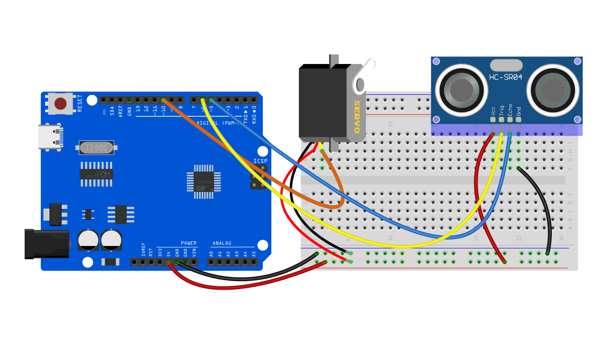
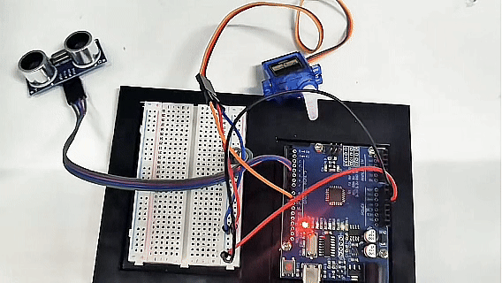

# Проект 28: Умное ведро


#### Описание

Умное ведро не только обладает базовыми функциями традиционных мусорных баков, но и интегрирует различные интеллектуальные технологии, что приносит много удобств в нашу жизнь.

В этом проекте мы создаем умное ведро на базе платы разработки UNO R3 (ch340), ультразвукового датчика и сервопривода. Когда кто-то подходит к ведру, крышка автоматически открывается; когда человек уходит, крышка автоматически закрывается.

#### Аппаратное обеспечение

1. Плата разработки UNO R3 (ch340) x1

2. Ультразвуковой датчик HC-SR04 x1

3. Сервопривод SG90 x1

4. Провода DuPont

5. Перемычки

#### Принцип работы

Ультразвуковой датчик HC-SR04 вычисляет расстояние до объекта, посылая и принимая ультразвуковые волны. Когда обнаруживается человек, сервопривод управляет открытием крышки. Когда человек уходит, крышка закрывается.


#### Схема подключения

1. Подключите вывод Trig ультразвукового датчика HC-SR04 к цифровому пину D6, вывод Echo к цифровому пину D5.
2. Подключите желтый провод (сигнал) сервопривода к цифровому пину D10 на плате.




#### Пример кода

```cpp

/*

Electronics Learning Starter Kit for Arduino

Project 28

Smart Bin

Edit By Keyes

*/

#include <Servo.h>

const int trigPin = 6; // Ultrasonic sensor Trig pin

const int echoPin = 5; // Ultrasonic sensor Echo pin

const int servoPin = 10; // Servo motor pin

Servo myservo; // Create a servo object

void setup() {

pinMode(trigPin, OUTPUT); // Set Trig pin as output

pinMode(echoPin, INPUT); // Set Echo pin as input

myservo.attach(servoPin); // Attach servo motor to pin 10

myservo.write(0); // Initialize servo to 0 degrees

Serial.begin(9600); // Initialize serial communication with a baud rate of 9600

}

void loop() {

long duration, distance;

// Send a 10-microsecond high pulse to trigger the ultrasonic sensor

digitalWrite(trigPin, LOW);

delayMicroseconds(2);

digitalWrite(trigPin, HIGH);

delayMicroseconds(10);

digitalWrite(trigPin, LOW);

// Read the high pulse duration from the Echo pin

duration = pulseIn(echoPin, HIGH);

// Calculate distance (in centimeters)

distance = duration * 0.034 / 2;

// Print the distance value to the serial monitor

Serial.print("Distance: ");

Serial.print(distance);

Serial.println(" cm");

if (distance < 20) { // If the distance is less than 20 cm, open the lid

myservo.write(180);

delay(3000); // Keep it open for 3 seconds

} else { // If the distance is greater than 20 cm, close the lid

myservo.write(0);

}

delay(100); // Delay for 100 milliseconds

}
```

#### Объяснение кода

**Подключение библиотеки:**

```cpp
#include <Servo.h>
```

Подключает библиотеку Arduino Servo, которая используется для управления сервоприводом.

**Определение пинов и создание объекта:**

```cpp

const int trigPin = 6; // Trig pin for the ultrasonic sensor

const int echoPin = 5; // Echo pin for the ultrasonic sensor

const int servoPin = 10; // Pin for the servo motor

Servo myservo; // Create a servo motor object

```

Определяет пины Trig и Echo для ультразвукового датчика и пин для подключения сервопривода. Также создается объект сервопривода для последующего управления.

**Настройка инициализации:**

```cpp
void setup() {

pinMode(trigPin, OUTPUT); // Set the Trig pin as an output

pinMode(echoPin, INPUT); // Set the Echo pin as an input

myservo.attach(servoPin); // Attach the servo to digital pin 10

myservo.write(0); // Set initial servo position to 0 degrees (closed position)

Serial.begin(9600); // Initialize serial communication at 9600 baud rate

}
```

Устанавливает режимы пинов для ультразвукового датчика, подключает сервопривод и инициализирует его позицию. Также запускается последовательная связь для отладки и мониторинга данных датчика.

**Основная функция цикла:**

```cpp
void loop() {

// ... (continued as above)

}
```

В основном цикле непрерывно считываются данные с ультразвукового датчика и управляется действие сервопривода в зависимости от расстояния.

**Триггер и считывание ультразвукового датчика:**

```cpp
// Send a 10-microsecond high pulse to trigger the ultrasonic sensor

digitalWrite(trigPin, LOW);

delayMicroseconds(2);

digitalWrite(trigPin, HIGH);

delayMicroseconds(10);

digitalWrite(trigPin, LOW);

// Read the high duration on the Echo pin

duration = pulseIn(echoPin, HIGH);
```

Отправляет определенный импульс для запуска ультразвукового датчика, затем с помощью функции `pulseIn` измеряет длительность высокого сигнала на пине Echo.

**Вычисление расстояния:**

```cpp

// Calculate distance (in centimeters)

distance = duration * 0.034 / 2;

```

Вычисляет расстояние от датчика до объекта на основе принципа работы ультразвуковых датчиков. Звук распространяется в воздухе со скоростью примерно 340 метров в секунду, или 0.034 сантиметра за микросекунду. Поскольку звук проходит путь туда и обратно, результат делится на два.

**Вывод расстояния в сериал монитор:**

```cpp

// Print the distance to the serial monitor

Serial.print("Detected Distance: ");

Serial.print(distance);

Serial.println(" cm");

```

Выводит вычисленное расстояние в сериал монитор, который можно просмотреть в Arduino IDE.

**Управление сервоприводом:**

```cpp

if (distance < 20) { // If the distance is less than 20 cm, open the trash bin lid

myservo.write(180); // Rotate the servo to 180 degrees (open position)

delay(3000); // Keep it open for 3 seconds

} else { // If the distance is 20 cm or greater, close the trash bin lid

myservo.write(0); // Rotate the servo to 0 degrees (closed position)

}

```

Определяет, находится ли кто-то поблизости по расстоянию. Если обнаруженное расстояние меньше 20 сантиметров, считается, что кто-то приближается, и крышка мусорного ведра открывается, удерживаясь открытой в течение 3 секунд; в противном случае сервопривод удерживает крышку закрытой.

**Задержка в цикле:**

```cpp

delay(100); // Delay for 100 milliseconds to control loop frequency

```

Задержка в 100 миллисекунд для контроля частоты выполнения цикла и предотвращения чрезмерной нагрузки.

#### Результат проекта

Когда кто-то подходит к ведру (менее 20 см), крышка автоматически открывается на 3 секунды.

Когда человек уходит (расстояние равно или больше 20 см), крышка автоматически закрывается, чтобы поддерживать чистоту окружающей среды.

