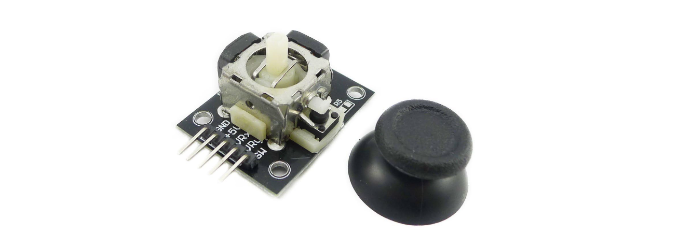
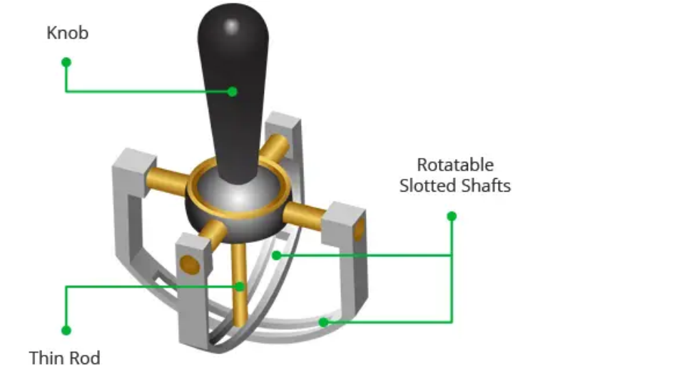
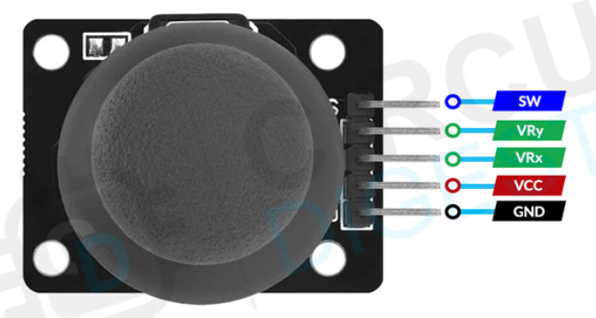
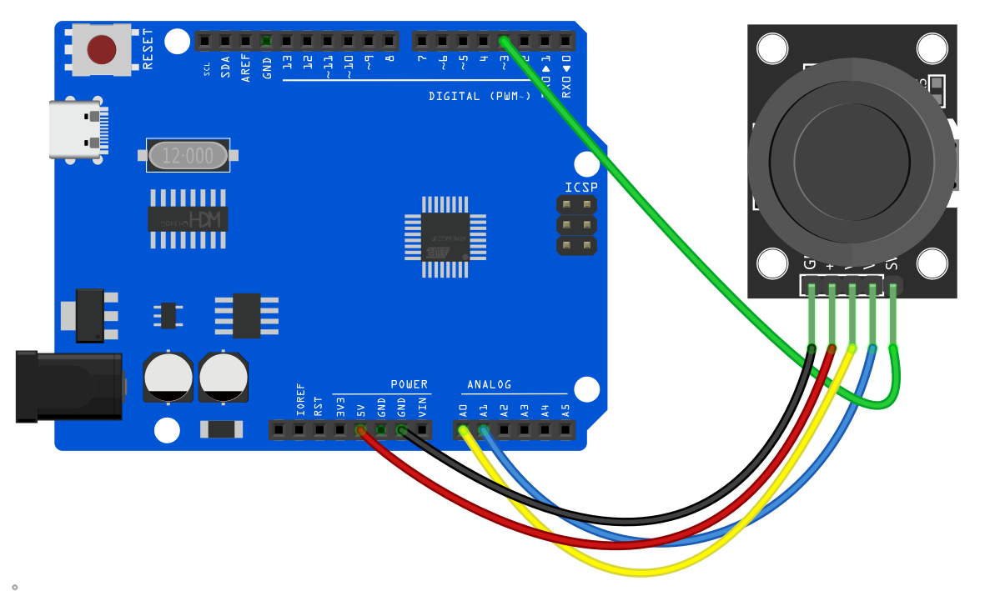
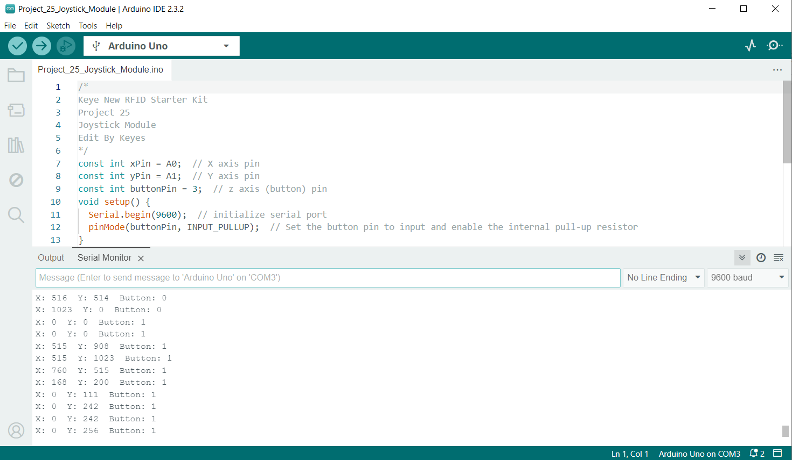
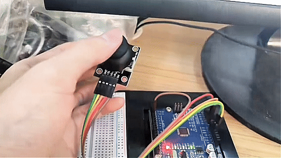

# Proyecto 29: Módulo Joystick




#### Descripción

Muchos proyectos de robots necesitan un joystick. Este módulo ofrece una solución económica. Simplemente conectándolo a dos entradas analógicas, el robot estará a tus órdenes con control X, Y. También tiene un interruptor que está conectado a un pin digital.

#### Hardware

1\. Placa de desarrollo UNO R3 (ch340) x1

2\. Módulo Joystick x1

3\. Cables DuPont

#### Principio de Funcionamiento

Es realmente notable cómo un joystick puede traducir cada pequeño movimiento de tus dedos. Esto es posible gracias al diseño del joystick, que consta de dos potenciómetros y un mecanismo de cardán.

Mecanismo de Cardán

Cuando mueves el joystick, una varilla delgada que se encuentra entre dos ejes ranurados giratorios (Cardán) se mueve. Uno de los ejes permite el movimiento a lo largo del eje X (izquierda y derecha), mientras que el otro permite el movimiento a lo largo del eje Y (arriba y abajo).



Cuando mueves el joystick hacia adelante y hacia atrás, el eje Y pivota. Cuando lo mueves de izquierda a derecha, el eje X pivota. Y cuando lo mueves en diagonal, ambos ejes pivotan.


Cada eje está conectado a un potenciómetro de modo que al mover el eje se rota el cursor del potenciómetro correspondiente. En otras palabras, empujar la perilla completamente hacia adelante hará que el cursor del potenciómetro se mueva a un extremo de la pista resistiva, y jalarlo hacia atrás hará que se mueva al extremo opuesto.


Leyendo estos potenciómetros, se puede determinar la posición de la perilla.

Lectura de valores analógicos desde el Joystick

El joystick emite una señal analógica cuyo voltaje varía entre 0 y 5V. Cuando mueves el joystick a lo largo del eje X de un extremo al otro, la salida X cambia de 0 a 5V, y lo mismo sucede cuando lo mueves a lo largo del eje Y. Y, cuando el joystick está centrado (posición de reposo), el voltaje de salida es aproximadamente la mitad de VCC, o 2.5V.

Este voltaje de salida puede ser alimentado a un ADC en un microcontrolador para determinar la posición física del joystick.

Debido a que la placa Arduino tiene una resolución ADC de 10 bits, los valores en cada canal analógico (eje) pueden variar de 0 a 1023. Por lo tanto, cuando el joystick se mueve de un extremo al otro, leerá un valor entre 0 y 1023 para el canal correspondiente. Cuando el joystick está centrado, los canales vertical y horizontal leerán ambos 512.

La figura a continuación muestra los ejes X y Y, así como cómo responderán las salidas cuando el joystick se mueva en diferentes direcciones.


#### Especificaciones

Voltaje de operación: 5V

Valor interno del potenciómetro: 10k

Conectores de interfaz de 2.54mm

Dimensiones: 4.0 cm x 2.6 cm x 3.2 cm (1.57 in x 1.02 in x 1.26 in)

Temperatura de operación: 0 a 70 °C

#### Pines

El módulo Joystick tiene un total de 5 pines. Dos son para alimentación, dos son para los potenciómetros X y Y, y uno es para el interruptor central. La asignación de pines del módulo es la siguiente:



GND es el pin de tierra.

VCC provee energía al módulo. Conéctalo a tu fuente positiva (usualmente 5V o 3.3V dependiendo de tus niveles lógicos).

VRx es el voltaje de salida horizontal. Mover el joystick de izquierda a derecha hace que el voltaje de salida cambie de 0 a VCC. El joystick leerá aproximadamente la mitad de VCC cuando esté centrado (posición de reposo).

VRy es el voltaje de salida vertical. Mover el joystick hacia arriba y abajo hace que el voltaje de salida cambie de 0 a VCC. El joystick leerá aproximadamente la mitad de VCC cuando esté centrado (posición de reposo).

SW es la salida del interruptor pulsador. Por defecto, la salida del interruptor está flotante. Para leer el interruptor, se requiere una resistencia pull-up para que cuando se presione la perilla del joystick, la salida del interruptor se vuelva LOW, de lo contrario permanece HIGH. Ten en cuenta que el pin de entrada al que está conectado el interruptor debe tener habilitado el pull-up interno, o debe conectarse una resistencia pull-up externa.

#### Diagrama de Conexiones

1\. Conecta el pin VCC del Módulo Joystick al 5V de la placa

2\. Conecta el pin GND del Módulo Joystick al GND de la placa

3\. Conecta el pin de salida del eje X del Módulo Joystick al pin de entrada analógica A0 de la placa

4\. Conecta el pin de salida del eje Y del Módulo Joystick al pin de entrada analógica A1 de la placa

5\. Conecta el pin de salida del botón del Módulo Joystick al pin de entrada digital D3 de la placa




#### Código de Ejemplo

```cpp

/*

Electronics Learning Starter Kit for Arduino

Project 29

Joystick Module

Edit By Keyes

*/

const int xPin = A0; // X axis pin

const int yPin = A1; // Y axis pin

const int buttonPin = 3; // z axis (button) pin

void setup() {

Serial.begin(9600); // initialize serial port

pinMode(buttonPin, INPUT_PULLUP); // Set the button pin to input and enable the internal pull-up resistor

}

void loop() {

int xValue = analogRead(xPin); // read the potentiometer value in X axis

int yValue = analogRead(yPin); // read the potentiometer value in Y axis

int buttonState = digitalRead(buttonPin); // read the button state

Serial.print("X: ");

Serial.print(xValue);

Serial.print(" Y: ");

Serial.print(yValue);

Serial.print(" Button: ");

Serial.println(buttonState);

delay(100); // delay 100ms

}
```

#### Explicación del Código

Primero, el código define tres constantes para especificar los pines conectados a la placa Arduino:

```cpp

const int xPin = A0; // Pin para eje X

const int yPin = A1; // Pin para eje Y

const int buttonPin = 3; // Pin para eje Z (botón)

```

Aquí, `xPin` y `yPin` están definidos como pines de entrada analógica A0 y A1, usados para leer los valores analógicos de los dos ejes. `buttonPin` está definido como pin digital 3, usado para leer el estado del botón.

Función Setup

En la función `setup()`, se realiza una configuración básica:

```cpp
void setup() {

Serial.begin(9600); // Inicializa el puerto serial

pinMode(buttonPin, INPUT_PULLUP); // Configura el pin del botón como entrada y habilita la resistencia pull-up interna

}
```

Aquí, `Serial.begin(9600);` inicializa la comunicación serial, estableciendo la tasa de baudios a 9600, lo que permite que el Arduino intercambie datos con una computadora u otros dispositivos seriales vía USB. `pinMode(buttonPin, INPUT_PULLUP);` configura el pin del botón como entrada y habilita la resistencia pull-up interna, que es una forma común de asegurar que el pin lea un nivel alto (HIGH) cuando el botón no está presionado.

Función Principal Loop

La función `loop()` contiene la lógica principal del programa, que se ejecuta continuamente, leyendo entradas y enviando datos al puerto serial:

```cpp
void loop() {

int xValue = analogRead(xPin); // Lee el valor del potenciómetro del eje X

int yValue = analogRead(yPin); // Lee el valor del potenciómetro del eje Y

int buttonState = digitalRead(buttonPin); // Lee el estado del botón

Serial.print("X: ");

Serial.print(xValue);

Serial.print(" Y: ");

Serial.print(yValue);

Serial.print(" Button: ");

Serial.println(buttonState);

delay(100); // Retardo de 100 milisegundos

}
```

Este código primero usa la función `analogRead()` para leer los valores analógicos del eje X y del eje Y, respectivamente. Estos valores típicamente varían de 0 a 1023, dependiendo de la variación del voltaje de entrada. Luego, usa la función `digitalRead()` para leer el estado del botón, que es HIGH (no presionado) o LOW (presionado). Después, estos valores se envían a través del puerto serial en el formato "X: [xValue] Y: [yValue] Button: [buttonState]". Finalmente, la llamada a la función `delay(100);` hace que el ciclo se ejecute cada 100 milisegundos para evitar leer entradas o enviar datos con demasiada frecuencia.

#### Resultado del Proyecto

Después de subir el código, abre el monitor serial del IDE de Arduino y configura la tasa de baudios a 9600. Cuando gires el Módulo Joystick, el monitor serial imprimirá el valor en los ejes X y Y. Al presionar el Módulo Joystick, el monitor mostrará 0 (presionado) o 1 (liberado).



