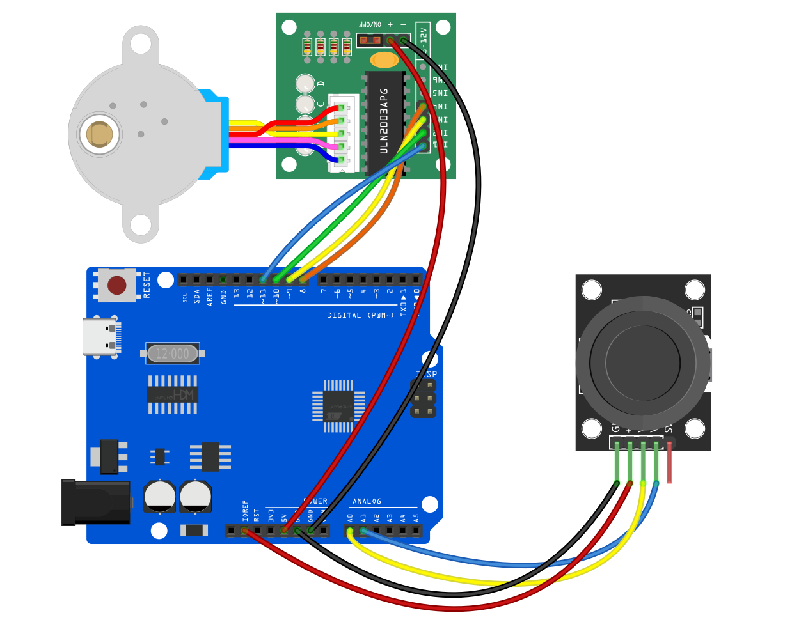
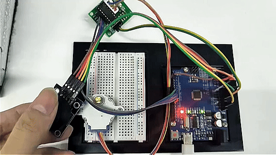

# Проект 30: Управление движением с помощью джойстика

## Описание
В этом проекте демонстрируется, как использовать Arduino для считывания аналоговых сигналов с двухосевого джойстика и ручного управления вращением шагового двигателя. Перемещая джойстик, вы можете точно контролировать вращение шагового двигателя вперед, назад или остановку.

Такой тип управления часто используется в роботизированных гимбалах, ручном обучении суставов роботизированных рук, перемещении микроскопного стола и других автоматизированных устройствах. Это отличный базовый проект для понимания «человеко-машинного взаимодействия».

## Аппаратное обеспечение
1. Плата разработки UNO R3 (CH340) × 1  
2. **Шаговый двигатель 28BYJ-48** × 1  
3. **Плата драйвера шагового двигателя ULN2003** × 1  
4. **Двухосевой модуль джойстика** × 1  
5. Макетная плата × 1  
6. Провода Dupont/соединительные провода × несколько  

## Принцип работы
Основная задача проекта — преобразовать выходное напряжение джойстика в команды движения для шагового двигателя.

1. **Аналоговый выход джойстика:** Внутри джойстика находятся два потенциометра (переменных резистора). При перемещении джойстика по оси X, на выводе `VRx` появляется изменяющееся напряжение. Arduino считывает это напряжение через аналоговый вход (A0) и преобразует его в значение от `0` до `1023`.
2. **Центральное положение и пороги:** Когда джойстик находится в центре, значение примерно равно `512`. В коде установлены следующие пороги:  
   * Если значение **меньше 300** (джойстик отклонён в одну сторону), шаговый двигатель вращается непрерывно вперед.  
   * Если значение **больше 800** (джойстик отклонён в другую сторону), шаговый двигатель вращается непрерывно назад.  
   * Если значение **между 300 и 800** (джойстик в центре/отпущен), питание шагового двигателя отключается, и он остаётся неподвижным.

## Схема подключения

**1. Модуль джойстика**  
*(Примечание: в этом проекте управляется только одноосевой шаговый двигатель, поэтому подключается только ось X. Выводы оси Y `VRy` и кнопки `SW` можно не подключать.)*  
* `VRx (аналоговый выход по оси X)` ➔ Подключить к **Arduino A0**  
* `VCC` ➔ Подключить к Arduino 5V  
* `GND` ➔ Подключить к Arduino GND  

**2. Шаговый двигатель и плата драйвера (ULN2003)**  
* Вставьте белый разъём шагового двигателя в гнездо платы драйвера ULN2003.  
* `IN1` ➔ Подключить к **Arduino D8**  
* `IN2` ➔ Подключить к **Arduino D10** *(Обратите внимание на порядок: для встроенной библиотеки Stepper Arduino порядок должен быть 8, 10, 9, 11)*  
* `IN3` ➔ Подключить к **Arduino D9**  
* `IN4` ➔ Подключить к **Arduino D11**  
* `+ (VCC)` ➔ Подключить к Arduino 5V (или внешнему источнику 5V)  
* `- (GND)` ➔ Подключить к Arduino GND  



## Пример кода

Скопируйте и загрузите следующий код в вашу Arduino:

```cpp
/*

Electronics Learning Starter Kit for Arduino

Project 30

Joystick Motion Control

Edit By Keyes

*/

#include <Stepper.h>

// Define the number of steps per revolution for the stepper motor (28BYJ-48 is usually 2048 steps)
const int stepsPerRevolution = 2048; 

// Initialize the stepper motor object, note the pin order is 8, 10, 9, 11
Stepper myStepper(stepsPerRevolution, 8, 10, 9, 11);

void setup() {
  // Set the stepper motor speed to 10 RPM (revolutions per minute)
  myStepper.setSpeed(10);
  
  // Initialize serial communication for monitoring joystick values
  Serial.begin(9600);
}

void loop() {
  // 1. Read the joystick X-axis analog value (range 0 - 1023)
  int xValue = analogRead(A0);
  
  // Print the current value to the serial monitor for debugging
  Serial.print("Joystick X-axis value: ");
  Serial.println(xValue);

  // 2. Determine joystick direction and control the motor
  if (xValue < 300) {
    // Joystick pushed to one side: step motor forward
    myStepper.step(10); 
  }
  else if (xValue > 800) {
    // Joystick pushed to the other side: step motor backward
    myStepper.step(-10); 
  } 
  else {
    // Joystick in neutral position (300 ~ 800)
    // De-energize all coils to prevent the stepper motor from overheating while idle
    digitalWrite(8, LOW);
    digitalWrite(9, LOW);
    digitalWrite(10, LOW);
    digitalWrite(11, LOW);
  }
}
```

## Объяснение кода

1. **Подключение библиотеки и инициализация:** `#include <Stepper.h>` подключает библиотеку управления шаговым двигателем. Строка `Stepper myStepper(stepsPerRevolution, 8, 10, 9, 11);` задаёт управляющие пины. **Важно:** при использовании этой официальной библиотеки с мотором 28BYJ-48 необходимо поменять местами средние два пина (то есть 10, 9 вместо 9, 10) для плавного вращения двигателя.
2. **Считывание аналогового значения:** `analogRead(A0)` непрерывно считывает наклон джойстика, возвращая число от 0 до 1023.
3. **Реакция на движение (`step`):** Каждая итерация цикла сдвигает мотор на небольшой шаг (`10` или `-10` шагов). Поскольку цикл выполняется очень быстро, удержание джойстика в одном направлении приводит к непрерывному и плавному вращению мотора.
4. **Защита при отключении питания (`digitalWrite(..., LOW)`):** Шаговые двигатели склонны блокировать вал при остановке, так как катушки остаются под напряжением. Чтобы этого избежать и снизить нагрев, когда джойстик в центре (отпущен), все четыре управляющих пина устанавливаются в LOW, отключая ток в катушках и защищая мотор и драйвер от перегрева.

## Результат проекта

После загрузки кода и подачи питания на схему:

1. **Нейтральное состояние:** Когда джойстик не трогают, он автоматически возвращается в центр, и шаговый двигатель остаётся неподвижным без нагрева.
2. **Отклонение влево/вниз:** Перемещение джойстика в одну сторону (значение < 300) заставляет шаговый двигатель вращаться непрерывно по часовой (или против часовой) стрелке.
3. **Отклонение вправо/вверх:** Перемещение джойстика в противоположную сторону (значение > 800) мгновенно меняет направление вращения двигателя для непрерывного вращения.
4. **Реакция в реальном времени:** При отпускании джойстика он возвращается в центр, и мотор мгновенно тормозит и останавливается. Открыв монитор порта на компьютере, вы можете наблюдать изменения данных джойстика в реальном времени.

