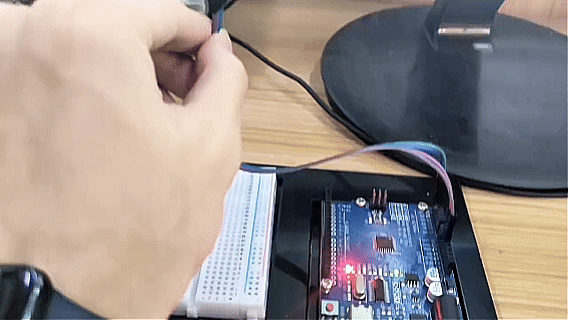

# Proyecto 31: Módulo MPU6050


#### Descripción

El MPU6050 es un potente dispositivo de seguimiento de movimiento de 6 ejes que combina un giroscopio de 3 ejes y un acelerómetro de 3 ejes en el mismo chip de silicio. Se utiliza ampliamente en drones, robots de equilibrio y dispositivos controlados por movimiento. En este proyecto, aprenderemos cómo leer los datos de aceleración y rotación del módulo MPU6050 utilizando el protocolo de comunicación I2C.

#### Hardware

1. Placa de desarrollo UNO R3 (ch340) x1  
2. Módulo MPU6050 x1  
3. Protoboard x1  
4. Cables jumper

#### Principio de Funcionamiento

El MPU6050 consta de dos sensores principales:  
- **Acelerómetro**: Mide las fuerzas de aceleración que actúan sobre el sensor en los ejes X, Y y Z. Esto puede usarse para determinar el ángulo de inclinación del sensor con respecto a la gravedad terrestre.  
- **Giroscopio**: Mide la velocidad de rotación alrededor de los ejes X, Y y Z. Esto ayuda a rastrear la orientación y el movimiento rotacional.

El módulo se comunica con el Arduino a través del protocolo I2C (Inter-Integrated Circuit), que solo requiere dos líneas de datos: SDA (Datos Seriales) y SCL (Reloj Serial). El Arduino solicita datos de los registros internos del MPU6050, y el módulo envía los valores crudos del sensor.

#### Diagrama de Conexiones

1. Conectar VCC del MPU6050 a 5V en la placa.  
2. Conectar GND del MPU6050 a GND en la placa.  
3. Conectar SCL del MPU6050 a A5 (o pin SCL) en la placa.  
4. Conectar SDA del MPU6050 a A4 (o pin SDA) en la placa.  


#### Código de Ejemplo

```cpp
/*

Electronics Learning Starter Kit for Arduino

Project 31

MPU6050 Module

Edit By Keyes

*/

#include <Wire.h>

const int MPU_addr=0x68;  // I2C address of the MPU-6050
int16_t AcX,AcY,AcZ,Tmp,GyX,GyY,GyZ;

void setup(){
  Wire.begin();
  Wire.beginTransmission(MPU_addr);
  Wire.write(0x6B);  // PWR_MGMT_1 register
  Wire.write(0);     // set to zero (wakes up the MPU-6050)
  Wire.endTransmission(true);
  Serial.begin(9600);
}

void loop(){
  Wire.beginTransmission(MPU_addr);
  Wire.write(0x3B);  // starting with register 0x3B (ACCEL_XOUT_H)
  Wire.endTransmission(false);
  Wire.requestFrom(MPU_addr,14,true);  // request a total of 14 registers
  
  AcX=Wire.read()<<8|Wire.read();  // 0x3B (ACCEL_XOUT_H) & 0x3C (ACCEL_XOUT_L)    
  AcY=Wire.read()<<8|Wire.read();  // 0x3D (ACCEL_YOUT_H) & 0x3E (ACCEL_YOUT_L)
  AcZ=Wire.read()<<8|Wire.read();  // 0x3F (ACCEL_ZOUT_H) & 0x40 (ACCEL_ZOUT_L)
  Tmp=Wire.read()<<8|Wire.read();  // 0x41 (TEMP_OUT_H) & 0x42 (TEMP_OUT_L)
  GyX=Wire.read()<<8|Wire.read();  // 0x43 (GYRO_XOUT_H) & 0x44 (GYRO_XOUT_L)
  GyY=Wire.read()<<8|Wire.read();  // 0x45 (GYRO_YOUT_H) & 0x46 (GYRO_YOUT_L)
  GyZ=Wire.read()<<8|Wire.read();  // 0x47 (GYRO_ZOUT_H) & 0x48 (GYRO_ZOUT_L)
  
  Serial.print("AcX = "); Serial.print(AcX);
  Serial.print(" | AcY = "); Serial.print(AcY);
  Serial.print(" | AcZ = "); Serial.print(AcZ);
  Serial.print(" | Tmp = "); Serial.print(Tmp/340.00+36.53);  // equation for temperature in degrees C from datasheet
  Serial.print(" | GyX = "); Serial.print(GyX);
  Serial.print(" | GyY = "); Serial.print(GyY);
  Serial.print(" | GyZ = "); Serial.println(GyZ);
  
  delay(500);
}
```

#### Explicación del Código

**Inicialización de I2C**:  
```cpp
Wire.begin();
Wire.beginTransmission(MPU_addr);
Wire.write(0x6B);  // PWR_MGMT_1 register
Wire.write(0);     // set to zero (wakes up the MPU-6050)
Wire.endTransmission(true);
```
La librería `Wire` se usa para la comunicación I2C. Primero activamos el MPU6050 escribiendo `0` en su registro de gestión de energía (`0x6B`).

**Lectura de Datos**:  
```cpp
Wire.beginTransmission(MPU_addr);
Wire.write(0x3B);  // starting with register 0x3B (ACCEL_XOUT_H)
Wire.endTransmission(false);
Wire.requestFrom(MPU_addr,14,true);  // request a total of 14 registers
```
Indicamos al MPU6050 que queremos comenzar a leer desde el registro `0x3B` (que contiene el byte alto de la aceleración en el eje X). Luego solicitamos un total de 14 bytes, que cubren la aceleración en 3 ejes, la temperatura y los datos del giroscopio en 3 ejes (cada valor ocupa 2 bytes).

**Combinación de Bytes**:  
```cpp
AcX=Wire.read()<<8|Wire.read();
```
Como cada lectura del sensor es de 16 bits (2 bytes), leemos el byte alto, lo desplazamos 8 bits a la izquierda (`<<8`) y usamos OR bit a bit (`|`) con el byte bajo para combinarlos en un solo entero de 16 bits.

#### Resultado del Proyecto

Después de subir el código, abre el Monitor Serial y configura la velocidad en baudios a 9600. Verás un flujo continuo de datos que muestran la aceleración (AcX, AcY, AcZ), la temperatura (Tmp) y los valores del giroscopio (GyX, GyY, GyZ). ¡Prueba inclinando y rotando el módulo MPU6050, y observa cómo cambian los valores en tiempo real!

