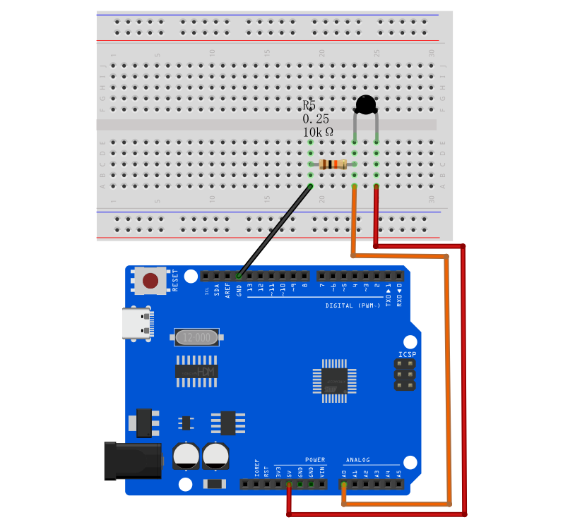
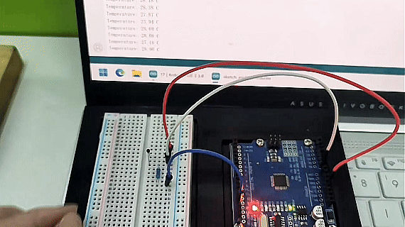

# Project 12: Temperature Sensor

#### Description

The Thermistor (NTC) is a widely used temperature sensor whose resistance decreases as the temperature increases. By using a voltage divider circuit with a known resistor, we can measure the voltage change and calculate the temperature using the Steinhart-Hart equation.

This project aims to create a temperature monitoring system using the UNO R3 development board （ch340） and a Thermistor NTC-MF52AT 10K.

#### Hardware

1. UNO R3 development board （ch340） x1
2. Thermistor NTC-MF52AT 10K x1
3. 10K Resistor x1
4. Breadboard x1
5. Jumper wires

#### Working Principle

A Negative Temperature Coefficient (NTC) thermistor is a resistor whose resistance decreases as temperature increases. To measure this change with an Arduino, we use a voltage divider circuit. We connect the NTC thermistor in series with a fixed 10K resistor. 

The Arduino's analog pin reads the voltage at the junction between the thermistor and the 10K resistor. As the temperature changes, the thermistor's resistance changes, which in turn changes the voltage read by the analog pin.

To convert this voltage reading into a temperature in Celsius, we use the **Steinhart-Hart equation**, which models the resistance of a semiconductor at different temperatures.

#### Wiring Diagram

1. Connect one leg of the Thermistor to 5V.
2. Connect the other leg of the Thermistor to Analog Pin A0.
3. Connect a 10K resistor from Analog Pin A0 to GND.


#### Sample Code

```cpp
/*

Electronics Learning Starter Kit for Arduino

Project 12

Temperature Sensor

Edit By Keyes

*/

int ThermistorPin = A0;
int Vo;
float R1 = 10000; // Fixed resistor value 10K
float logR2, R2, T;
float c1 = 1.009249522e-03, c2 = 2.378405444e-04, c3 = 2.019202697e-07; // Steinhart-Hart coefficients

void setup() {
  Serial.begin(9600);
}

void loop() {
  Vo = analogRead(ThermistorPin);
  
  // Calculate resistance of the thermistor
  R2 = R1 * (1023.0 / (float)Vo - 1.0);
  
  // Calculate temperature using Steinhart-Hart equation
  logR2 = log(R2);
  T = (1.0 / (c1 + c2*logR2 + c3*logR2*logR2*logR2));
  T = T - 273.15; // Convert Kelvin to Celsius
  
  Serial.print("Temperature: "); 
  Serial.print(T);
  Serial.println(" C"); 
  
  delay(1000);
}
```

#### Code Explanation

**Voltage Divider Calculation**:
```cpp
R2 = R1 * (1023.0 / (float)Vo - 1.0);
```
This formula calculates the current resistance of the NTC thermistor based on the analog reading (0-1023).

**Steinhart-Hart Equation**:
```cpp
logR2 = log(R2);
T = (1.0 / (c1 + c2*logR2 + c3*logR2*logR2*logR2));
T = T - 273.15;
```
These lines apply the Steinhart-Hart equation to convert the calculated resistance into temperature in Kelvin, and then subtract 273.15 to convert it to Celsius.

#### Project Result

After uploading the code to the development board, open the serial monitor of the Arduino IDE and set the baud rate to 9600. You will see the current ambient temperature printed every second in degrees Celsius. Try pinching the thermistor with your fingers to see the temperature rise!


