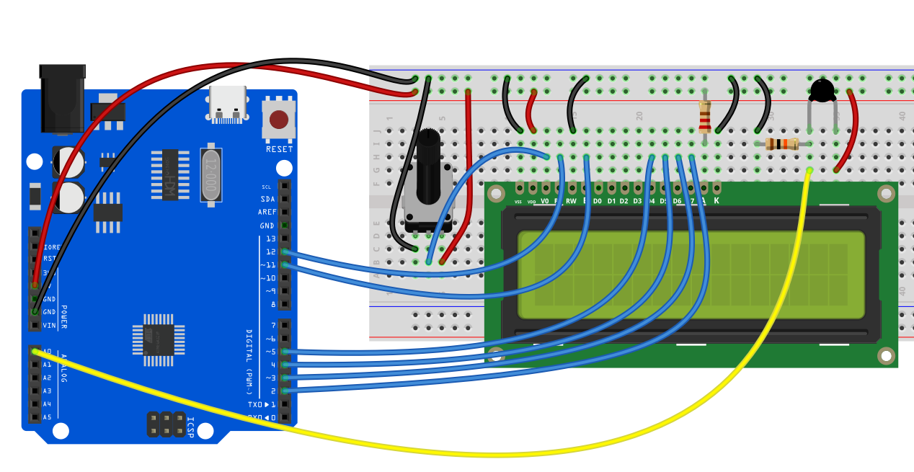

# Project 18: Thermometer


#### Description

This project aims to design a simple Arduino smart thermometer using an Thermistor NTC-MF52AT 10K and an LCD display. The Thermistor sensor detects the ambient temperature, and the LCD displays the temperature value in real-time. This project serves as a great exercise for beginners, as it helps them understand the basic working principle of sensors and practice interaction between the display and sensor.

#### Hardware

1\. UNO R3 development board （ch340） x1

2\. Thermistor NTC-MF52AT 10K x1

3\. 16x2 LCD display x1

4\. resistors (220 ohms) x1

5\. Breadboard x1

6\. Jumper wires

#### Working Principle

The working principle of this project is as follows:

The Thermistor NTC-MF52AT 10K detects the ambient temperature and converts it into a corresponding analog voltage signal.

The analog input pin of the Arduino development board (A0 in this case) reads the analog voltage output from the Thermistor.

The analog-to-digital converter (ADC) inside the Arduino converts the analog voltage value into a digital quantity.

Based on the conversion formula of the Thermistor (where every 10mV corresponds to 1 degree Celsius), the Arduino converts the digital quantity into a temperature value.

The Arduino then displays the computed temperature value on the LCD1602 liquid crystal display.

#### Wiring Diagram

**Thermistor Sensor**

VCC: Arduino's 5V

GND: Arduino's GND

VOUT: A0 (analog input pin)

**LCD1602**

RS: Connect to digital pin 11

EN: Connect to digital pin 12

D4-D7: Connect to digital pins 5, 4, 3, 2, respectively




#### Sample Code

```cpp

/*

Electronics Learning Starter Kit for Arduino

Project 18

Thermometer

Edit By Keyes

*/

#include <LiquidCrystal.h>

// Initialize the GPIO pins: RS, E, D4, D5, D6, D7

LiquidCrystal lcd(12, 11, 5, 4, 3, 2);

const int sensorPin = A0; // Thermistor connected to A0

void setup() {

// Set LCD column and row count

lcd.begin(16, 2);

// Display text on the first line

lcd.print("Temperature:");

}

void loop() {

// Read the analog value from Thermistor (0-1023)

int sensorValue = analogRead(sensorPin);

// Convert the analog value to voltage (unit: mV)

float voltage = sensorValue * (5000.0 / 1023.0);

// Calculate the temperature value (unit: Celsius)

float temperatureC = voltage / 10.0;

// Display the temperature value on the LCD second line

lcd.setCursor(0, 1);

lcd.print(temperatureC);

lcd.print(" C ");

// Update every second

delay(1000);

}
```

#### Code Explanation

**Library Inclusion and Initialization**

```cpp
#include <LiquidCrystal.h>

LiquidCrystal lcd(12, 11, 5, 4, 3, 2);

const int sensorPin = A0; // Thermistor connected to A0
```

`#include <LiquidCrystal.h>`: Includes the LiquidCrystal library for LCD control.

`LiquidCrystal lcd(...)`: Initializes the lcd object based on the LCD pin connections.

`const int sensorPin = A0;`: Defines the analog pin connecting the Thermistor sensor as A0.

**Setup Function setup()**

```cpp
void setup() {

lcd.begin(16, 2);

lcd.print("Temperature:");

}
```

`lcd.begin(16, 2);`: Sets the LCD to a 16-column and 2-row display mode.

`lcd.print("Temperature:");`: Displays “Temperature:” on the first line of the LCD.

**Main Loop Function loop()**

```cpp
void loop() {

int sensorValue = analogRead(sensorPin);

float voltage = sensorValue * (5000.0 / 1023.0);

float temperatureC = voltage / 10.0;

lcd.setCursor(0, 1);

lcd.print(temperatureC);

lcd.print(" C ");

delay(1000);

}
```

**Read Sensor Value**

```cpp

int sensorValue = analogRead(sensorPin);

```

`analogRead(sensorPin)`: Reads the analog voltage value from the Thermistor sensor, returning an integer between 0 and 1023.

**Convert to Voltage**

```cpp

float voltage = sensorValue * (5000.0 / 1023.0);

```

Converts the sensor value to an actual voltage value in millivolts.

`5000.0` accounts for Arduino’s 5V reference voltage, which is converted to 5000mV.

`1023.0` is the maximum value of the ADC (10-bit ADC scale: 0-1023).

**Calculate Temperature**

```cpp

float temperatureC = voltage / 10.0;

```

Given Thermistor’s specifications, every degree Celsius equals 10mV.

Thus, dividing the voltage by 10 yields the current temperature in Celsius.

**Display Temperature on LCD**

```cpp

lcd.setCursor(0, 1);

lcd.print(temperatureC);

lcd.print(" C ");

```

`lcd.setCursor(0, 1);`: Moves the cursor to the second line, first column on the LCD.

`lcd.print(temperatureC);`: Displays the temperature value.

`lcd.print(" C ");`: Displays the Celsius symbol with spaces to cover any leftover characters.

**Delay of One Second**

```cpp

delay(1000);

```

Delays for 1000 milliseconds (1 second) to control the update frequency.

#### Project Result

Upon completing this project, you will have a fully functional temperature tester. This device can display the ambient temperature in real time and provide visual feedback for temperature changes.


