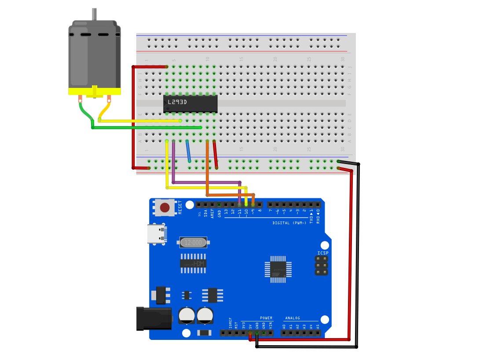

# Project 23: L293D Motor Driver

## Project Introduction
This project aims to achieve fully automatic control of a DC motor using an Arduino board combined with an L293D (or compatible SN754410) motor driver chip. Once the program runs, the motor will operate without manual intervention (no need to send commands via the serial monitor), automatically and cyclically executing the sequence: "forward rotation -> stop -> reverse rotation -> stop." This project is an excellent foundational practice for learning motor driving, PWM speed control, and H-bridge logic control.

## Project Hardware
The following basic hardware components are required to complete this project:
*   **Arduino board** (e.g., Arduino UNO) × 1
*   **L293D or SN754410 motor driver chip** × 1
*   **Standard DC motor** × 1
*   **Breadboard** × 1
*   **Dupont wires** (male-to-male) × several
*   **External independent power supply** (strongly recommended, such as a 4-cell AA battery holder or 9V battery, used to power the motor separately)

## Project Principle
The operating state of the DC motor (direction and speed) is controlled by the L293D driver chip, with the core principles as follows:
1.  **Direction Control (H-Bridge Principle):** The chip integrates an H-bridge circuit internally. For a single motor channel, the chip provides two direction input pins (Input 1 and Input 2). When these two pins receive opposite logic levels (one HIGH, one LOW), the motor rotates; swapping the HIGH and LOW reverses the motor direction; if both pins are HIGH or both LOW, the motor stops (brakes).
2.  **Speed Control (PWM):** The chip’s enable pin (Enable) receives a PWM signal (analog output) from the Arduino. By adjusting the PWM duty cycle (a value from 0 to 255), the average voltage output to the motor is controlled, enabling stepless speed regulation.

## Wiring Diagram
Please connect the components on the breadboard strictly according to the following pin correspondences:

**1. Control Signal Pins (Arduino side)**
*   `Arduino D10`  ➔ connected to **Chip Pin 1 (Enable 1,2)** —— *PWM speed control*
*   `Arduino D11`  ➔ connected to **Chip Pin 2 (Input 1)** —— *Direction control 1*
*   `Arduino D9`   ➔ connected to **Chip Pin 7 (Input 2)** —— *Direction control 2*

**2. Motor Pins**
*   **One terminal of the DC motor** ➔ connected to **Chip Pin 3 (Output 1)**
*   **Other terminal of the DC motor** ➔ connected to **Chip Pin 6 (Output 2)**
*(Note: The DC motor wiring is non-polarized; reversing the wires only affects the initial forward/reverse direction.)*

**3. Power and Ground Pins**
*   `Arduino 5V` ➔ connected to **Chip Pin 16 (VCC1 logic power)**
*   `Positive terminal of external battery` ➔ connected to **Chip Pin 8 (VCC2 motor power)** ⚠️ *Safety warning: It is not recommended to connect this pin to Arduino 5V. The motor’s starting current may cause the board to reset or damage the voltage regulator.*
*   `Arduino GND` & `Battery negative terminal` ➔ connected together to **common ground on the breadboard (GND)**, which is also connected to **Chip Pins 4, 5, 12, 13**.


## Example Code
Copy and upload the following code to your Arduino:

```cpp
/*

Electronics Learning Starter Kit for Arduino

Project 23

L293D Motor Driver

Edit By Keyes

*/

// Define pins
const int enablePin = 10; // D10: controls motor speed (PWM)
const int in1Pin = 11;    // D11: controls motor direction 1
const int in2Pin = 9;     // D9:  controls motor direction 2

void setup() {
  // Set control pins as output
  pinMode(enablePin, OUTPUT);
  pinMode(in1Pin, OUTPUT);
  pinMode(in2Pin, OUTPUT);
}

void loop() {
  // 1. Full speed forward for 2 seconds
  setMotor(255, false); 
  delay(2000);

  // 2. Stop for 1 second
  setMotor(0, false);   
  delay(1000);

  // 3. Full speed reverse for 2 seconds
  setMotor(255, true);  
  delay(2000);

  // 4. Stop for 1 second
  setMotor(0, false);   
  delay(1000);
}

// Custom motor control function
// Parameter speed: speed (0~255)
// Parameter reverse: direction (false = forward, true = reverse)
void setMotor(int speed, boolean reverse) {
  // Send PWM signal to set speed
  analogWrite(enablePin, speed);
  
  // Use negation logic to control direction, ensuring the two pins always have opposite levels
  digitalWrite(in1Pin, !reverse); 
  digitalWrite(in2Pin, reverse);  
}
```

## Code Explanation
This program consists of three core parts:
1.  **Pin definition and initialization (`setup`)**: At the beginning of the code, the actual hardware wiring pins D10, D11, and D9 are assigned to corresponding variables, and all are configured as `OUTPUT` mode in `setup()` to send control signals to the chip.
2.  **Custom control function (`setMotor`)**: This is the essence of the code. We encapsulate speed (`speed`) and direction (`reverse`) as parameters. The line `digitalWrite(in1Pin, !reverse);` cleverly uses Boolean negation logic (`!`). When `false` is passed, `in1Pin` outputs HIGH and `in2Pin` outputs LOW; when `true` is passed, the outputs are reversed. This completely avoids the risk of both pins being HIGH simultaneously due to coding errors, making the main program calls very simple.
3.  **Main loop control (`loop`)**: Calls the `setMotor()` function like building blocks. It sequentially sends commands for forward rotation (speed 255), stop (speed 0), reverse rotation (speed 255), and stop (speed 0), using `delay()` between each step to maintain the corresponding state duration, thus achieving fully automated operation.

## Experimental Phenomenon
After uploading the code and powering the circuit, you will observe the following:
1.  The motor starts rotating at full speed in one direction (e.g., clockwise) for **2 seconds**.
2.  The motor powers off and stops completely, remaining stationary for **1 second**.
3.  The motor restarts and rotates at full speed in the opposite direction (e.g., counterclockwise) for **2 seconds**.
4.  The motor powers off and stops again, remaining stationary for **1 second**.
5.  The system automatically returns to step 1, repeating this cycle indefinitely until the power is turned off.

