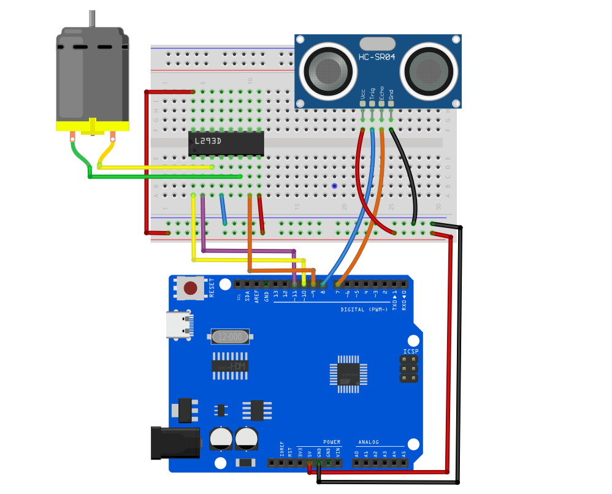
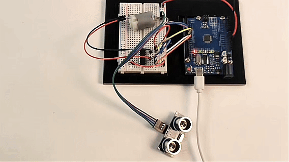

# Project 24: Smart Obstacle Avoidance Fan

## Description
In this project, we will build a "smart fan" that responds to its surrounding environment. We will combine the **HC-SR04 ultrasonic sensor** with a DC motor driven by an L293D chip. The ultrasonic sensor acts as a proximity detector: when an object (such as your hand) gets too close to the fan blades, the motor will automatically stop to prevent injury; when the obstacle is removed, the fan will automatically resume spinning.

## Hardware
1. UNO R3 development board (CH340) × 1  
2. **HC-SR04 Ultrasonic Sensor × 1**  
3. L293D Motor Driver Chip × 1  
4. 130 DC Motor × 1  
5. 9V Battery and Battery Clip × 1 (for independent motor power supply)  
6. Breadboard × 1  
7. Jumper wires × several  

## Working Principle
1. **Ultrasonic Distance Measurement:** The HC-SR04 sensor emits high-frequency sound waves and measures the time it takes for the echo to return. Arduino calculates the physical distance ahead based on the round-trip time of the sound wave.  
2. **Logic Control:** We set a "safe distance" threshold in the code (e.g., 15 cm). Arduino continuously checks the distance measured by the ultrasonic sensor:  
   * If the distance is **greater than** 15 cm: Arduino sends commands to the L293D via a custom `setMotor` function to run the DC motor at full speed.  
   * If the distance is **less than or equal to** 15 cm: Arduino immediately sends a stop command to the L293D, and the motor brakes instantly.  

## Wiring Diagram

**1. HC-SR04 Ultrasonic Sensor Pins**  
* `VCC` ➔ Connect to Arduino 5V  
* `GND` ➔ Connect to Arduino GND  
* `Trig (Trigger)` ➔ Connect to **Arduino D8**  
* `Echo (Echo)` ➔ Connect to **Arduino D7**  

**2. L293D Motor Driver Pins (following previous safe wiring method)**  
* `Pin 1 (Enable 1)` ➔ Connect to **Arduino D10** *(for speed control / start-stop)*  
* `Pin 2 (Input 1)` ➔ Connect to **Arduino D11** *(direction control 1)*  
* `Pin 7 (Input 2)` ➔ Connect to **Arduino D9** *(direction control 2)*  
* `Pin 3 (Output 1)` ➔ Connect to one terminal of the motor  
* `Pin 6 (Output 2)` ➔ Connect to the other terminal of the motor  
* `Pin 16 (VCC1)` ➔ Connect to Arduino 5V *(logic power)*  
* `Pin 8 (VCC2)` ➔ Connect to 9V battery positive terminal *(motor independent power)*  
* `Pin 4, 5 (GND)` ➔ Connect to breadboard common GND (including Arduino GND and battery negative terminal)  



## Sample Code

```cpp
/*

Electronics Learning Starter Kit for Arduino

Project 24

Smart Obstacle Avoidance Fan

Edit By Keyes

*/

// --- 1. Ultrasonic sensor pin definitions ---
const int trigPin = 8;  // Trigger pin
const int echoPin = 7;  // Echo pin

// --- 2. L293D motor driver pin definitions ---
const int enablePin = 10; // D10: motor speed control (PWM)
const int in1Pin = 11;    // D11: motor direction control 1
const int in2Pin = 9;     // D9:  motor direction control 2

// --- 3. Parameter settings ---
const int safeDistance = 15; // Safe distance threshold set to 15 cm

void setup() {
  // Initialize ultrasonic sensor pins
  pinMode(trigPin, OUTPUT);
  pinMode(echoPin, INPUT);
  
  // Initialize motor control pins
  pinMode(enablePin, OUTPUT);
  pinMode(in1Pin, OUTPUT);
  pinMode(in2Pin, OUTPUT);
  
  // Start serial communication to monitor distance data on PC
  Serial.begin(9600);
}

void loop() {
  // ================= Step 1: Emit sound wave and measure distance =================
  digitalWrite(trigPin, LOW);
  delayMicroseconds(2);
  digitalWrite(trigPin, HIGH); // Emit 10 microseconds high-frequency sound pulse
  delayMicroseconds(10);
  digitalWrite(trigPin, LOW);
  
  // Measure the duration of echo pin being HIGH (microseconds)
  long duration = pulseIn(echoPin, HIGH);
  // Calculate distance (speed of sound approx. 0.034 cm/us, divide by 2 for round trip)
  int distance = duration * 0.034 / 2;
  
  // Print current distance to serial monitor
  Serial.print("Current distance: ");
  Serial.print(distance);
  Serial.println(" cm");
  
  // ================= Step 2: Control motor start/stop based on distance =================
  // Add distance > 0 to avoid misjudgment when sensor occasionally returns 0
  if (distance > 0 && distance <= safeDistance) {
    // Obstacle too close! Set speed to 0 and stop motor.
    setMotor(0, false);
    Serial.println(">>> Status: Danger! Braking <<<");
  } else {
    // Safe ahead! Set speed to 255, full speed forward.
    setMotor(255, false);
    Serial.println("Status: Running normally...");
  }
  
  // Short delay to avoid interference from too frequent measurements
  delay(100); 
}

// ================= Custom motor control function =================
void setMotor(int speed, boolean reverse) {
  analogWrite(enablePin, speed);
  digitalWrite(in1Pin, !reverse); 
  digitalWrite(in2Pin, reverse);  
}
```

## Code Explanation

**1. Distance Measurement (`pulseIn` function):**  
```cpp
long duration = pulseIn(echoPin, HIGH);
int distance = duration * 0.034 / 2;
```
The `pulseIn()` function measures how long the Echo pin stays HIGH. We multiply this time by the speed of sound (0.034 cm per microsecond), then divide by 2 because the sound travels to the object and back, to get the accurate one-way distance in centimeters.

**2. Safe Obstacle Avoidance Logic:**  
```cpp
if (distance > 0 && distance <= safeDistance)
```
We check if the distance is less than or equal to the `safeDistance` (15 cm). The `distance > 0` condition is added because the ultrasonic sensor sometimes returns 0 when out of range or no echo is received. Without this check, the fan might mistakenly stop when the sensor outputs 0.

**3. Using Safe Motor Control:**  
The code continues to use the previously written `setMotor()` function. This ensures that no matter how the main program changes, the underlying mutually exclusive logic controlling direction (`!reverse`) protects the chip from short circuits.

## Project Result
After uploading the code to Arduino and connecting the 9V battery:  
1. The DC motor will start spinning immediately.  
2. Place your hand or a book about 10–15 cm in front of the ultrasonic sensor, and the motor will **stop spinning immediately**.  
3. Move your hand away, and the motor will **automatically resume spinning**.  
4. If you open the Arduino IDE **Serial Monitor** (baud rate set to 9600), you can see the real-time measured distance and the fan’s running status.

