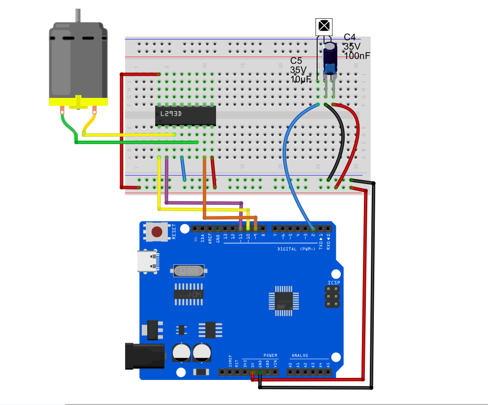
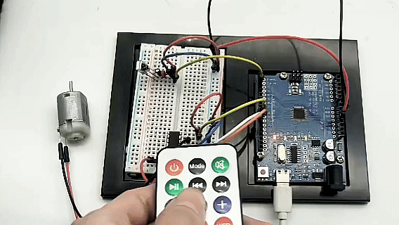

# Project 26: IR Remote Fan

## Project Introduction
In this project, we will combine "infrared remote control technology" with "DC motor driving technology" to create a smart fan that can be wirelessly controlled using a remote control. Infrared remotes are widely used in household appliances such as TVs and air conditioners. We will use an infrared receiver module to capture signals sent by the remote control (such as "forward," "backward," and "stop" buttons). After decoding these signals with an Arduino, we will command the L293D chip to change the operating state of the fan (DC motor), achieving comprehensive remote control.

## Project Hardware
The following components are required to complete this project:
1. UNO R3 development board (CH340) × 1
2. **Infrared Remote Controller** × 1
3. **IR Receiver Module** × 1 *(If using a bare component, add 100nF and 10μF capacitors as needed)*
4. **L293D Motor Driver Chip** × 1
5. **130 DC Motor** × 1
6. **9V Battery and Battery Clip** × 1 (for independent motor power supply)
7. Breadboard × 1 and several Dupont wires

## Project Principle
This project involves the coordinated operation of two independent systems:
1. **Infrared Signal Decoding (IR Decoding):**  
   The infrared remote control emits infrared light signals modulated by a 38kHz carrier through its front IR LED. The IR receiver captures this light, filters out ambient interference, and converts it back into electrical signals. The Arduino uses the `IRremote` library to decode these signals via the NEC protocol, converting them into unique hexadecimal (HEX) codes. Each button corresponds to a unique code.
2. **Motor Driving:**  
   After receiving the decoded button code, the Arduino performs logical checks (e.g., is the pressed button the "up" key?). Once the command is confirmed, the Arduino sends the corresponding PWM speed signal and high/low direction signals to the L293D chip. Using the internal H-bridge circuit of the L293D, it safely controls the motor’s forward rotation, reverse rotation, or braking.

## Library Installation (Install IRremote Library)
Before writing the code, you must install the dedicated infrared remote library:
1. In the Arduino IDE, click the menu bar **Tools** -> **Manage Libraries...**.
2. In the pop-up Library Manager search box, enter **`IRremote`**.
3. Find the library named `IRremote`, **select version `2.0.1` from the version dropdown menu** (to match this tutorial’s syntax, do not install the latest version), then click “Install.”
4. Wait until the status changes to “Installed,” then close the window.

## Wiring Diagram

**1. IR Receiver Pins**  
* `VCC` ➔ Connect to Arduino 5V  
* `GND` ➔ Connect to breadboard common GND  
* `OUT (Signal Pin)` ➔ Connect to **Arduino D2**

**2. L293D Motor Driver Pins**  
* `Pin 1 (Enable 1)` ➔ Connect to **Arduino D10** *(PWM speed control)*  
* `Pin 2 (Input 1)` ➔ Connect to **Arduino D11** *(Direction 1)*  
* `Pin 7 (Input 2)` ➔ Connect to **Arduino D9** *(Direction 2)*  
* `Pin 3 (Output 1)` ➔ Connect to one terminal of the DC motor  
* `Pin 6 (Output 2)` ➔ Connect to the other terminal of the DC motor  
* `Pin 16 (VCC1)` ➔ Connect to Arduino 5V *(chip logic power)*  
* `Pin 8 (VCC2)` ➔ Connect to 9V battery positive terminal *(fan independent power)*  
* `Pin 4, 5 (GND)` ➔ Connect to breadboard common GND (Note: Arduino GND and 9V battery negative terminal must share a common ground)  


## Example Code

*Note: Different remote controllers have different button codes. The hexadecimal codes used below (e.g., `0xFF629D`) are examples from common remotes on the market. If your remote buttons do not respond, open the Serial Monitor, press a button, note the displayed HEX code, and replace the corresponding `case` statements in the code.*

```cpp
/*

Electronics Learning Starter Kit for Arduino

Project 26

IR Remote Fan

Edit By Keyes

*/

#include <IRremote.h> // Include IR library (version 2.0.1 required)

// --- 1. IR Receiver Pin Definition and Object Creation ---
const int RECV_PIN = 2; // IR receiver signal pin D2
IRrecv irrecv(RECV_PIN); // Create IR receiver object
decode_results results;  // Object to store decoding results

// --- 2. L293D Motor Control Pin Definition ---
const int enablePin = 10; // D10: motor speed control (PWM)
const int in1Pin = 11;    // D11: motor direction 1
const int in2Pin = 9;     // D9:  motor direction 2

void setup() {
  Serial.begin(9600);      // Initialize serial port at 9600 baud
  irrecv.enableIRIn();     // Start the IR receiver

  // Set motor pins as outputs
  pinMode(enablePin, OUTPUT);
  pinMode(in1Pin, OUTPUT);
  pinMode(in2Pin, OUTPUT);
  
  Serial.println("System initialized, waiting for IR signals...");
}

void loop() {
  // If an IR signal is received and decoded successfully
  if (irrecv.decode(&results)) { 
    // Print the received hexadecimal IR code to the serial monitor
    Serial.print("Received IR code: 0x");
    Serial.println(results.value, HEX); 

    // Execute corresponding action based on received button code
    switch (results.value) {
      
      // Button 1 (example code): Forward rotation (replace with your remote's "up" key code)
      case 0xFF629D: 
        setMotor(255, false); // Full speed forward
        Serial.println("Action: Fan forward (FORWARD)");
        break;

      // Button 2 (example code): Reverse rotation (replace with your remote's "down" key code)
      case 0xFFA857: 
        setMotor(255, true);  // Full speed backward
        Serial.println("Action: Fan backward (BACKWARD)");
        break;

      // Button 3 (example code): Stop (replace with your remote's "OK" or "stop" key code)
      case 0xFF02FD: 
        setMotor(0, false);   // Speed zero, stop
        Serial.println("Action: Fan stop (STOP)");
        break;
        
      default:
        // Unknown button, do nothing
        break;
    }
    
    // Prepare to receive the next signal
    irrecv.resume(); 
  }
  
  delay(100); // Slight delay to avoid excessive reading from rapid button presses
}

// --- 3. Custom Motor Control Function ---
void setMotor(int speed, boolean reverse) {
  analogWrite(enablePin, speed);
  digitalWrite(in1Pin, !reverse); 
  digitalWrite(in2Pin, reverse);  
}
```

## Code Explanation
1. **Include and Initialization:** `#include <IRremote.h>` imports the library. In `setup()`, `irrecv.enableIRIn()` activates the receiver to start listening on pin D2 for 38kHz signals.
2. **Decoding and Detection:** `irrecv.decode(&results)` is the core method. It listens continuously and returns `true` when a remote button is pressed, storing the decoded unique code in `results.value`.
3. **Switch-Case Logic Dispatch:** After receiving the code, the program uses a `switch` statement to match it. If it matches `case 0xFF629D:`, the program knows you want to turn on the fan, so it calls the custom `setMotor(255, false)` function.
4. **Resetting the Receiver:** `irrecv.resume()` is a frequently forgotten but critical line. It clears the buffer and prepares the receiver to accept the next command. Without it, the receiver only works once.

## Experiment Observation
1. After wiring and uploading the code, open the Arduino IDE’s **Serial Monitor**, and set the baud rate at the bottom right to `9600`.
2. Point the remote at the IR receiver and press buttons. The Serial Monitor will print hexadecimal codes such as `0xFF629D`.
3. **Important Debugging Step:** Modify the `0xFFxxxx` values in the example code’s `switch` statement according to the actual codes your remote outputs, then re-upload the code.
4. After debugging: pressing a specific button will make the fan run forward at full speed; pressing another will make it run backward at full speed; pressing the stop button will smoothly brake and stop the fan. You now have a smart fan controllable by a TV remote!

