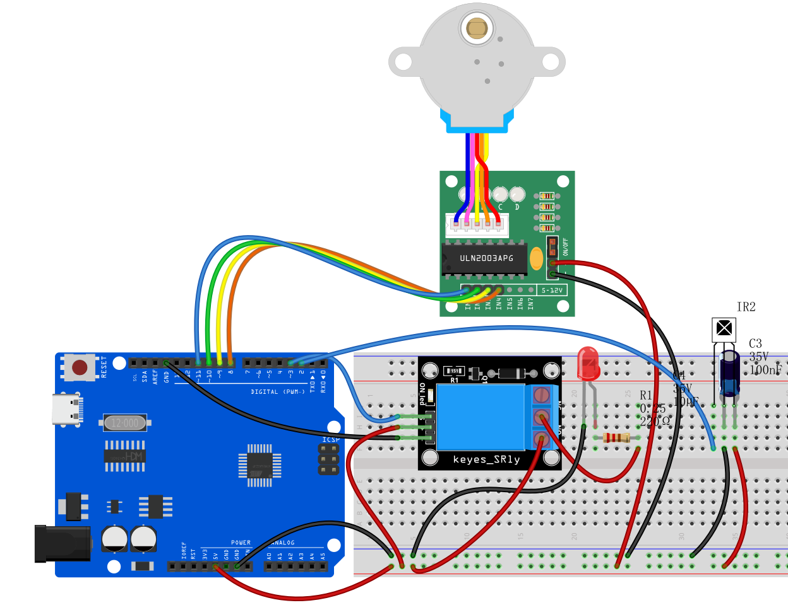
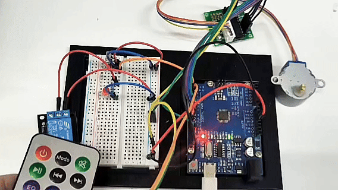

# Project 27: infrared remote control Smart Home

## Description
Smart homes use IoT and automation technologies to provide people with a more comfortable, convenient, and secure living experience. It covers many aspects, from lighting and security to appliance control.

In this project, we will use an Arduino UNO R3 main board, an infrared receiver module, a relay module, and a stepper motor to build a miniature "smart home system." You can use a regular IR remote control to remotely operate devices at home: for example, use the relay to switch the "light" on or off, and use the stepper motor to control the opening and closing of "curtains."

## Hardware
1. UNO R3 development board (CH340) × 1  
2. **IR Receiver** × 1 *(includes 100nF and 10μF capacitors)*  
3. **Relay Module** × 1  
4. **28BYJ-48 Stepper Motor** × 1  
5. **ULN2003 Stepper Motor Driver Board** × 1  
6. IR Remote Control × 1  
7. LED × 1 *(used to simulate a household appliance controlled by the relay)*  
8. 220Ω Resistor × 1 *(for LED current limiting)*  
9. Breadboard × 1 and several Dupont jumper wires  

## Working Principle
When you press a button on the remote control, the IR receiver detects a specific coded infrared signal. The Arduino decodes this signal and triggers corresponding actions based on the code:  
* **Control lighting (relay):** When the code for "Button 1" is received, the Arduino toggles the relay state (if it was ON, turn it OFF; if OFF, turn it ON), thereby controlling the LED connected to the relay.  
* **Control curtains (stepper motor):** When "Button 2" is received, the Arduino commands the stepper motor to rotate forward one full turn (simulating opening the curtains); when "Button 3" is received, it commands the stepper motor to rotate backward one full turn (simulating closing the curtains).

## Wiring Diagram

**1. IR Receiver**  
* `VCC` ➔ Arduino 5V  
* `GND` ➔ Arduino GND  
* `OUT (Signal Pin)` ➔ **Arduino D2**

**2. Stepper Motor & Driver Board (ULN2003)**  
* Plug the stepper motor’s white connector into the matching socket on the ULN2003 driver board.  
* Driver `IN1` ➔ **Arduino D8**  
* Driver `IN2` ➔ **Arduino D10** *(Note: According to the code below, IN2 connects to D10, IN3 connects to D9)*  
* Driver `IN3` ➔ **Arduino D9**  
* Driver `IN4` ➔ **Arduino D11**  
* Driver `+ (VCC)` ➔ Arduino 5V  
* Driver `- (GND)` ➔ Arduino GND

**3. Relay Module**  
* Relay `VCC` ➔ Arduino 5V  
* Relay `GND` ➔ Arduino GND  
* Relay `S (Signal/IN)` ➔ **Arduino D3**

**4. Simulated Appliance (LED connected to relay side)**  
* Connect the LED’s long leg (anode) through a 220Ω resistor to 5V.  
* Connect the LED’s short leg (cathode) to the relay’s **Normally Open (NO)** terminal.  
* Connect the relay’s **Common (COM)** terminal to GND.  



## Sample Code

*Note: Before uploading the code, make sure you have installed the `IRremote` library (recommended version 2.0.1) via the Arduino IDE Library Manager. The hexadecimal codes `0xFF...` in the code are examples; please replace them with the actual codes from your remote control’s buttons.*

```cpp
/*

Electronics Learning Starter Kit for Arduino

Project 27

infrared remote control Smart Home

Edit By Keyes

*/

#include <IRremote.h> // Include IR remote library
#include <Stepper.h>  // Include Arduino built-in stepper motor library

// --- 1. Pin and parameter definitions ---
#define IR_RECEIVE_PIN 2   // IR receiver pin D2
#define RELAY_PIN 3        // Relay control pin D3
#define STEPS_PER_REV 2048 // Number of steps for 28BYJ-48 stepper motor to complete one revolution

// --- 2. Create control objects ---
IRrecv irrecv(IR_RECEIVE_PIN); // Create IR receiver object
decode_results results;        // Store IR decode results

// Create stepper motor object; note pin order is 8, 10, 9, 11 (corresponding to IN1, IN3, IN2, IN4, which is the motor’s required driving sequence)
Stepper stepper(STEPS_PER_REV, 8, 10, 9, 11); 

void setup() {
  irrecv.enableIRIn();           // Initialize and start the IR receiver
  
  pinMode(RELAY_PIN, OUTPUT);    // Set relay pin as output
  digitalWrite(RELAY_PIN, LOW);  // Initialize relay as OFF
  
  stepper.setSpeed(10);          // Set stepper motor speed to 10 RPM
}

void loop() {
  // If an IR signal is received
  if (irrecv.decode(&results)) {
    
    // Perform actions based on received button code
    switch (results.value) {
      
      // Button 1 (example code 0xFF6897): control light (relay)
      case 0xFF6897: 
        // Toggle relay state: if ON, turn OFF; if OFF, turn ON
        digitalWrite(RELAY_PIN, !digitalRead(RELAY_PIN)); 
        break;

      // Button 2 (example code 0xFF9867): open curtains (stepper motor forward)
      case 0xFF9867: 
        // Rotate stepper motor forward one full revolution (2048 steps)
        stepper.step(STEPS_PER_REV); 
        break;

      // Button 3 (example code 0xFFB04F): close curtains (stepper motor backward)
      case 0xFFB04F: 
        // Rotate stepper motor backward one full revolution (-2048 steps)
        stepper.step(-STEPS_PER_REV); 
        break;
    }
    
    // Resume IR receiver to get next signal
    irrecv.resume(); 
  }
}
```

## Code Explanation

**1. Include necessary libraries:**  
```cpp
#include <IRremote.h>
#include <Stepper.h>
```
The `IRremote.h` library allows the Arduino to understand the "codes" sent by the IR remote control. The `Stepper.h` library is an official Arduino library designed for precise control of stepper motor rotation angles and directions (used here to simulate curtain movement).

**2. Object initialization:**  
```cpp
Stepper stepper(STEPS_PER_REV, 8, 10, 9, 11);
```
This line is very important. Due to the internal coil arrangement of the 28BYJ-48 stepper motor, to ensure smooth rotation, the pin order passed to the code must be `8, 10, 9, 11` (corresponding to driver board IN1, IN3, IN2, IN4). This is called half-step sequence.

**3. Relay toggle logic:**  
```cpp
digitalWrite(RELAY_PIN, !digitalRead(RELAY_PIN));
```
This is a classic "one-button toggle" code. It first reads the current relay state using `digitalRead`, then uses the `!` (NOT operator) to invert the state, and finally writes the opposite state back with `digitalWrite`. This way, pressing the button once turns it ON, pressing again turns it OFF.

**4. Stepper motor rotation:**  
```cpp
stepper.step(STEPS_PER_REV);
stepper.step(-STEPS_PER_REV);
```
The `step()` function makes the motor rotate a specified number of steps. Since we defined `STEPS_PER_REV = 2048`, passing 2048 makes the motor rotate one full revolution forward (opening curtains), and passing -2048 makes it rotate one full revolution backward (closing curtains). The program waits at this line until the motor completes the steps.

## Project Result

After uploading the code and powering the circuit, you can experience smart home control:  
1. **Control the light:** Press "Button 1" on the remote, you will hear a click from the relay and the LED will turn ON; press "Button 1" again, the relay clicks again and the LED turns OFF.  
2. **Open curtains:** Press "Button 2," the stepper motor indicator LED will blink, and the motor shaft will smoothly rotate clockwise one full turn, simulating the curtains being slowly opened.  
3. **Close curtains:** Press "Button 3," the stepper motor will rotate counterclockwise one full turn, returning to the initial position, simulating the curtains closing.

Through this project, you can intuitively understand how household appliances and automation devices can be centrally controlled via wireless signals!

