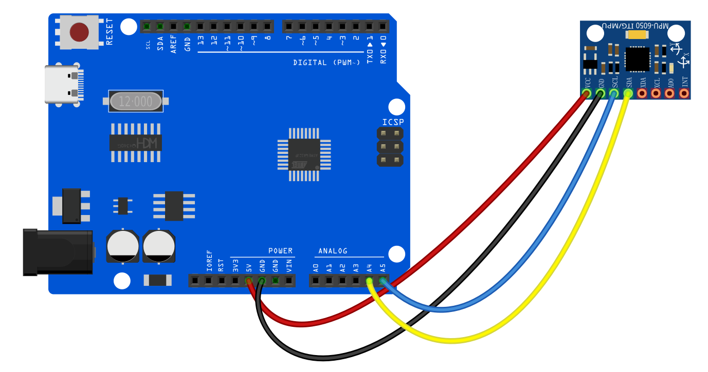

# Project 31: MPU6050 Module


#### Description

The MPU6050 is a powerful 6-axis motion tracking device that combines a 3-axis gyroscope and a 3-axis accelerometer on the same silicon die. It is widely used in drones, balancing robots, and motion-controlled devices. In this project, we will learn how to read the acceleration and rotation data from the MPU6050 module using the I2C communication protocol.

#### Hardware

1. UNO R3 development board （ch340） x1
2. MPU6050 Module x1
3. Breadboard x1
4. Jumper wires

#### Working Principle

The MPU6050 consists of two main sensors:
- **Accelerometer**: Measures the acceleration forces acting on the sensor in the X, Y, and Z axes. This can be used to determine the tilt angle of the sensor relative to the earth's gravity.
- **Gyroscope**: Measures the rate of rotation around the X, Y, and Z axes. This helps in tracking the orientation and rotational movement.

The module communicates with the Arduino via the I2C (Inter-Integrated Circuit) protocol, which requires only two data lines: SDA (Serial Data) and SCL (Serial Clock). The Arduino requests data from the MPU6050's internal registers, and the module sends back the raw sensor values.

#### Wiring Diagram

1. Connect VCC of MPU6050 to 5V on the board.
2. Connect GND of MPU6050 to GND on the board.
3. Connect SCL of MPU6050 to A5 (or SCL pin) on the board.
4. Connect SDA of MPU6050 to A4 (or SDA pin) on the board.


#### Sample Code

```cpp
/*

Electronics Learning Starter Kit for Arduino

Project 31

MPU6050 Module

Edit By Keyes

*/

#include <Wire.h>

const int MPU_addr=0x68;  // I2C address of the MPU-6050
int16_t AcX,AcY,AcZ,Tmp,GyX,GyY,GyZ;

void setup(){
  Wire.begin();
  Wire.beginTransmission(MPU_addr);
  Wire.write(0x6B);  // PWR_MGMT_1 register
  Wire.write(0);     // set to zero (wakes up the MPU-6050)
  Wire.endTransmission(true);
  Serial.begin(9600);
}

void loop(){
  Wire.beginTransmission(MPU_addr);
  Wire.write(0x3B);  // starting with register 0x3B (ACCEL_XOUT_H)
  Wire.endTransmission(false);
  Wire.requestFrom(MPU_addr,14,true);  // request a total of 14 registers
  
  AcX=Wire.read()<<8|Wire.read();  // 0x3B (ACCEL_XOUT_H) & 0x3C (ACCEL_XOUT_L)    
  AcY=Wire.read()<<8|Wire.read();  // 0x3D (ACCEL_YOUT_H) & 0x3E (ACCEL_YOUT_L)
  AcZ=Wire.read()<<8|Wire.read();  // 0x3F (ACCEL_ZOUT_H) & 0x40 (ACCEL_ZOUT_L)
  Tmp=Wire.read()<<8|Wire.read();  // 0x41 (TEMP_OUT_H) & 0x42 (TEMP_OUT_L)
  GyX=Wire.read()<<8|Wire.read();  // 0x43 (GYRO_XOUT_H) & 0x44 (GYRO_XOUT_L)
  GyY=Wire.read()<<8|Wire.read();  // 0x45 (GYRO_YOUT_H) & 0x46 (GYRO_YOUT_L)
  GyZ=Wire.read()<<8|Wire.read();  // 0x47 (GYRO_ZOUT_H) & 0x48 (GYRO_ZOUT_L)
  
  Serial.print("AcX = "); Serial.print(AcX);
  Serial.print(" | AcY = "); Serial.print(AcY);
  Serial.print(" | AcZ = "); Serial.print(AcZ);
  Serial.print(" | Tmp = "); Serial.print(Tmp/340.00+36.53);  // equation for temperature in degrees C from datasheet
  Serial.print(" | GyX = "); Serial.print(GyX);
  Serial.print(" | GyY = "); Serial.print(GyY);
  Serial.print(" | GyZ = "); Serial.println(GyZ);
  
  delay(500);
}
```

#### Code Explanation

**I2C Initialization**:
```cpp
Wire.begin();
Wire.beginTransmission(MPU_addr);
Wire.write(0x6B);  // PWR_MGMT_1 register
Wire.write(0);     // set to zero (wakes up the MPU-6050)
Wire.endTransmission(true);
```
The `Wire` library is used for I2C communication. We first wake up the MPU6050 by writing `0` to its power management register (`0x6B`).

**Reading Data**:
```cpp
Wire.beginTransmission(MPU_addr);
Wire.write(0x3B);  // starting with register 0x3B (ACCEL_XOUT_H)
Wire.endTransmission(false);
Wire.requestFrom(MPU_addr,14,true);  // request a total of 14 registers
```
We tell the MPU6050 that we want to start reading from register `0x3B` (which holds the high byte of the X-axis acceleration). Then we request 14 bytes of data in total, which covers the 3-axis acceleration, temperature, and 3-axis gyroscope data (each value takes 2 bytes).

**Combining Bytes**:
```cpp
AcX=Wire.read()<<8|Wire.read();
```
Since each sensor reading is 16 bits (2 bytes), we read the high byte, shift it left by 8 bits (`<<8`), and use bitwise OR (`|`) with the low byte to combine them into a single 16-bit integer.

#### Project Result

After uploading the code, open the Serial Monitor and set the baud rate to 9600. You will see a continuous stream of data showing the acceleration (AcX, AcY, AcZ), temperature (Tmp), and gyroscope (GyX, GyY, GyZ) values. Try tilting and rotating the MPU6050 module, and observe how the values change in real-time!


