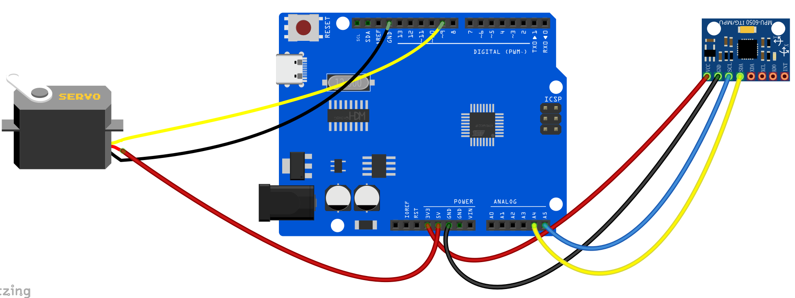
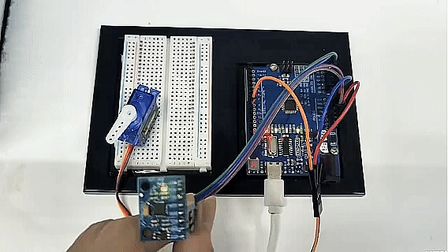

# Project 32: Motion-Controlled Servo


#### Description

In this project, we will combine the MPU6050 6-axis motion sensor with an SG90 Servo motor to create a motion-controlled system. By tilting the MPU6050 module along its X-axis, the Arduino will read the acceleration data, map it to an angle, and command the servo motor to rotate accordingly. This is the basic principle behind gimbal stabilization and motion-controlled robotic arms.

#### Hardware

1. UNO R3 development board （ch340） x1
2. MPU6050 Module x1
3. SG90 Servo Motor x1
4. Breadboard x1
5. Jumper wires

#### Working Principle

The MPU6050 measures the acceleration of gravity. When the module is perfectly flat, the X and Y axes read 0g, and the Z axis reads 1g. When you tilt the module, the gravity vector is distributed across the axes. By reading the raw acceleration value of the X-axis, we can determine the tilt angle.

The Arduino reads this raw X-axis value (which typically ranges from -17000 to +17000 depending on the tilt) and uses the `map()` function to convert this range into a degree value between 0 and 180. This degree value is then sent to the Servo motor using the `Servo` library, causing the motor's arm to mimic the tilt of the sensor.

#### Wiring Diagram

**MPU6050**:
- VCC -> 5V
- GND -> GND
- SCL -> A5
- SDA -> A4

**SG90 Servo**:
- Brown/Black Wire -> GND
- Red Wire -> 5V
- Orange/Yellow Wire (Signal) -> Digital Pin 9


#### Sample Code

```cpp
/*

Electronics Learning Starter Kit for Arduino

Project 32

Motion Controlled Servo

Edit By Keyes

*/

#include <Wire.h>
#include <Servo.h>

const int MPU_addr=0x68;  // I2C address of the MPU-6050
int16_t AcX, AcY, AcZ;

Servo myServo;  // create servo object to control a servo

void setup() {
  Wire.begin();
  Wire.beginTransmission(MPU_addr);
  Wire.write(0x6B);  // PWR_MGMT_1 register
  Wire.write(0);     // set to zero (wakes up the MPU-6050)
  Wire.endTransmission(true);
  
  myServo.attach(9);  // attaches the servo on pin 9 to the servo object
  Serial.begin(9600);
}

void loop() {
  Wire.beginTransmission(MPU_addr);
  Wire.write(0x3B);  // starting with register 0x3B (ACCEL_XOUT_H)
  Wire.endTransmission(false);
  Wire.requestFrom(MPU_addr, 6, true);  // request a total of 6 registers
  
  AcX = Wire.read()<<8 | Wire.read();  // 0x3B (ACCEL_XOUT_H) & 0x3C (ACCEL_XOUT_L)    
  AcY = Wire.read()<<8 | Wire.read();  // 0x3D (ACCEL_YOUT_H) & 0x3E (ACCEL_YOUT_L)
  AcZ = Wire.read()<<8 | Wire.read();  // 0x3F (ACCEL_ZOUT_H) & 0x40 (ACCEL_ZOUT_L)
  
  // Map the X-axis acceleration (-17000 to 17000) to Servo angle (0 to 180)
  // Note: You may need to adjust the -17000 and 17000 values based on your specific sensor's calibration
  int servoAngle = map(AcX, -17000, 17000, 0, 180);
  
  // Constrain the angle to prevent servo damage
  servoAngle = constrain(servoAngle, 0, 180);
  
  myServo.write(servoAngle);  // tell servo to go to position in variable 'servoAngle'
  
  Serial.print("AcX: ");
  Serial.print(AcX);
  Serial.print(" => Angle: ");
  Serial.println(servoAngle);
  
  delay(50);  // small delay for stability
}
```

#### Code Explanation

**Mapping the Values**:
```cpp
int servoAngle = map(AcX, -17000, 17000, 0, 180);
```
The `map()` function takes the raw X-axis acceleration reading (`AcX`) and scales it from its original range (-17000 to 17000) to the target range for the servo motor (0 to 180 degrees).

**Constraining the Angle**:
```cpp
servoAngle = constrain(servoAngle, 0, 180);
```
The `constrain()` function ensures that even if the sensor outputs a value slightly outside the expected range, the `servoAngle` will never drop below 0 or exceed 180. This protects the physical gears inside the servo motor from grinding.

#### Project Result

After uploading the code, hold the MPU6050 module in your hand. As you tilt the module left and right along its X-axis, the SG90 servo motor will rotate synchronously, mirroring your hand's movement. You can open the Serial Monitor to see the raw acceleration values and the corresponding calculated angles.


